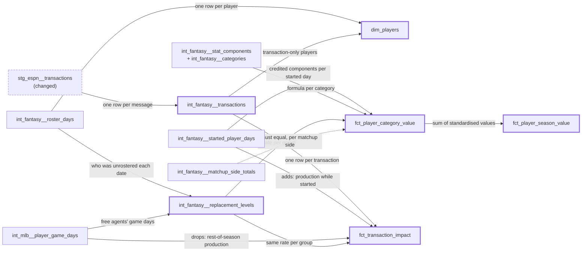

# Player value and transaction impact — design

Issue: #11 · Requirements: [requirements.md](requirements.md) · Tasks: [tasks.md](tasks.md)

## Overview

Three intermediate models carry the meaning; four marts present it. A transactions
interface says which team did what to which player. A replacement-level model measures
what the free-agent pool produced. Player value then compares each player's credited
production while started against that pool, one category at a time, and sums the
standardised results into one number. Transaction impact applies the same yardstick to
the window each add or drop opens.

Which models this adds, and what each row of them is:

Thick borders are new models; the dashed one changes. The dotted edge is the
reconciliation test, not a dependency.

### dbt concepts this introduces

- **`dim_` and `fct_` roles.** A *dimension* describes a thing (one row per player; you
  join to it for attributes). A *fact* records measurements at a grain (one row per
  player-team-category; you aggregate it). The prefix tells a reader which questions a
  model answers before they open it.
- **Window functions over a timeline.** An add's window ends at the *next* drop of that
  player by that team. `lead(...) over (partition by player, team order by transacted_at)`
  reads the next row's value without a self-join; that is the whole trick.
- **Unit tests.** A dbt `unit_tests:` block feeds a model a few hand-written input rows
  and asserts the exact output rows. Data tests check the warehouse you built; unit
  tests check the logic, so they can prove a sign or a window boundary that the fixture
  season may never exercise.

## Alternatives considered

### Replacement level (the main fork)

| | A — free-agent pool (chosen) | B — bench median (the original plan) | C — last rostered starter |
|---|---|---|---|
| Measures | what was actually available to pick up | what teams chose not to start | the worst player good enough to be owned |
| 2026 result | hitters .237 AVG; SP 5.15 ERA; RP 4.13 ERA | **0 hits, 0 outs** in every group | not computed |
| Sensitivity | stable: .237–.242 AVG, 5.00–5.15 SP ERA across N = 6, 12, 24 | n/a | depends on roster-size assumption |
| Bias | pool is players nobody wanted *all season*; a hot free agent who got added leaves it | availability: benched SPs pitch on 4.0% of bench days, hitters play on 65.2% | ignores availability entirely |
| Data needed | roster days + MLB game days (have both) | roster days + MLB game days | roster days only |

**A — free-agent pool.** Replacement means "what you would have got from the waiver wire".
The data holds it directly: 44,217 MLB player-days by 1,266 players on no fantasy roster
that date. Taking the top N by playing time picks regulars nobody owned rather than
September call-ups with nine outs.

**B — bench median.** Fails on the evidence above: the median benched player-day is an
empty line, so "over replacement" would mean "over nothing". Restricting to played bench
days rescues the arithmetic but keeps the selection problem — the bench is who a manager
sat *today*, often for a platoon or matchup reason.

**C — last rostered starter.** The classic draft-prep definition. It answers "is he worth
a roster spot", not "did he beat what I could have had", and needs an assumed number of
starters per position to find the marginal one.

### Unit of comparison

A count category needs a "per what". Per plate appearance or out makes the innings
category worth exactly zero for everyone. Per roster slot-day charges a player for off
days and credits a manager for streaming. **Per played day** — a game day against a
replacement's game day — avoids both
([ADR 0002](../../adr/0002-value-is-measured-per-played-day.md)).

### Shape of the value tables

One wide table with 17 hardcoded category columns contradicts the project rule that
nothing knows the league scores 17 categories. One long table at (player, team,
category) cannot hold day counts without repeating them 17 times. So: a long fact for
category values and a narrow fact for the season summary
([ADR 0007](../../adr/0007-category-values-are-a-long-table.md)).

## Decisions

| ADR | Decision | Status |
|---|---|---|
| [0001](../../adr/0001-replacement-level-is-the-free-agent-pool.md) | Replacement level is the top-N free agents per group, N = number of teams | accepted |
| [0002](../../adr/0002-value-is-measured-per-played-day.md) | Counts compare per played day; rates compare as marginal components | accepted |
| [0003](../../adr/0003-total-value-is-a-sum-of-standardised-category-values.md) | Total value is the equal-weight sum of standardised category values | accepted |
| [0004](../../adr/0004-a-transactions-acting-team-depends-on-its-message-type.md) | A transaction's acting team comes from a field chosen by message type, held in a seed | accepted |
| [0005](../../adr/0005-a-drops-impact-is-the-rest-of-the-season.md) | A drop's impact is the player's MLB production for the rest of the season | accepted |
| [0006](../../adr/0006-player-value-counts-every-started-day.md) | Value counts every started day; reconciliation covers matchup days only | accepted |
| [0007](../../adr/0007-category-values-are-a-long-table.md) | Category values are a long fact; the season summary is a separate narrow fact | accepted |

## Detailed design

### `stg_espn__transactions` (changed)

Selects the message's `for` field, and renames so no column claims to be a team id:
`message_to`, `message_from`, `message_for` (integers, as ESPN sends them). Still never
selects `author`. `to_team_id` and `from_team_id` go; nothing outside staging reads them
today (task 1 confirms with a grep).

### `espn_activity_types` seed (changed)

Gains two columns, so the rule is data:

| message_type_id | activity | is_transaction | movement | method | team_field |
|---|---|---|---|---|---|
| 178 | FA ADDED | true | add | free_agent | to |
| 180 | WAIVER ADDED | true | add | waiver | to |
| 179 | DROPPED | true | drop | drop | to |
| 181 | DROPPED | true | drop | drop | to |
| 239 | DROPPED | true | drop | drop | for |
| 244 | TRADED | true | *(empty)* | *(empty)* | *(empty)* |
| 188 | LINEUP MOVED | false | | | |

A transaction type with no `movement` fails the build (R2.4). The seed gains columns, so a
local build needs `dbt seed --full-refresh` once (AGENTS.md, dbt gotchas).

### `int_fantasy__transactions` (new, table, contracted)

Grain: one row per transaction message. Key: `transaction_id`.

| Column | Meaning |
|---|---|
| `platform` | `'espn'` |
| `transaction_id`, `topic_id` | the message, and the event it belongs to (an add and its paired drop share a topic) |
| `transacted_at`, `transaction_date` | instant, and Eastern calendar date |
| `platform_player_id` | the player moved |
| `fantasy_team_id` | the acting team: `message_to` or `message_for`, per the seed's `team_field` |
| `movement` | `add` or `drop` |
| `method` | `free_agent`, `waiver`, `drop` |
| `dropped_from_slot` | for type 239, the lineup slot he left (`message_from` joined to `espn_lineup_slots`); else null |

No `league_id` or `season`: staging has neither (#28). The model header says the marts
join it to the single league-season on team and player id, and that #28 must land before
a second league or season is loaded.

### `int_fantasy__replacement_levels` (new, table)

Grain: one row per (replacement group, component), plus `pool_players` and
`pool_played_days` repeated per group.

1. *Free-agent days*: rows of `int_mlb__player_game_days` within the season's scoring
   dates whose player is on no row of `int_fantasy__roster_days` that date (anti-join on
   `mlbam_player_id` and date).
2. *Group* of an MLB player over his free-agent days: `hitter` if he recorded no outs or
   had more plate appearances than batters faced; otherwise `SP` if at least half his
   games pitched were starts, else `RP`.
3. *Pool*: the top N per group by plate appearances (hitters) or outs recorded
   (pitchers), N = `count(*)` of `int_fantasy__teams`. Ties broken by `mlbam_player_id`
   so the pool is deterministic.
4. *Level*: per component, `sum(component) / pool_played_days`. Only the side the group
   is credited for counts: batting components for `hitter`, pitching for `SP` and `RP`,
   mirroring slot-role crediting in `int_fantasy__started_player_days`. A *played day* is
   likewise one-sided: `games_batted > 0` for `hitter`, `games_pitched > 0` for `SP`
   and `RP`.
5. *Every group gets its rows.* The output starts from the three groups crossed with
   the components and left-joins the pool, so an empty pool yields rows with null levels
   (R3.4) rather than no rows — an inner join downstream would otherwise drop that
   group's players without a trace.

The header states the definition, its bias (never-owned players only), and the measured
rates at N/2, N and 2N.

### `dim_players` (new, table)

Grain: one row per `platform_player_id`. Rows: every player in `int_fantasy__roster_days`
(name, default position and resolution from his latest roster day) union every player in
`int_fantasy__transactions` not already present (resolved through `stg_idmap__players` by
id alone, since there is no roster name to fall back on; name null).

Columns: `platform`, `platform_player_id`, `mlbam_player_id`, `player_name`,
`player_resolution`, `default_position`, `replacement_group`, `first_rostered_date`,
`last_rostered_date`, `is_transaction_only`.

`replacement_group` is `SP` or `RP` from the default position, `hitter` for any other
default position, and — when there is no default position — the MLB-derived group from
step 2 of the replacement model, computed over all his MLB days in the season. Null only
if he is unresolved. Without that last rule every transaction-only player would fall
through to `hitter`; the design review found one who is a pitcher with 400 outs after
his drop.

"Pro team" from the original plan is left out: a player's MLB team changes within the
season, so it is not an attribute of the player. It belongs on a player-day if anything
ever needs it.

### `fct_player_category_value` (new, table)

Grain: one row per (`platform_player_id`, `fantasy_team_id`, `category_key`), for pairs
with at least one started day.

For a pair, over its started days: `N` = weighted sum of the category's numerator
components, `D` = the same for its denominator (null for a count), both through
`int_fantasy__stat_components`. `played_days` = started days with an appearance on the
side the slot credits (`games_batted > 0` in a hitter slot, `games_pitched > 0` in a
pitcher slot), counted separately per side. `played` on the grain model means any
appearance and is not used here: 2026 has two pitcher-slot days where a `DH`-default
player batted and did not pitch, which must charge no pitching replacement. Replacement `rN`, `rD` per played day
come from the player's group: `hitter` for hitter-slot days; for pitcher-slot days, his
`dim_players.replacement_group`, or `RP` if that is `hitter` (a position player in a
pitcher slot — see open questions).

| Column | Count category (no denominator) | Rate category |
|---|---|---|
| `numerator`, `denominator` | `N`, null | `N`, `D` |
| `contribution` | `N` | `N / D` (null if `D = 0`) |
| `value_over_replacement` | `N − rN × played_days` | `N − (rN / rD) × D` |
| sign | × −1 when `is_lower_better` | × −1 when `is_lower_better` |
| `standardised_value` | `value_over_replacement / sd` | same |

So AVG's value is *hits above what a replacement hits in the same at-bats*, and ERA's is
*earned runs saved over the same outs*. `sd` is the population standard deviation of
`value_over_replacement` for that category across pairs with at least one played day on
the category's side (batting categories: hitter-slot played days; pitching: pitcher-slot).
A pair with no played day on a category's side gets 0 for that category, not null: he
neither helped nor hurt it. If `sd` is 0 (every pair identical, possible on fixtures)
the standardised value is 0 for all: no spread, no information. Keeping `numerator` and
`denominator` means rates can be recombined across a team's players as components,
never averaged.

### `fct_player_season_value` (new, table)

Grain: one row per (`platform_player_id`, `fantasy_team_id`). Columns: `started_days`,
`played_started_days`, `started_days_outside_matchups`, `unverified_started_days`,
`first_started_date`, `last_started_date`, `total_value` =
`sum(standardised_value)` over the scored categories.

### `fct_transaction_impact` (new, table)

Grain: one row per transaction. Columns: the `int_fantasy__transactions` columns, then

- `window_start`, `window_end`.
  - Add: from `greatest(transaction_date, first scoring date)` to the day of that team's
    next drop of that player (`lead` over the player-team timeline), else the last
    scoring date.
  - Drop: from the day after the drop (or the first scoring date) to the last scoring date.
- Add: `rostered_days`, `started_days`, `played_started_days`, and every credited
  component summed over the window's started days for that team (the wide
  `fo_batting_columns` / `fo_pitching_columns` pattern of `int_fantasy__matchup_side_totals`).
- Drop: `played_days` and every component summed from `int_mlb__player_game_days` over
  the window, on the side his `replacement_group` is credited for;
  `next_added_at` and `next_added_by_team_id` (null if never re-added).
- `total_value`: the same per-category formulas and the same `sd` as
  `fct_player_category_value`, applied to the window's components.

The per-category arithmetic is one macro used by both facts, so the two cannot drift.

## Test strategy

| Requirement | Test | Catches |
|---|---|---|
| R1.1 | `unique` + `not_null` on `dim_players.platform_player_id`; singular test: every roster-day and transaction player is in it | a dropped or doubled player |
| R1.2, R1.3 | `accepted_values` on `player_resolution`, `replacement_group` | a new resolution leaking through unlabelled |
| R2.1, R2.5 | `unique` on `transaction_id`; `not_null` + `relationships` to `int_fantasy__teams` on `fantasy_team_id` | the 239 defect returning; a slot id read as a team |
| R2.2, R2.4 | `not_null` on `movement` | a trade or new message type being guessed at |
| R2.2 | singular: no drop names a team other than the one rostering the player the day before | the wrong field chosen for a type |
| R2.3 | contract on `stg_espn__transactions` columns | a misleading name coming back |
| R3.1 | singular: each group's pool has ≤ N players; warn if a group has 0 played days | a pool built at the wrong size; an empty pool going unnoticed |
| R3.4 | unit test: an empty RP pool still yields RP rows with null levels, and an RP's value over replacement is null | an empty pool becoming "replacement = 0", or its players vanishing in a join |
| R3.5, R4.7 | unit test: a pitcher-slot day with batting but no pitching counts 0 played days and charges no replacement | a two-way player's off-side appearance charged as a pitching day |
| R1.4 | unit test: a transaction-only player with pitching appearances gets `SP` or `RP`; singular: no resolved player has a null group | a pitcher valued as a hitter after his drop |
| R4.8 | unit test: identical values in a category give standardised 0, not a division error | `sd = 0` on small fixtures |
| R3.2 | singular: the pool's own value over replacement is 0 in every category | per-player rates being averaged; formula drift between pool and players |
| R4.1 | `unique` on (player, team, category); row count = pairs × categories | fan-out from a join |
| R4.2 | singular: categories in the fact = categories in `int_fantasy__categories` | a hardcoded category list |
| R4.3 | unit test (`dbt` unit test with fixed inputs): a pitcher with ERA below replacement has positive ERA value; a hitter with more strikeouts per played day than replacement has negative B_SO value | a sign error on lower-is-better |
| R4.4–R4.6 | singular: `started_days = inside + outside`; `unverified_started_days` equals the count from `input_status` | bye-week days vanishing; unverified zeroes counted as real |
| R5.1 | singular `player_contributions_match_matchup_sides`: started days joined to `int_fantasy__matchup_periods` and summed per (league, season, matchup, team, component), full-outer-joined to the side totals; exact | double counting; a missed day; a wrong join grain; errors in two matchups cancelling in a season total |
| R5.2 | singular: fact day counts sum to `int_fantasy__started_player_days` rows | rows lost between the grain and the fact |
| R6.1 | `unique` on `transaction_id`; row count = interface row count | a transaction lost or doubled |
| R6.2 | unit test: add on day 3, drop on day 7 → window is days 3–7 and only that team's started days count | an add's window running past its drop |
| R6.3 | unit test: drop on day 3, re-added by another team on day 5 → components cover days 4 to season end; `next_added_*` filled | the window stopping at the re-add |
| R6.4 | singular: no `window_start` before the first scoring date | pre-season transactions with impossible windows |
| R6.5 | covered by the shared macro and R3.2's test | two value scales |

Tests are written before the models they test. Unit tests use dbt's `unit_tests:` with
inline rows, so they run in CI regardless of what the fixtures hold.

## Risks

- **CI fixtures may hold no free agents.** The fixture season is small and may roster
  every MLB player it contains, leaving the pool empty. Likely; cheap. Task 3 checks,
  and if so extends `scripts/make_fixtures.py` (allowlist, never hand-edit) to include a
  few unrostered player-days.
- **Renaming staging columns breaks a reader I have not found.** Unlikely; task 1 greps
  first.
- **The total value will be read as more objective than it is.** Certain. Mitigated by the
  header and ADR 0003 stating the equal-weight assumption; the per-category table is
  there for anyone who disagrees with the sum.
- **Small-sample pairs.** A player started for two days can post a large per-category
  value. Accepted: `played_started_days` sits beside every value so a consumer can filter.

## Open questions

- **A position player in a pitcher slot**: his pitcher-slot days use the `RP` level when
  his default position is a hitter's. The design review measured the only 2026 cases:
  two days, a `DH`-default player who did not pitch, which now count no played day and
  so charge nothing (R4.7). The `RP` fallback is therefore untested by real data; task 6
  re-counts after the build.
- **The five transaction-only players**: the review confirmed at least one resolves by
  id (a pitcher). Whether all five do is for task 4 to report; `unresolved` is an
  acceptable answer (R1.3).
- **Eleven type-179/181 drops whose player was not on the named team the day before**
  (6 are pre-season). Same-day add-and-drop is the likely cause; not confirmed. Task 2
  classifies them. They do not block: the acting team is still stated by the message.
- **#10 is still open** pending the 10/5 refresh's effect on the residual register. If
  that refresh changes credited production, R5.1 still holds (both sides move together),
  but the expected values above would need re-measuring.

## Evidence

Read-only queries against `data/warehouse.duckdb` (built 2026-10-01), run 2026-10-03.

| Claim | Measured |
|---|---|
| Bench median is zero | benched hitter-days 5,176 (65.2% played), SP 4,965 (4.0%), RP 562 (8.7%); median hits 0 and median outs 0 in all three |
| Free-agent pool exists | 44,217 unrostered MLB player-days, 1,266 players (557 hitters, 148 SP, 561 RP) of 69,200 player-days in season |
| Pool is stable | hitters AVG .241 / .237 / .242 at N = 6 / 12 / 24; SP ERA 5.07 / 5.15 / 5.00; RP ERA 4.45 / 4.13 / 3.90. Started players: .254, 3.81 |
| Transactions | 737 messages: 354 FA ADDED, 20 WAIVER ADDED, 363 DROPPED (179: 241, 181: 11, 239: 111); 0 TRADED; 49 pre-season |
| Type 179/181 team is in `to` | 241 of 252 on that team the day before; 0 the day after |
| Type 239 team is in `for` | `from` takes values 0–5 and 13–17 (lineup slot ids; teams are 1–12). On the `for` team the day before: 89; on any team the day before: 89; on it the day after: 0 |
| Adds' team is in `to` | 336 of 374 on that team the day after; 0 the day before |
| Days outside matchups | 245 started player-days, 2 teams, 2026-08-31 to 09-06; 38,420 inside; 38,665 total |
| Grain sizes | 493 rostered players, 481 ever started, 580 (player, team) pairs, 17 scored categories |

## Review log

| Source | Finding | Resolution |
|---|---|---|
| design-review 2026-10-03 | F1 (P0): transaction-only players have no default position, so all fall to `hitter`; one is a pitcher with 400 outs after his drop | Changed: R1.4 and the `dim_players` rule derive the group from MLB appearances; unit test added |
| design-review | F2 (P1): `played` means any appearance, so a pitcher-slot day with only batting charged pitching replacement (2 rows in 2026) | Changed: played days are per credited side (R3.5, R4.7, ADR 0002); unit test added |
| design-review | F3 (P1): reconciling per team lets errors in two matchups cancel | Changed: R5.1 now reconciles each of the 286 matchup sides |
| design-review | F4 (P1): a rate `contribution` cannot be recombined or traced to a matchup | Changed in part: the fact keeps `numerator` and `denominator`. Not changed: no per-matchup player fact — the day grain in `int_fantasy__started_player_days` is that trace, and the goal is reworded to say so |
| design-review | F5 (P1): an empty pool had no guaranteed rows, so R3.4 was unenforceable | Changed: groups × components spine with a left join; unit test with an empty RP pool |
| design-review | F6 (P2): no rule for `sd = 0` | Changed: R4.8, standardised value 0; unit test |

## Amendments

### 2026-10-03 — the seed generator is behind the committed seeds

Found in task 2. `scripts/make_espn_seeds.py` writes `espn_activity_types` with two
columns and `espn_lineup_slots` with three, but the committed seeds carry
`is_transaction` (and a row for type 188) and `slot_role`, added in #26 and #10 without
the generator. Running it as task 2 instructs would have dropped them. Task 2 therefore
first makes the generator reproduce the committed seeds byte for byte, with the rules for
`is_transaction` and `slot_role` held as tables in the script, and only then adds
`movement`, `method` and `team_field`. No decision changes.

### 2026-10-03 — the fixtures must carry the message's `for` field

Found in task 1. `scripts/make_fixtures.py` allowlists `to` and `from` on a transaction
message but not `for`, and the fixtures hold one type-239 drop. Without `for` its acting
team is null in CI and R2.5 fails there. Task 2 adds `for` to the allowlist and
regenerates. `for` is a team id on type 239 (ADR 0004), not member data, and the
allowlist approach and privacy test are unchanged.

### 2026-10-03 — type 180 also carries `for`, and it is not the acting team

Found in task 1. All 20 WAIVER ADDED messages carry `for` and `from` (always 0). ADR
0004's rule for 180 stands: the player is on the `to` team's roster the next day for all
10 in-season claims (the other 10 are pre-season), on the `for` team's for 1 (the one row
where the two are equal), and each claim's paired drop names the `to` team. What `for`
means on a 180 is not established and nothing here uses it.

### 2026-10-03 — task 2 and 3 results against the open questions

- *The eleven 179/181 drops*: 7 are pre-season (the spec said 6) and 4 are same-day
  add-and-drops by the same team. None names a wrong team.
- Across all types, 33 of 363 drops have the player on no roster the day before, so the
  rostering-team test covers 330 and passes on all of them. Two type-239 drops are neither
  pre-season nor same-day: one team's free-agent adds on 2026-04-19 dropped on 04-20,
  absent from the 04-19 roster snapshot.
- *Fixtures and the replacement pool* (task 3): the CI warehouse holds unrostered players
  in every group (22 hitters, 3 SP, 9 RP), so no fixture change was needed for the pool.
- The seed generator now writes LF line endings, as the hand-edited seeds already had;
  `espn_stat_ids` and `espn_player_positions` change in line endings only.

### 2026-10-03 — the hitter replacement AVG at N = 12 measures .2416, not .237

Found in task 5. Built exactly as designed (unrostered that date, grouped over free-agent
days, top N by plate appearances, ties by id), the hitter pool is 12 players, 1,690 played
days, 1,369 H in 5,666 AB: **.2416**. Everything else in the expected-values table
reproduces to the printed precision: hitters .2410 at N = 6 and .2420 at N = 24; SP ERA
5.07 / 5.15 / 5.00 and WHIP 1.45; RP ERA 4.45 / 4.13 / 3.90 and WHIP 1.29; 44,217
free-agent days, 1,266 players, 557 / 148 / 561 per group. The 12/13 cut is not a tie (483
PA twice, split by id, then 479).

No variant of the pool tried (ranking by at-bats, days or games; never-rostered instead of
unrostered-that-date) gives .237 at 12 together with .241 and .242 at 6 and 24, so the
.237 in requirements.md, the design's alternatives table and ADR 0001 looks like a
mis-recorded figure, not a different definition. **The definition is unchanged and
nothing was tuned.** The owner accepted .2416 as the expected value on 2026-10-03;
requirements.md and ADR 0001 carry the corrected figure.

### 2026-10-03 — a non-pitcher in a pitcher slot is measured from his own pitching

Found in task 6; decided by the owner. The open question said the only 2026 cases were two
days on which a `DH`-default player did not pitch. The count is 15 started days in pitcher
slots (9 `SP`, 6 `P`) by one `DH`-default two-way player, and he pitched on 13 of them,
every one a start. The spec's flat `RP` fallback would have measured a starter's day
against a reliever's.

Superseded rule: for pitcher-slot days, a player whose `replacement_group` is `hitter` is
measured against `SP` if at least half his games pitched in the season were starts, else
`RP` (the `fo_replacement_group` rule on his pitching alone). A player who never recorded
an out stays `RP`; he has no pitching day, so the level is never applied. The answer is
the new column `dim_players.pitcher_slot_replacement_group`, which both value facts read.
2026: 230 hitters `RP`, 1 hitter `SP`. This refines how ADR 0002's levels are assigned and
changes no ADR decision.
