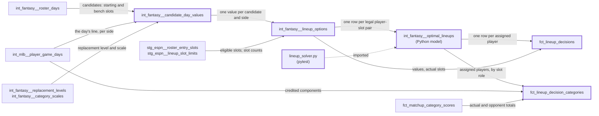

# Lineup decisions: what was left on the bench — design

Issue: #12 · Requirements: [requirements.md](requirements.md) · Tasks: [tasks.md](tasks.md)

## Overview

Two SQL models turn each roster day into what a solver needs: the day's value of every
player who could have been started, in the unit the player facts use, and every legal
(player, slot) pair of a team-day. A dbt Python model solves each team-day as an
assignment problem with SciPy and returns only who goes where. Two marts read that: one
row per team-day with the actual lineup's value, the optimal lineup's and the gap; and
one row per matchup side and category with the team's total under each lineup against
the opponent's actual total. The optimal lineup may replace a starter who played only
with another player who played, so the gap measures choices between players, not days
a manager could not have known were bad.

A *dbt Python model* is a model whose body is a Python function that returns a table;
with DuckDB it runs inside the dbt process. It is used here because exact assignment
cannot be written in SQL. dbt cannot unit-test one, and it cannot be a view.



Thick border: new. Nothing existing changes except one added seed column.

## Evidence

Read-only on the real 2026 season, 2026-10-09, with a throwaway prototype (SciPy's
`linear_sum_assignment` over the warehouse's own tables; not committed).

- **The day value adds up.** Summing each started player-day's value on its slot's side
  over the season gives 2,245.53; `sum(total_value)` in `fct_player_season_value` is
  2,245.5322. The value-over-replacement and scaling macros are linear in days.
- **Size.** 2,160 team-days, 18 slots, 21 to 23 candidates each. All of them solve in
  0.3 seconds.
- **Unrestricted optimum.** 6,007.65 against 2,245.53: a gap of 3,762.12, with 10,152
  played starters sat and 6,609 slots left empty (the actual lineups leave 215).
- **With the rule of R3.1.** 3,713.74: a gap of 1,468.21 on 1,540 team-days; 2,427
  starters replaced by 2,533 players brought in; never below the actual lineup.
- **The zero point barely matters under that rule.** Measuring a count from zero
  instead of from replacement gives a gap of 1,545.78: with the number of played
  starters held, a replacement level cancels between the player sat and the player
  brought in.
- **Eligibility.** With eligibility as fetched, 1,468.21. Cut back to slots a player
  had already occupied by that date (plus `UTIL` and `P`), 1,357.58: the as-fetched
  figure overstates by at most about 8%.
- **Injured-list slots.** 240 IL-slot days had an MLB appearance. As candidates they
  add 164 players brought in and 85.77 to the gap.
- **The starts limit.** Started pitcher starts per team and seven-day matchup period
  reach 14 once in the actual lineups (ESPN's totals still match ours there, so the
  limit is not a hard cut at 13). The optimal lineups hold 2,639 starts against 2,524,
  and exceed 13 in 2 of 264 seven-day team-periods, never above 14.
- **Categories.** Recomputing each side's totals from the actual lineups reproduces
  `fct_matchup_category_scores.team_value` in 4,862 of 4,862 rows. With the optimal
  lineups, 453 losses become wins and 6 wins become losses; 216 of 286 sides gain
  category wins and 1 loses.
- **Settings.** `lineupLocktimeType` is `INDIVIDUAL_GAME`: a lineup is set per day, per
  player. `lineupSlotStatLimits` holds `{"22": {"statId": 33, "limitValue": 1.857}}`:
  stat 33 is games started; what slot key 22 denotes is inferred (pitchers together),
  not confirmed.
- **dbt-duckdb 1.11** accepts a DuckDB relation returned from a Python model, and has a
  `module_paths` profile setting for local helper modules. Neither `scipy`, `numpy`,
  `pandas` nor `pyarrow` is installed today.
- **CI fixtures:** 36 team-days, 824 candidate days of which 32 have an MLB appearance;
  every fixture date lacks boxscores; 6 of 17 category scales are null or zero. The
  prototype there: actual 17.3729, optimal 26.8169, a gap on 4 team-days.

## Alternatives considered

### What the optimal lineup may do

| | A — replace a played starter only with a player who played (chosen) | B — unrestricted hindsight | C — fill-first: most played starters, then value | D — fill empty and off-day slots only |
|---|---|---|---|---|
| Season gap, 2026 | 1,468 | 3,762 | not measured | not measured |
| Counts "start A or B, both play" | yes | yes | yes | no |
| Counts "sit him, start nobody" | no | yes: 10,152 times | no | no |
| Never worse than the actual lineup | yes | yes | no: it can force a bad day into a slot | yes |
| Solved as one assignment | yes, with idle fillers | yes | two passes | yes |
| Depends on the zero point of a count | hardly (1,468 against 1,546) | fully | hardly | hardly |

**A.** A lineup choice is a choice between players. Holding the number of played
starters per role removes the one move that is pure hindsight and keeps the rest.

**B.** What the issue literally asks. It loses because most of its gap is days that
went badly, which no lineup rule could have avoided, and its size depends on where zero
is put.

**C.** The ex-ante rule ("start everyone who plays"). It can make the "optimal" lineup
worse than the actual one, which the issue's own test forbids.

**D.** Only the uncontroversial mistakes. It would not count the commonest real
decision, which of two playing players to start.

### How it is solved

| | A — dbt Python model, SciPy (chosen) | B — dbt Python model, own solver | C — SQL, greedy by value | D — a script outside dbt that writes a table |
|---|---|---|---|---|
| Exact | yes | yes, if written and proven | no: double-assigns a player eligible at two slots | yes |
| New dependencies | `scipy`, `numpy` (dev group) | none | none | `scipy`, `numpy` |
| Code to own and test | the cost matrix | a Hungarian or min-cost-flow implementation | a window query | a second orchestration path |
| In the dbt DAG and the gates | yes | yes | yes | no |
| Portable to BigQuery | no, needs a Python runtime there | no | yes | no |

**A.** The issue's own choice, and the smallest amount of code that can be wrong.

**B.** The same model with no dependency. It loses because an assignment solver is
exactly the code not to write twice; SciPy's is the reference it would be tested
against.

**C.** Portable and wrong. A property test would show it.

**D.** Keeps Python out of dbt, and takes the result out of the lineage, the tests and
the isolation gate.

### Which eligibility

| | A — ESPN's, as fetched, with the fetch time carried (chosen) | B — only slots already occupied | C — rebuild from games played by position |
|---|---|---|---|
| True on the day | for a capture near the day; not for the 2026 backfill | understates: a new eligibility counts only after first use | in principle |
| Season gap, 2026 | 1,468 | 1,358 | not measured |
| Rule to maintain | none | an invented one | ESPN's thresholds, per season |

### Shape of the output

| | A — a team-day fact and a matchup-category fact (chosen) | B — the team-day fact only | C — one wide table per matchup |
|---|---|---|---|
| Value left on the bench, by day | yes | yes | no |
| Category results that would have changed | yes | no | yes |
| Knows how many categories the league scores | no (long, ADR 0007) | no | yes |

The issue asks for both grains. B is the cut if the owner wants a smaller first step.

## Decisions

| ADR | Decision | Status |
|---|---|---|
| [0037](../../adr/0037-the-optimal-lineup-replaces-a-played-starter-only-with-a-player-who-played.md) | The optimal lineup maximises summed day value, and replaces a played starter only with a player who played; injured-list slots are not candidates; the starts limit is not enforced | proposed |
| [0038](../../adr/0038-lineup-eligibility-is-espns-as-fetched.md) | Lineup eligibility is ESPN's as fetched, with the fetch time carried | proposed |
| [0039](../../adr/0039-the-optimal-lineup-is-solved-in-a-dbt-python-model-with-scipy.md) | The optimal lineup is solved exactly, in a dbt Python model, with SciPy | proposed |

## Detailed design

Every new model carries `platform`, `league_id`, `season`. "Team-day" below is
(`platform`, `league_id`, `season`, `scoring_date`, `fantasy_team_id`).

### Seed: `espn_lineup_slots.is_injured_list_slot`

`scripts/make_espn_seeds.py` writes one more column: true for `IL`, false otherwise.
The seed is regenerated by the script. A seed that gains a column needs
`dbt seed --full-refresh` on the real warehouse once (AGENTS.md, dbt gotchas).

### `int_fantasy__candidate_day_values.sql`

Grain: team-day, `platform_player_id`, `side`. Table.

| Column | Meaning |
|---|---|
| `mlbam_player_id` | from the roster day; a candidate with none has no row |
| `side` | `batting` or `pitching` |
| `day_kind` | `batting`, `start` or `relief` (`fo_pitching_day_kind`) |
| `day_value` | R1.3; null by R1.4 |

- `candidates`: `int_fantasy__roster_days` joined to the seed, where `is_started` or
  (`slot_role = 'bench'` and not `is_injured_list_slot`).
- `played_sides`: joined to `int_mlb__player_game_days` on MLB id and date; one row for
  `batting` where `games_batted > 0`, one for `pitching` where `games_pitched > 0`.
- From there the arithmetic is `fct_player_category_value`'s, at the grain of a day:
  components unpivoted one query per column of `fo_batting_columns` /
  `fo_pitching_columns`, weighted by `int_fantasy__stat_components`, a kind meeting
  only the components of its own side, the replacement level of the day's kind from
  `int_fantasy__replacement_levels`, then `fo_value_over_replacement` with
  `played_days` 1 and `fo_scaled_value` with the row of `int_fantasy__category_scales`.
  `day_value` is `sum(scaled_value order by category_key)`, null if any is null.
- Both sides of a two-way player's day are valued. Which one counts is decided by the
  slot, in the next model.

### `int_fantasy__lineup_slots.sql`

One row per starting slot a league-season uses: `lineup_slot_id`, `lineup_slot`,
`slot_role`, `slot_count`, from `stg_espn__lineup_slot_limits` where
`is_starting_slot and slot_count > 0`, with the seed's role. A view.

### `int_fantasy__lineup_options.sql`

Grain: team-day, `platform_player_id`, `lineup_slot_id`. Table.

| Column | Meaning |
|---|---|
| `scoring_period` | the roster's period |
| `lineup_slot`, `slot_role` | from `int_fantasy__lineup_slots` |
| `option_value` | the `day_value` of the side the slot's role credits |
| `day_kind` | of that side's day: `batting`, `start` or `relief` |
| `is_started` | he was in a starting slot that day |
| `is_actual` | he was in this slot |
| `eligibility_fetched_at` | `stg_espn__roster_entry_slots.fetched_at` |

`candidates` joined to `stg_espn__roster_entry_slots` on (`league_id`, `season`,
`scoring_period`, team, player), to `int_fantasy__lineup_slots` on the slot, and inner
to `int_fantasy__candidate_day_values` on the side the role credits (`hitter` →
`batting`, `pitcher` → `pitching`). A player who did not play that side has no option
there, so a slot nobody is assigned to is simply idle.

### `dbt/python_modules/lineup_solver.py`

A plain function with no dbt and no database in it:

```python
def solve_team_day(
    options: list[Option],        # player_id, slot_id, role, value, is_actual
    slots: list[Slot],            # slot_id, role, count
) -> list[tuple[int, int]]:       # (player_id, slot_id), sorted
```

- Rows of the cost matrix are slot instances, ordered by (`slot_id`, instance). Columns
  are the distinct players, ordered by id, then idle fillers: for each role, (slots of
  the role) minus (actual starters with an `is_actual` option in the role).
- Cost of (slot, player) is `-(value + 1e-9 if is_actual else value)` where the pair is
  an option, and forbidden otherwise. That is R3.1's objective as written: the bonus
  is in the requirement, not a perturbation of it. Cost of (slot, idle filler of the slot's role) is
  0, and forbidden across roles. Forbidden is a large finite cost.
- `scipy.optimize.linear_sum_assignment` matches every slot instance. The actual lineup
  is one such matching, so a full matching exists; the function raises if the result
  uses a forbidden pair.
- A slot matched to an idle filler is idle. Limiting the fillers is what enforces
  R3.1's "at least as many": a slot of a role can go idle only as often as the actual
  lineup left one without a played starter.
- The 1e-9 bonus is R3.4. The actual lineup collects it on every played starter, more
  than any other lineup can, so it wins a tie. Its price is R3.2's bound: the chosen
  lineup's plain value can fall short of the true maximum by less than 1.8e-8, which
  the pytest brute-force case checks. An exact two-stage tie-break (maximise value,
  then actual slots among the maxima) was considered and left out: it needs equality
  of floating-point sums to mean something.
- Sorting rows and columns makes the result independent of input order (R3.6).

### `int_fantasy__optimal_lineups.py`

Grain: team-day, `platform_player_id`. Columns: the keys and `lineup_slot_id`. Table.

`model(dbt, session)` reads `int_fantasy__lineup_options` and `int_fantasy__lineup_slots`
ordered by their keys, groups the options by team-day in Python, skips a team-day that
has an option with a null value (R3.5: unvalued), calls `solve_team_day` with that league-season's
slots, inserts the rows into a temporary table and returns it as a DuckDB relation. It
computes no total. `profiles.yml` gains `module_paths: ["python_modules"]` on both
targets so the model can import the solver; `pyproject.toml` adds `scipy` to the dev
group and `dbt/python_modules` to pytest's `pythonpath` and ruff's `src`.

The header states the BigQuery implication: there a Python model needs a Spark or
BigQuery DataFrames runtime, so this model either stays DuckDB-only or the solver
moves; sub-project 3 decides.

### `fct_lineup_decisions.sql`

Grain: team-day. Table.

| Column | Meaning |
|---|---|
| `scoring_period`, `matchup_period` | from the roster day and `int_fantasy__matchup_periods` |
| `matchup_id` | from `int_fantasy__matchup_sides`; null in a period with no matchup |
| `candidates` | roster days in a starting or bench slot |
| `played_starters` | started players with an `is_actual` option |
| `optimal_starters` | assigned players |
| `actual_value` | `sum(option_value)` over `is_actual` options, in player order |
| `optimal_value` | `sum(option_value)` over the optimal lineup's options, in player order |
| `value_gap` | `optimal_value - actual_value` |
| `players_brought_in`, `players_sat`, `players_moved` | R4.2 |
| `actual_pitcher_starts`, `optimal_pitcher_starts` | options with `day_kind = 'start'` in a pitcher-role slot: the `is_actual` ones, and the optimal lineup's (R4.9) |
| `missed_start_platform_player_id`, `missed_start_mlbam_player_id`, `missed_start_slot`, `missed_start_value` | R4.3 |
| `eligibility_fetched_at` | of the team-day's roster |
| `is_unvalued` | any of the team-day's options has a null value (R3.5) |
| `has_unverified_inputs` | R4.5 |

The spine is the distinct team-days of `int_fantasy__roster_days`, so a team-day with no
option still has a row: not unvalued, both values 0, all counts 0. `is_unvalued` is
computed in this model from `int_fantasy__lineup_options`, never from whether
`int_fantasy__optimal_lineups` has rows for the day: no rows means "nobody assigned"
when it is false and "not solved" when it is true.
`has_unverified_inputs` is true when the date is incomplete in `int_mlb__game_dates`
or any candidate has no MLB id.

The two pitcher-start counts are there because the starts limit is not enforced (ADR
0037): summed by team and matchup period they show a period over a league's limit,
whatever that limit is. The model does not read `lineupSlotStatLimits`.

### `fct_lineup_decision_categories.sql`

Grain: (`matchup_id`, `fantasy_team_id`, `category_key`). Table.

| Column | Meaning |
|---|---|
| `matchup_period`, `opponent_team_id`, `category_label`, `is_lower_better` | from `fct_matchup_category_scores` |
| `actual_value`, `opponent_value`, `actual_result` | that fact's `team_value`, `opponent_value`, `result` |
| `optimal_value` | the team's total under the optimal lineups |
| `optimal_result` | `optimal_value` against `opponent_value`, by that fact's rule: both rounded to nine decimals, `is_lower_better` applied |
| `has_unverified_inputs` | R5.5 |

- `lineup_player_days`: two sets of (team-day, player, `slot_role`) under a `lineup`
  label: `actual` from the started roster days, `optimal` from
  `int_fantasy__optimal_lineups` with its slot's role.
- One path for both: joined to `int_mlb__player_game_days`, a hitter role crediting the
  batting columns and a pitcher role the pitching ones (as
  `int_fantasy__started_player_days` does), summed per matchup side over the dates of
  its matchup period, then numerator over denominator by `int_fantasy__stat_components`.
- The final select takes the `optimal` totals beside `fct_matchup_category_scores`.
  The `actual` totals are not selected; R5.3's test compares them with `team_value`,
  which proves the path the `optimal` totals came through.
- `optimal_value` and `optimal_result` are null when any team-day of the side's period
  has `is_unvalued` in `fct_lineup_decisions` (R5.4). A day with no assigned player
  adds nothing to the sums and is not a reason for null.
- The opponent is held at what it actually did. Two teams both re-optimised is a
  different question and is not asked.

### Tests

Singular tests in `dbt/tests/`, each with a comment saying what it catches:

- `candidate_day_values_add_back_to_season_value` (R1.5).
- `lineup_options_hold_one_actual_slot_per_played_starter` (R2.4).
- `optimal_lineups_are_legal` (R6.2): a player twice, a slot over its count, a pair
  that is not an option.
- `fct_lineup_decisions_are_never_worse_than_the_actual_lineup` (R4.7).
- `fct_lineup_decisions_change_nothing_when_nothing_is_gained` (R4.8).
- `fct_lineup_decision_categories_reproduce_the_actual_totals` (R5.3).

Generic tests: `unique_combination_of_columns` on each grain; `not_null` on keys;
`accepted_values` on `side`, `day_kind`, the two results; `relationships` from
`missed_start_mlbam_player_id` to `dim_players`.

dbt unit tests for the SQL models, with the Python model's output given as an input:
`candidate_day_values` (a hitter's day, a start, a relief day, a two-way day, a null
level); `lineup_options` (an ineligible slot, an unused slot, a side not played, the
actual slot); `fct_lineup_decisions` (a replacement, a move, a tie, an unvalued day, a
day with no options, the missed-start tie-break, a benched start brought in for a
started relief day); `fct_lineup_decision_categories` (a
count and a rate that change result, a lower-is-better category, a period with an
unvalued day, a period with a day on which nobody played, an unverified day).

pytest, `ingestion/tests/test_lineup_solver.py`: the cases of R6.1.

## Test strategy

| Requirement | Test | Catches |
|---|---|---|
| R1.1–R1.4 | unit test of the day values | a bench or IL player in or out wrongly; a relief day at a start's level; a null level read as zero |
| R1.5 | `candidate_day_values_add_back_to_season_value`, real season | a day value on a different scale from the facts |
| R2.1–R2.3 | unit test of the options | a slot the league does not use; an ineligible pair; a pitcher's bat credited |
| R2.4 | `lineup_options_hold_one_actual_slot_per_played_starter` | an actual lineup the solver could not reproduce |
| R3.1–R3.4, R3.6, R6.1 | pytest on the solver | a greedy double-assignment; a sit with no replacement; a spurious move on a tie; order dependence |
| R3.3, R6.2 | `optimal_lineups_are_legal` | an illegal lineup from a wrong matrix |
| R3.5, R4.6 | unit test of the team-day fact | an unvalued day reported as a zero gap |
| R4.1–R4.5 | unit test of the team-day fact | counts off by a moved player; the wrong missed start; a bye week dropped |
| R4.9 | unit test of the team-day fact | a relief day counted as a start; a hitter slot counted; the optimal count taken from the actual lineup |
| R4.7, R4.8 | the two singular tests | an "optimal" lineup below the actual; churn on a tie |
| R5.1, R5.2, R5.4, R5.5 | unit test of the category fact | a result decided without the rounding; a rate summed as a rate; an idle day nulling a week; an unverified week reported as certain |
| R5.3 | `fct_lineup_decision_categories_reproduce_the_actual_totals` | a credited component the totals path gets wrong |
| R6.3 | `.agentic/gates` | a team-day reading another league's rows |
| R6.4 | review | — |
| Expected values | the last task | numbers that moved from the prototype's |

## Risks

- A Python model returning a relation built from Python rows, or importing through
  `module_paths`, does not work as read from the adapter's source — low to medium;
  unproven — task 1 is a spike that proves both before anything else is written. If
  either fails the build stops and says so.
- `scipy` and `numpy` in the dev group lengthen `uv sync` in CI — certain; size not measured —
  accepted with ADR 0039.
- The solver's result differs between builds on an exact tie the bonus does not
  separate (two bench players of identical value for one slot) — low — SciPy is
  deterministic for a given matrix and the matrix is built in sorted order; the
  isolation gate would show it.
- The 1e-9 bonus prefers a lineup whose value is lower by less than 1.8e-8 — by
  design (R3.2); a day value is of order 0.01 to 5 — R4.8 uses the same bound.
- R5.3's exact equality fails in the last binary digit, because DuckDB sums in a
  different order from the fact — low; the prototype's difference was 0 — the test
  would then compare after the fact's own rounding to nine decimals, as an amendment.
- Readers take the gap for manager skill — likely — R6.4, and the ADR's title.
- The fixtures give CI almost no signal on values (6 of 17 scales null or zero) —
  certain — CI proves the plumbing and legality; the unit tests and pytest prove the
  rules; the real season proves the numbers.

## Open questions

- **What slot key 22 in `lineupSlotStatLimits` denotes, and how ESPN applies the
  limit.** Inferred, not confirmed. Not needed while the limit is not enforced.
- **Whether dbt unit tests accept a Python model as a given input.** Expected to work
  (an input is replaced by fixture rows); task 1 checks it.
- **In season, how stale eligibility is.** A settled roster capture is taken up to a
  week after its period (ADR 0018), so it is as of then, not of the day. Not measured:
  2026 has no in-season captures.

## Review log

| Source | Finding | Resolution |
|---|---|---|
| design-review | F1 (P0): a team-day with no options has a valid empty lineup, but "no optimal rows" was also the sign of an unvalued day, so the category mart could null a week for an idle day | Changed: `is_unvalued` is a column of the team-day fact, computed from the options (R3.5, R4.6); R5.4 reads it; a unit-test case for an idle day in a period |
| design-review | F2 (P1): the 1e-9 bonus for an actual slot changes the objective, against "greatest summed value, exactly" | Changed: the bonus is written into R3.1's objective and its cost bounded in R3.2 (under 1.8e-8); pytest checks the bound against brute force; R4.8 uses the same bound. A two-stage exact tie-break was considered and not taken |
| design-review | F3 (P1): the category mart reported results with no flag for unverified inputs | Changed: R5.5 and `has_unverified_inputs` on the category mart |
| design-review | F4 (P2): the 21-to-23 candidates could not be verified from the options, which hold only players who played | Changed: verified from `fct_lineup_decisions.candidates` |
| design-review | F5 (P2): CI's gap and moves had no expected values | Changed: measured with the prototype on the fixture warehouse and added; verified in the last task |
| design-review | F6 (P3): "2 of 288" and "2 of 264" for the starts limit | Changed: 264 seven-day team-periods throughout |
| owner, 2026-10-09 | The eight decisions of the spec PR taken as recommended, with one change: the starts limit is not enforced, and the team-day fact carries the pitcher starts of both lineups, so a breach shows in a league whose limit binds | Changed: R4.9; `day_kind` on the options; two columns on `fct_lineup_decisions`; ADR 0037 |
| owner, 2026-10-09 | #60's build (PR #106) merged before this spec was approved | Changed: the risk that it would not be is removed; the spec is rebased onto it |

## Amendments
