# Docs site, SQL lint, exposures and the record — design

Issue: #13 · Requirements: [requirements.md](requirements.md) · Tasks: [tasks.md](tasks.md)

## Overview

Four additions to what CI already does, and one rewrite of prose. CI's single job gains
a SQL lint step before `dbt build`, and after it a check of the example queries, `dbt
docs generate`, and a script that assembles and checks a three-file site; on `main` a
second job deploys that site to GitHub Pages. dbt gains two kinds of declaration it did
not have: exposures (the planned dashboard, and each example query) and an overview
page. The existing SQL is reformatted once, to rules fitted to the style it already
has, and the real warehouse is compared before and after to prove nothing moved. Source
freshness already exists and is only proved and documented. The README is brought up
to what is built.

Nothing here changes a model's output. The largest diff, the reformatting, is the one
with the strongest proof.

What runs when, and what has to pass before anything is published?

```mermaid
flowchart LR
    subgraph quality["ci.yml job: quality (every push and pull request)"]
        direction LR
        A["ruff, mypy, pytest"] -->|"pass"| B["front-office load<br/>dbt deps"]
        B -->|"ci.duckdb, packages"| C["sqlfluff lint"]
        C -->|"0 violations"| D["dbt build"]
        D -->|"built fixture warehouse"| E["scripts/check_examples.py"]
        E -->|"examples run and match"| F["dbt docs generate<br/>scripts/build_docs_site.py"]
        F -->|"site checked"| G["scripts/check_tenant_isolation.py"]
    end
    subgraph deploy["ci.yml job: deploy-docs (push to main only)"]
        H["actions/deploy-pages"]
    end
    F -.->|"site/ artifact, main only"| H
    G -->|"needs: quality"| H
    classDef new stroke-width:3px,stroke-dasharray:0
    class C,E,F,H new
```



Thick borders are new. The deploy job starts only when every step of `quality` passed.

## Alternatives considered

The four decisions each have their own ADR with the options weighed there. The
alternative to the approach as a whole:

| | A — one PR, in CI's existing job (chosen) | B — three PRs: lint, then docs and exposures, then README | C — separate workflows per concern |
|---|---|---|---|
| Reformat diff readable | own commit, listed in `.git-blame-ignore-revs` | own PR | own commit |
| Warehouse built per push | once | once | once per workflow (2 to 3 times) |
| Site can show a commit that failed its gates | no (`needs: quality`) | no | yes, unless chained |
| README numbers match the merged code | yes, one run | README PR must wait for two merges, numbers re-read | yes |
| Review load | one large PR, 117 files of it mechanical | three small ones | one large PR |
| Conflicts with other open work | one window | reformat PR conflicts with any SQL PR open at the time, either way | one window |

**A — one PR.** The issue is one unit of work, the project's rule is one PR per unit,
and the reformat is isolated by commit, which is what the issue asks. No SQL work is
open (#12 merged as PR #110), so the conflict window is empty now.

**B — three PRs.** Easier to review, and a real option. It loses on the repo's own
rule and because the README's numbers would be re-read twice; it would win if another
SQL change were in flight.

**C — separate workflows.** `docs/design/02` sketched a `docs.yml`. It rebuilds the
fixture warehouse a second time and can deploy from a red commit (ADR 0042).

## Decisions

| ADR | Decision | Status |
|---|---|---|
| [0042](../../adr/0042-the-docs-site-is-built-in-ci-from-the-fixtures.md) | The docs site is built in CI from the fixtures, and deployed by the Pages actions | proposed |
| [0043](../../adr/0043-sql-lint-rules-are-fitted-to-the-conventions-the-models-keep.md) | SQL lint rules are fitted to the conventions the models already keep, and no rule may change a relation | proposed |
| [0044](../../adr/0044-sql-is-linted-as-dbt-compiles-it.md) | SQL is linted as dbt compiles it | proposed |
| [0045](../../adr/0045-an-example-query-is-an-exposure-and-the-dashboard-reads-every-mart.md) | An example query is an exposure the gates check, and the planned dashboard reads every mart | proposed |

### The owner's choices, 2026-10-09

Made on the spec PR (#112), before approval. The ADRs stay `proposed` until the spec is
approved.

| Question | Chosen |
|---|---|
| Tier | M |
| Where the site is built and deployed (ADR 0042) | in CI's existing job, as recommended |
| Who enables GitHub Pages | the owner, before the build's PR merges |
| Lint rules (ADR 0043) | fitted to the existing style, as recommended |
| Templater (ADR 0044) | dbt, as recommended |
| What the exposures declare (ADR 0045) | every mart for the dashboard, and checked examples, as recommended |
| Mart example queries | add three (R3.8) |
| The team named in `roster_day_query.sql` | select by `team_id` instead (R3.9) |
| Per-source freshness | a follow-up issue, #114 |
| One PR or three | one |

## Detailed design

### 1. SQL lint (R2)

`.sqlfluff`, at the repository root, as the starting point (ADR 0043, 0044):

```ini
[sqlfluff]
dialect = duckdb
templater = dbt
max_line_length = 100
# ST06 reorders a model's output columns. RF04 can only be satisfied by renaming
# columns. Both would change a relation (spec 0013, R2.4).
# RF01 reads DuckDB struct access (entry.playerId) as a reference to a missing table.
exclude_rules = ST06, RF04, RF01

[sqlfluff:templater:dbt]
project_dir = dbt
profiles_dir = dbt
target = ci

[sqlfluff:indentation]
# `on a = b` / `and c = d` are written at one indent throughout.
indented_on_contents = False

[sqlfluff:rules:structure.join_condition_order]
# The joined table is written first throughout: `on joined.x = earlier.x`.
preferred_first_table_in_join_clause = later
```

Command, from the repository root: `uv run sqlfluff lint dbt/models dbt/tests`. It
exits non-zero on any violation and on any unparsable section. In CI and the gates it
runs after the fixture warehouse and `dbt deps` steps, so that the `ci` target exists
whether or not the templater opens it, and before `dbt build`, so that a style failure
is reported in a minute and not after the build.

Order of the SQL changes, each its own commit (R2.3):

1. **Hand edits.** In `int_fantasy__category_scales.sql`, the CTE `prior` is renamed
   `earlier_seasons` (it holds the league's earlier seasons' sums). This removes both
   parse errors. The three `ST03` and one `AM08` reports in that file are probably
   artefacts of the failed parse; the triage confirms it after the rename. Any other edit `sqlfluff fix` cannot make
   (long lines, `LT05`: 57) goes here or in a second hand-edit commit after the
   reformat.
2. **Rule triage** (judgment, no commit of SQL). For every rule still reporting under
   the starting configuration, in this order: can `fix` clear it without changing a
   relation → leave it on; is it under ten places and worth obeying → fix by hand; else
   → turn off, with the reason in `.sqlfluff`. `RF02`/`RF03` (qualification, 56) and
   `CP02` (capitalisation, 26, in four files) are the ones expected to need thought. The outcome is posted on the issue before the
   reformat is committed.
3. **The reformat.** `uv run sqlfluff fix dbt/models dbt/tests`, committed alone. Its
   hash is appended to a new `.git-blame-ignore-revs`, in the following commit, so
   that `git blame` and GitHub skip it.

Proof (R2.4, R2.5), on the real season:

- Before step 1: `dbt build` on the real warehouse at the base commit; record the
  counts; copy the file to `data/warehouse_before.duckdb`.
- After step 3: `dbt build` on the real warehouse; `scripts/compare_warehouses.py
  data/warehouse_before.duckdb data/warehouse.duckdb --strict-columns` exits 0.
  `--strict-columns` is what makes a relation or a column present on one side only a
  failure; without it an added relation is reported and the script still exits 0. The
  script does not claim to compare column order or type, so one query over
  `information_schema.columns` (name, ordinal position, data type, for the staging,
  intermediate, marts and reconciliation schemas) is compared across the two files as
  well.
- No new capture is loaded between the two builds; `count(*)` of `raw.api_responses`
  is recorded with each.

### 2. Exposures and the examples check (R3)

`dbt/models/marts/_exposures.yml`:

```yaml
version: 2

exposures:
  - name: front_office_dashboard
    label: Front Office dashboard (planned)
    type: dashboard
    maturity: low
    owner:
      name: Nick Socci
    description: >
      Planned for sub-project 3 and not built. Declared so that the lineage ends where
      the marts are meant to be read, and so that everything the dashboard will need
      can be selected in one expression. It names every mart; when the dashboard
      exists this list is rewritten from what it queries (ADR 0045).
    depends_on:
      - ref('dim_players')
      # … all nine marts, alphabetical

  - name: roster_day_query
    label: "Example: a team's roster on one day"
    type: analysis
    maturity: medium
    owner:
      name: Nick Socci
    url: https://github.com/nick-socci/front-office/blob/main/docs/examples/roster_day_query.sql
    description: >
      Sub-project 1's definition of done: who was on a team's roster on a date, and
      what each of them did in MLB that day.
    depends_on:
      - ref('stg_espn__roster_entries')
      - ref('stg_espn__scoring_periods')
      - ref('stg_espn__teams')
      - ref('stg_idmap__players')
      - ref('stg_mlb__batting_game_logs')
      - ref('stg_mlb__games')
      - ref('stg_mlb__pitching_game_logs')
```

`scripts/check_examples.py --db dbt/ci.duckdb` (a gate step after `dbt build`):

- Reads every `_exposures.yml`-style file under `dbt/models` with PyYAML (already a dev
  dependency), and every `docs/examples/*.sql`.
- An example's exposure is the one of type `analysis` whose `name` is the file's stem.
- The relations a file reads are the distinct matches of
  `\b(staging|intermediate|marts|reconciliation)\.([a-z0-9_]+)\b` in the file's text
  once `--` comments, `/* … */` comments and single-quoted string literals have been
  removed; the exposure's are the names inside its `ref('…')` entries. The two sets
  must be equal, and the file's must not be empty (R3.3).
- Every mart `.sql`/`.py` file's stem must be in `front_office_dashboard` (R3.5).
- Every exposure's `owner` has `name` and no `email` (R3.6).
- Each example is executed on the given database, opened read-only, with lines that
  begin with `.` (DuckDB command-line directives such as `.mode box`) dropped (R3.4).
- Its functions are plain and tested with pytest on small temporary files; the
  database step is covered by the gate itself.

Three files are added under `docs/examples/` (R3.8), each a single `select` over marts
joined to `dim_players` where a player's name is wanted, with no parameter that names a
team, and each with an `analysis` exposure. What each one shows is `judgment`, and the
owner sees its real-season output before it is committed; that each runs and matches
its exposure is the gate's.

`roster_day_query.sql` changes in one place (R3.9): its `params` CTE carries a
`team_id` in place of a team name, the join to `params` is on `team_id`, and the
header comment's wording follows. `params` also names the `league_id`, because a
`team_id` is unique only within a league (owner, 2026-10-10, PR #116 review F2); the
date already fixes the season. It still prints `team_name` in its output, which is
the real name on a local warehouse and an alias on the fixtures. The models it reads
do not change, so its exposure is as sketched above.

### 3. The docs site (R1)

`dbt/models/overview.md` holds a docs block, dbt's way of writing long documentation in
Markdown; the block named `__overview__` replaces the site's landing page:

```

…R1.5's content…

```

`scripts/build_docs_site.py --target-dir dbt/target --out site`:

- Creates `site/` empty (refuses if it exists and is not empty), and copies
  `index.html`, `manifest.json`, `catalog.json` by name (R1.4). A missing one is an
  error.
- Checks, on the copies (R1.3): the directory listing is exactly those three; every
  `catalog.json` node and source has `metadata.database == "ci"`; walking both JSON
  files with `privacy.walk`, no key is in `privacy.FORBIDDEN_KEYS`; `privacy.GUID`
  matches nothing in any of the three files once the values of `metadata.invocation_id`
  and `metadata.user_id` are removed from the text.
- Prints the counts of models, tests, sources and exposures it found, for the log.
- `site/` is added to `.gitignore`.

The forbidden words do appear in the site as prose (model descriptions that say what
is deliberately not selected); the check is on JSON keys, which is what the patterns
mean everywhere else.

`.github/workflows/ci.yml`, sketched; action versions are the current major at build
time:

```yaml
      # in job `quality`, after "dbt build"
      - name: Example queries match their exposures and run
        run: uv run python scripts/check_examples.py --db dbt/ci.duckdb

      - name: dbt docs generate
        run: "uv run dbt docs generate --target ci --vars '{anonymize: true}'"
        working-directory: dbt
        env:
          DBT_PROFILES_DIR: .

      - name: Assemble and check the docs site
        run: uv run python scripts/build_docs_site.py --target-dir dbt/target --out site

      - name: Upload the docs site
        if: github.event_name == 'push' && github.ref == 'refs/heads/main'
        uses: actions/upload-pages-artifact@v3
        with:
          path: site

  deploy-docs:
    name: publish the docs site
    if: github.event_name == 'push' && github.ref == 'refs/heads/main'
    needs: quality
    runs-on: ubuntu-latest
    permissions:
      pages: write
      id-token: write
    environment:
      name: github-pages
      url: ${{ steps.deployment.outputs.page_url }}
    steps:
      - id: deployment
        uses: actions/deploy-pages@v4
```

The workflow gains a top-level `permissions: contents: read`, so the default token is
read-only by declaration and not by repository setting (R1.6). `.agentic/gates` gains
the lint, examples, generate and assemble steps in the same places; it removes `site/`
first, as it removes `ci.duckdb`.

The site's address will be `https://nick-socci.github.io/front-office/`. Pages is
enabled by the owner, with "GitHub Actions" as the source, before the PR merges.

### 4. Source freshness (R4)

No threshold changes. The comment on the source is rewritten to R4.4's four points. On
the real warehouse `dbt source freshness` is run once, and `max_loaded_at` and the age
in `target/sources.json` are compared with `max(fetched_at)` read directly. On the
fixtures it was run on 2026-10-09: `max_loaded_at` `2026-05-02T16:00:00+00:00`, status
`error`, which shows the stamp is read as UTC and why no gate may run it.

### 5. README and the record (R5)

`README.md`, in order: site link under the badge (R1.8); *What it does today* loses the
"still pending" paragraph and its diagram runs through to marts; the layer table gains
intermediate, marts and reconciliation rows; a mart table (R5.1); a *Does it agree with
ESPN?* paragraph with R5.3's numbers and what `explained`, `registered` and `bye` mean;
the snapshot and validation paragraphs re-dated from the recorded run (R5.5); the
*Known gaps* paragraph rewritten to what is true now (milestone 2 is closed, 6 of 6);
freshness under *Decisions worth explaining* or the roadmap's 2027 item (R4.4); the
roadmap renumbered from BigQuery.

`ingestion/tests/test_readme.py` parses the mart table, which is the Markdown table
under the heading `## The marts`: its first column, between backticks, must be exactly
the stems of `dbt/models/marts/*.sql` and `*.py`, one row each, and no row may have an
empty question, grain or row-count cell (R5.1, R5.2). A mart named only in prose does
not satisfy it.

`docs/README.md`: sub-project 2 complete; *What is here* gains `specs/` and `adr/`.

`AGENTS.md` *Commands* gains `uv run sqlfluff lint dbt/models dbt/tests` and, under
*Project shape*, one line for `_exposures.yml` and `scripts/check_examples.py`.

## Test strategy

| Requirement | Test | Catches |
|---|---|---|
| R1.3 | pytest on `build_docs_site`: a clean site passes; each of an extra file, a non-`ci` database, a forbidden JSON key, a GUID in a description fails | a site built from the wrong warehouse; a member's id reaching a description or compiled SQL |
| R1.3 | pytest: dbt's own `invocation_id` and `user_id` do not fail it | a check so strict it is switched off |
| R1.1, R1.2, R1.6 | the PR's own CI run (generates, does not deploy); the first run on `main` (deploys) | a workflow that deploys from a PR, or cannot deploy at all |
| R1.5, R1.7 | the gates; the overview read on the deployed site | a landing page that is dbt's boilerplate |
| R2.1 | the gate: `sqlfluff lint` exits 0 | new SQL off the style; SQL sqlfluff cannot parse |
| R2.4 | `compare_warehouses.py --strict-columns` and the column query, real season, before against after | a "layout" fix that changed a result: a reordered column, a rewritten join |
| R2.5 | dbt result counts, fixtures and real season, before against after | a test silently dropped or broken by the reformat |
| R3.3, R3.5, R3.6 | pytest on `check_examples`: missing relation, extra relation, file without exposure, exposure without file, mart missing from the dashboard, owner with an email; a relation-shaped name inside a string literal, a `--` comment and a block comment is not counted | an exposure that says something untrue |
| R3.4 | the gate runs each example on the fixture warehouse | an example broken by a renamed model or column |
| R3.8, R3.9 | each example run on the real season and read by the owner; `roster_day_query.sql`'s rows before against after | an example that shows something wrong or names a team; a `team_id` that is a different team |
| R3.7 | `dbt build --target ci --select +exposure:…`, once per exposure, at verification | an exposure dbt cannot resolve |
| R4.2 | `dbt source freshness` on the real warehouse against `max(fetched_at)` | a time-zone or parsing error in `loaded_at_field` |
| R5.1, R5.2 | `test_readme.py`, on the parsed mart table | a mart added later and never documented; a mart dropped from the table but still named in prose; a row with no grain or count |
| R5.5, R5.6 | the recorded run on the issue; a read of the README against it | a number copied from an old run |

## Risks

- **The reformat changes a result.** Low likelihood (most of it is whitespace), high
  impact. Mitigated by R2.4, which is exact, and by turning off the rules that reorder
  columns.
- **Rule triage sprawls.** Medium. Bounded by the order in design §1 and by reporting
  before committing.
- **The first deploy fails on `main`** because Pages is not enabled or the
  `github-pages` environment restricts the branch. Medium likelihood, low impact (a red
  deploy job, nothing published wrongly). Task 2 comes first, and the PR says so.
- **A SQL PR opened during the build conflicts with the reformat.** Low today: none is
  open.
- **The site check gives false confidence.** It checks patterns, not meaning. Accepted:
  the stronger guarantee is structural, that the site is built from fixtures and from
  files already public.
- **sqlfluff and dbt versions drift apart.** Low. Both templater and linter are pinned
  together (R2.7); a dbt upgrade re-runs the gate.

## Open questions

- Does the dbt templater open the warehouse file, or only parse the project? It ran
  with `ci.duckdb` present. Sidestepped by step order.
- Current major versions of `actions/upload-pages-artifact` and `actions/deploy-pages`
  are assumed, not checked. The builder checks.
- Which column names trip `RF04`, and which four files trip `CP02`, were counted but
  not read one by one. Triage (§1, step 2) reads them.
- Freshness is one age for a table of three sources: on 2026-10-09 the id map's newest
  capture is 13 days old and the table's is hours old. Not solved here; it is #114, for
  the 2027 schedule (owner, 2026-10-09).

## Review log

| Source | Finding | Resolution |
|---|---|---|
| design-review | F1 (P1): `compare_warehouses.py` exits 0 when the new warehouse has an added relation or column, so R2.4 was not enforced by the command given | Changed: `--strict-columns` in design §1, the test strategy, task 8 and the expected values. Read in the script's header: without the flag a relation only in NEW "is reported, not a failure". The open question about the script is closed; the column query stays, for order and type |
| design-review | F2 (P2): the README test looked for each mart's name anywhere, so it could not enforce R5.1's table | Changed: the test parses the table under `## The marts` and requires one complete row per mart (design §5, R5.2) |
| design-review | F3 (P2): the example matcher skipped only `--` comments, and would count a relation-shaped name in a string or a block comment | Changed: both are removed before matching, with a test case each (design §2, test strategy) |

## Amendments

- **2026-10-10, during the build (task 1). The baseline is the one measured after #113.**
  The expected values were measured at `263923d`. #113 merged before the build started
  and added a model (`rec_espn__register_rows`), four data tests and two unit tests. The
  counts the build is held to are therefore those recorded on #13 at `0df7e6e`: 57
  models; fixtures PASS=648 WARN=3 of 651; real season PASS=650 WARN=1 of 651; 118 SQL
  files to lint; reconciliation 7 relations. R2.5's rule is unchanged: the same counts
  before and after. Nothing in scope moves.
- **2026-10-10, during the build (task 1). The real season is built into copies.** §1 and
  tasks 1 and 8 say to build `data/warehouse.duckdb` and copy it. The owner's file is
  copied first instead, and the base commit is built into the copy (the *before* file);
  the *after* file is a second copy built at the reformatted commit. Both start from the
  same raw table and are compared as §1 says. The owner's warehouse is not written by
  the build. The proof is the same; only which file holds each side changes.
- **2026-10-10, during the build (task 3). No file is skipped for its size.** §1's
  `.sqlfluff` left sqlfluff's `large_file_skip_byte_limit` at its default of 20,000
  bytes, under which `fct_transaction_impact.sql` (26,074 bytes) is skipped with a
  warning and a zero exit. R2.1 says every file. The setting is `0` in `.sqlfluff`, with
  its reason. The spec's own measurements were made with the limit off, so they stand.
- **2026-10-10, during the build (task 3). The lint command names the fixture
  warehouse.** §1 left open whether the dbt templater opens the warehouse. It does: run
  from the repository root, where the profile's `ci.duckdb` is a relative path, it
  creates an empty `ci.duckdb` in the root. The command in the gates, CI and `AGENTS.md`
  is therefore `FO_CI_DUCKDB_PATH=dbt/ci.duckdb uv run sqlfluff lint dbt/models
  dbt/tests`, which points it at the fixture warehouse the earlier step built.
- **2026-10-10, during the build (task 5). Three more rules are off, and one setting is
  added.** Within ADR 0043's rule (fix, or turn off with a reason; never change a
  relation), and with the owner's approval of each group of more than ten hand edits:
  `CP02` is off (it lowercased ESPN's field names in struct access); `ST07` is off (its
  fix rewrote `using` joins into 141-character `on` lines); `RF03` is off (it takes
  struct access and a table function's column for qualified references, and its fix
  wrote a column that does not exist, which the fixture build caught before any
  commit); `template_blocks_indent = False`, because a Jinja block's body sits at its
  tag's indent throughout. §1 expected `RF02`/`RF03` and `CP02` to need thought; this is
  the outcome. Loop commas are written literally (`,`),
  14 lines, before the reformat: sqlfluff's fix broke every loop whose comma was emitted
  by an expression. The full list with counts is on #13.
- **2026-10-10, during the build (task 8). One view does not reproduce to the last digit,
  with or without the reformat.** R2.4's comparison reports one difference of 56
  relations: `rec_fantasy__category_wins_by_group.correlation`, by 1e-16 to 8e-16 on its
  three rows. Two builds of the base commit differ in the same relation and rows, so the
  edits did not cause it; with doubles rounded to 12 places the comparison exits 0, and
  the column query is identical. It was reported to the owner and is #115. R2.4 is read
  as met for the reformat. The view is not changed here: no relation changes in this
  work.
