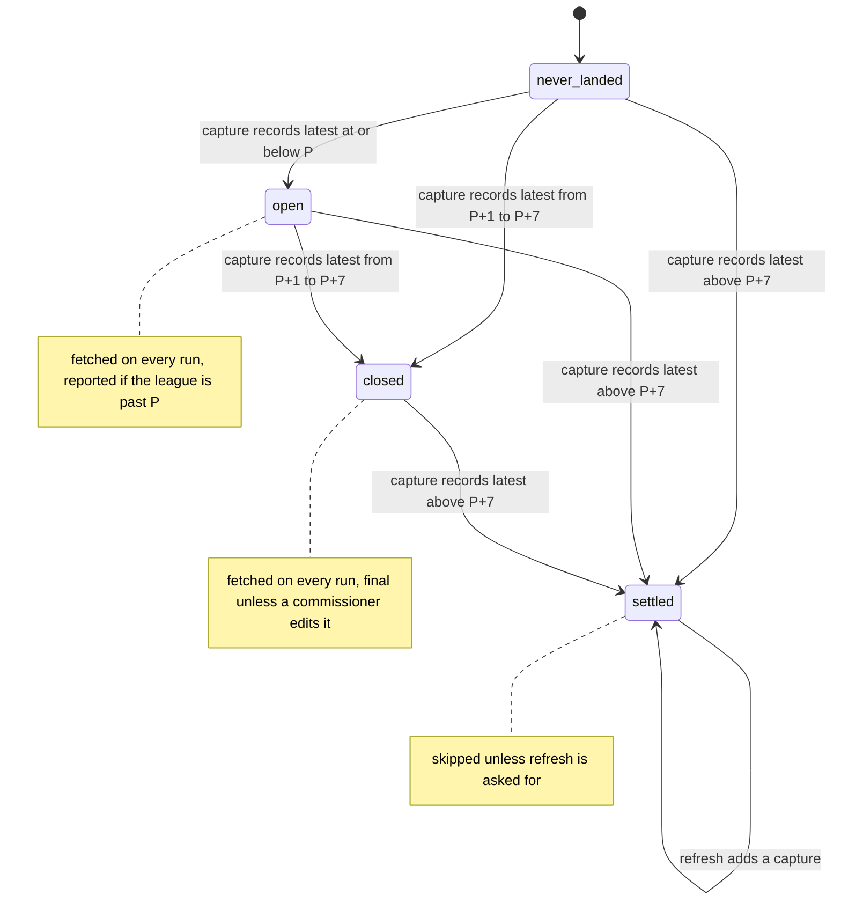

# Settled roster captures — design

Issue: #27 · Requirements: [requirements.md](requirements.md) · Tasks: [tasks.md](tasks.md)

## Overview

Every ESPN roster response already carries the league's `status` block, with the period
ESPN counts as current (`latestScoringPeriod`). The roster fetcher copies that number
into the capture's sidecar as `source_status`. A period is *closed* when one of its
committed captures records a latest period greater than itself: the league had moved on
when that roster was served. Because a commissioner can still correct a recent day, a
closed period goes on being fetched until a capture records a latest period more than 7
past it; then it is *settled* and skipped. Captures made before this change have no `source_status`; for them the evidence is
the settings capture of the same run, which is the rule the audit applies today and which
shows all 180 periods of 2026 final. The audit and the fetch logic call one function.

What states a period moves through, and what moves it:



Nothing here is dbt. Staging already reads the newest capture per period through
`fo_espn_latest`, and the newest capture of a closed period was taken after it closed.

## Evidence

Read from the real landing zone on 2026-10-06; nothing was fetched.

- 180 committed roster captures, one per period, all from run `20260926T162307Z`. Their
  sidecars have the keys `endpoint, fetched_at, params, partitions, request_key, source,
  url`: no status, no size or checksum.
- Every one of the 180 payloads has a top-level `status` block. In all of them
  `latestScoringPeriod` is 186 and `finalScoringPeriod` is 180, whichever period was
  requested (the period-99 payload says 186). So the block is the league's status at the
  time of the request, not the status as of the requested period.
- The settings capture of the same run also says latest 186. Later settings captures say
  186 and 188: the counter keeps rising after the final period, so period 180 can be
  shown closed.
- `fetched_at` is the run's stamp, shared by every capture of a run. It is not the time
  of the individual request, so it cannot place a roster request relative to a period
  boundary.
- The audit reports `180 of 180 rosters captured after their period closed`.
- The roster payloads total 436 MB (2.4 MB each); a settings payload is 6 KB.

## Alternatives considered

### Where the status comes from

| | A — the roster response's own `status` (recommended) | B — the run's settings status, copied to each roster sidecar | C — a status request before each roster request |
|---|---|---|---|
| Extra requests per run | 0 | 0 | one per period fetched |
| Can call a still-open period closed | only if ESPN serves a roster older than the status in the same response | no: the status is older than the roster | no |
| Run crossing a period boundary | each capture is judged by its own response | every capture judged as of the run's start; the period that closed mid-run is fetched again next run | as A |
| Evidence can be re-checked later | yes, it is in the payload | only against another capture | only against another capture |
| Depends on the order of steps in a run | no | yes: settings must be fetched first | yes |

**A — the roster response's own status.** One response holds the roster and the counter,
so there is no gap between them for a period boundary to fall into, which is the
reviewer's condition. It costs nothing and the sidecar value can always be checked
against the payload beside it. Its one assumption is that ESPN does not pair a fresh
status with a stale roster inside one response.

**B — the run's settings status.** Always errs towards fetching again, which is the safe
direction. It loses because the evidence is about a different request, it holds only
while settings is fetched before rosters, and it is the weaker reading of "close enough
to the roster request". It is kept for legacy captures, where nothing better is recorded.

**C — a status request before each roster.** As safe as B and nearly as tight as A, for
double the requests against a private API with no published rate limit.

### How captures without recorded status are judged

| | A — the same run's settings capture (recommended) | B — the capture's own payload | C — refetch all 180 with `--refresh` | D — `fetched_at` after the season's end date |
|---|---|---|---|---|
| Result on 2026 | 180 of 180 settled | 180 of 180 settled | 180 new captures | not measured |
| Read on every run | sidecars, and one 6 KB payload per legacy run | 436 MB of JSON | nothing extra | sidecars |
| Uses the credentials | no | no | yes | no |
| Rests on | status only moves forward, and settings is fetched first | the response itself | the new rule alone | a calendar anchor and a run stamp |

**A — same-run settings.** The audit's existing rule, moved into the shared function.
Cheap, already proven on the real season, and conservative for the reason given in B
above.

**B — the capture's own payload.** The strongest evidence, and it agrees with A on all
180. It loses on cost: every run would parse 436 MB to learn what three small files say,
and the fetch decision would read roster payloads, which spec 0029 tests against.
It is used once, in verification, as a cross-check.

**C — refetch everything.** Leaves one rule and no legacy path for 2026, but the
fixtures and any capture restored from backup would still need a legacy rule, it adds
436 MB, and it needs a credentialed run. It stays available to the owner at any time.

**D — a date.** Ruled out by the reviewer's follow-up, and `fetched_at` is the run's
stamp, not the request's.

### How a commissioner's edit to a closed period is picked up

The owner confirmed on 2026-10-06 that a commissioner can edit a past period's roster,
and asked for it to be accommodated if that is not too expensive. Costs assume one run a
day and 2.4 MB per roster capture.

| | A — re-check for 7 periods after the close (recommended) | B — nothing automatic; `--refresh` by hand | C — refresh every period on every run | D — find edits in the activity log | E — re-check until the period's matchup ends |
|---|---|---|---|---|---|
| Requests per daily run | 9 | 2 | up to 180 | 2, plus those triggered | 2 to 9 |
| Stored per season | about 3.9 GB | about 0.9 GB | about 39 GB | about 0.9 GB | between A and B; depends on matchup lengths, not worked out |
| Edit within a week of the day | caught next run | missed until someone refreshes | caught | caught, if logged | caught only inside the same matchup |
| Edit older than that | `--refresh`; the audit warns if a finished season never had one | the same | caught | caught, if logged | `--refresh` |
| Ingestion interprets a payload | no | no | no | yes: activity types and the period they apply to | yes: the matchup schedule |

**A — a fixed window.** One constant and one comparison added to the rule already there:
settled means evidence greater than P + 7 instead of greater than P. Seven periods is a
scoring week, which is when a lineup mistake still matters to a matchup. Nothing new is
read or interpreted.

**B — by hand.** The cheapest, and what the first draft of this spec proposed. It loses
because the owner wants edits accommodated and a manual step is the one that is
forgotten.

**C — everything, every run.** Catches every edit at any age, for about 40 times the storage of B
and 180 requests a day against a private API.

**D — the activity log.** The right signal in principle. Not checked: whether a
commissioner's lineup edit appears in the log at all, and whether it names the period it
changes. The 2026 log holds 3,098 topics; staging keeps only adds and drops. Reading it
in the fetcher would also break "ingestion never interprets".

**E — until the matchup ends.** Fits the reason edits happen, but the fetcher would have
to read the matchup schedule, and an edit made the day after a matchup ends is missed.

## Decisions

| ADR | Decision | Status |
|---|---|---|
| [0016](../../adr/0016-a-roster-period-is-settled-by-the-status-in-its-own-response.md) | A roster period is settled by the status recorded from its own response | proposed; option chosen by the owner 2026-10-06 |
| [0017](../../adr/0017-a-legacy-roster-capture-is-judged-by-its-runs-settings.md) | A roster capture with no recorded status is judged by its run's settings capture | proposed; option chosen by the owner 2026-10-06 |
| [0018](../../adr/0018-a-closed-roster-period-is-rechecked-for-seven-periods.md) | A closed roster period is fetched again for seven periods | proposed |

## Detailed design

### The sidecar field

`LandingZone.write` gains one optional keyword, `source_status: Mapping[str, Any] | None
= None`. When it is given, the sidecar gains a `source_status` key holding a copy of it;
when it is not, the sidecar is exactly what it is today. The landing zone does not look
inside it. `_sidecar_problem` and `LandingZone.check` are unchanged (R1.4).

A roster sidecar written after this change:

```json
{
  "source": "espn",
  "endpoint": "roster",
  "partitions": {"season": 2027, "league_id": "111111", "scoring_period": 100},
  "…": "the existing keys, unchanged",
  "source_status": {"latest_scoring_period": 101, "final_scoring_period": 180}
}
```

`espn/rosters.py::_fetch_one` builds it from the response it is about to land:
`latest_scoring_period` is `payload["status"]["latestScoringPeriod"]` when that is an
`int` and not a `bool`, otherwise `None` with a warning; `final_scoring_period` likewise
from `finalScoringPeriod`. This is the one place the ingestion package looks inside a
roster response, and it copies two integers; the same module already reads the same two
fields from the settings response to decide which periods exist.

### One function for the evidence

In `espn/rosters.py`, pure and without I/O, so the audit can call it with its own
objects:

```python
def settled_through(
    roster_metas: Iterable[Mapping[str, Any]],
    settings_latest_by_run: Mapping[str, int],
) -> dict[int, int]:
    """For each scoring period, the highest latest-period any of its captures is evidence of."""
```

For each roster sidecar: if it has a `source_status` key, its evidence is that value's
`latest_scoring_period` when the value is a mapping and the counter is an `int` and not
a `bool`; any other shape (null, a list, a string, a missing or non-integer counter) is
no evidence and never an error (R2.2, R3.4). If it has no
such key, its evidence is `settings_latest_by_run.get(meta["fetched_at"])` (R3.1, R3.2).
The result maps period to the largest evidence found. Two predicates read it, with
`RECHECK_PERIODS = 7` a module constant:

- `is_closed(period, evidence)` is `evidence.get(period, 0) > period`;
- `is_settled(period, evidence)` is `evidence.get(period, 0) > period + RECHECK_PERIODS`.

The caller passes sidecars of one league-season only (R2.7), and builds
`settings_latest_by_run` from the committed settings captures of that league-season.

### The fetch path

`backfill_rosters` does one pass before its loop:

1. Collect the sidecars of committed roster captures whose partitions match the season
   and league (`zone.committed(source, endpoint)`, filtered on `meta["partitions"]`
   compared as strings). No payload is read.
2. Take the `fetched_at` stamps of those with no `source_status` key. For committed
   settings captures of the same league-season with one of those stamps, read the payload
   and keep `status.latestScoringPeriod` when it is an integer (R3.3). On the real zone
   that is one 6 KB file.
3. `evidence = settled_through(...)`.

`needs_fetch(period, *, evidence, refresh)` becomes a pure function: true when `refresh`,
or when the period is not settled. "Never landed" needs no separate branch, since a
period with no capture has no evidence. `period_is_over` is deleted: the current run's
status no longer settles anything (R2.5) and is used only by `last_period`.

After each successful fetch the loop adds the status it just recorded to `evidence`.
When the loop ends, `summary.unproven` is every period that exists and that the league
is past, that is every P from 1 to `last_period(status)` with P below the run's
`latestScoringPeriod`, that is still not closed: a failed fetch, a response with no
usable status, or a status that lagged. The command prints them to stderr and exits 1
(R4.1). The period in progress is expected to be open and is not listed; a period that
is closed and inside the re-check window is not a failure either (R6.2).

How the cases in the issue play out:

| Run | Status at run | Period 100 before | Action | After |
|---|---|---|---|---|
| day 100 | latest 100 | never landed | fetch; records 100 | open |
| day 100, evening | latest 100 | open | fetch; records 100 | open |
| day 101 | latest 101 | open | fetch; records 101 | closed |
| days 102–107 | latest 102–107 | closed | fetch; records the day | closed; an edit made meanwhile is landed |
| day 108 | latest 108 | closed | fetch; records 108 | settled |
| day 109 | latest 109 | settled | skip | settled |
| day 105 after an outage since day 100 | latest 105 | open | fetch 100–105; 100–104 record 105 | 100–104 closed, 105 open |
| a past season, first run after it ended | latest 186 | never landed | fetch 1–180; all record 186 | 1–178 settled; 179, 180 closed until one more run |
| a response whose status lags (says 100 on day 101) | latest 101 | open | fetch; records 100; reported, exit 1 | open; closed by the next run |

### Closed, and the capture dbt reads

Closed and settled are facts about the period, proved by *some* capture; `fo_espn_latest` reads the
*newest* capture, ordered by `fetched_at`. The two agree because a period, once closed,
stays closed: any capture landed after the one that proved the period closed was itself
taken after the close, whatever its own sidecar records. Runs cannot interleave (the
writer lock, ADR 0015) and a later run has a later stamp, so "landed after" and "newer
`fetched_at`" are the same order. A newer capture with a missing or lagging status
(a `--refresh` whose response lacks `status`, say) therefore leaves the period as it
was and is still a post-close roster. It differs from the proving capture only when a
commissioner has edited the period in between, and then the newer capture is the more
correct one, which is the point of the re-check.

### The audit

`audit._check_league` judges roster finality by calling `settled_through` with the
roster captures' sidecars and the latest period of each settings capture it has already
read, in place of `closed_at_run`. The closure itself stays: the league-snapshot check
further down (settings, teams, matchups, transactions after the final period) still uses
it and is not changed. Its three findings keep their severities and wording; the warning's text
changes from "no capture shown final by same-run settings" to "no capture shown final",
since the evidence may now be the capture's own. Two findings are new: information
giving the number of closed periods still inside the re-check window (R6.3), and, once
the season is over, a warning listing periods with no capture whose evidence is greater
than the final period (R6.4). The second is what tells the owner a finished season still
needs its closing `--refresh`; 2026 has had it.

### What it costs in a season

With one run a day each period is captured nine times: once while current, then on each
of the eight following days, the last of which settles it. That is 9 requests and about
22 MB per run, 3.9 GB per season, against one request and 0.4 GB under today's unsafe
rule. Without the re-check window it would be two captures and 0.9 GB. dbt reads the
newest capture of each period, so the warehouse does not grow.

## Test strategy

All in pytest with a fake transport; no dbt test changes.

| Requirement | Test | Catches |
|---|---|---|
| R1.1 | a landed roster's sidecar holds the two numbers from the response it landed, not from the run's status | status taken from the wrong place |
| R1.2 | a response with no `status`, and one with a string or boolean counter, lands with null and warns | a crash losing the capture; a non-integer compared as a number |
| R1.3 | settings, teams, matchups, transactions, boxscore and id-map sidecars have today's key set | the field leaking to other endpoints; fixtures drifting |
| R1.4 | captures with, without and with a malformed `source_status` are all committed | a new way for a capture to be quarantined |
| R2.1, R5.1 | a period captured while current, then on the next run: both fetch, and the second closes it; it is fetched on every run through P + 8 and skipped from P + 9 | the R1 defect itself |
| R2.2 | `source_status` that is a list, a string, null, or a mapping without the counter: the capture is committed and is no evidence; nothing raises | one odd sidecar stopping a backfill or the audit |
| R4.1 | a finished season (latest 188, final 180) with all 180 closed reports nothing and exits 0; periods 181–187 are never asked about | periods that do not exist reported as unproven |
| R6.1, R6.2, R5.2 | nine daily runs over one period: fetched on each, skipped on the tenth, exit code 0 throughout; evidence exactly at P + 7 is not settled | an off-by-one in the window; the re-check treated as a failure |
| R6.3, R6.4 | audit: a closed period inside the window is counted as information; a finished season with a period never captured after the final period warns; 2026-shaped data (all evidence 186, final 180) does not | the closing refresh silently skipped; noise on a clean season |
| R2.1 | a period settled by one capture, then given a newer capture with a null status: still settled, skipped on the next run | "newest capture" used instead of "some capture"; a refresh un-settling a period |
| R2.3, R5.2 | an outage: periods 100–104 landed or missing in a mix, run at latest 105 | a closed period skipped because a mid-day file exists |
| R2.4 | `--refresh` fetches settled periods | refresh ignored |
| R2.5 | a period with a mid-day capture is fetched although the run's status is past it | the old rule surviving under a new name |
| R2.6 | the fetch decision with roster payload reads made to raise (the existing 0029 test, kept and re-pointed) | the fetch made slow |
| R2.7 | a settled capture for another league, and for another season, settles nothing here | cross-league leakage |
| R3.1, R5.2 | legacy capture with same-run settings past the period is settled; with settings at the period it is not | legacy captures all trusted, or all refetched |
| R3.2 | legacy capture with no same-run settings, or settings without a counter, is not settled | finality assumed from absence |
| R3.3 | only settings payloads with a legacy roster's stamp are read (others raise) | reading every settings capture each run |
| R3.4 | `source_status` with a null counter plus a qualifying same-run settings is not settled | the fallback papering over a bad status |
| R4.1, R5.2 | a response whose status lags leaves the period listed and the exit code 1; the next run settles it | a silent permanent refetch; no recovery |
| R4.2 | the audit's existing roster tests pass unchanged, plus one where the evidence is `source_status` with no settings capture | the audit and the fetch logic disagreeing |

## Risks

- ESPN serves a roster older than the status beside it — unknown likelihood, impact is
  exactly R1's — not detectable from one response, and not testable until a season is in
  progress. Two ways it could happen: the two parts of one response are computed at
  slightly different instants around a boundary (option B of the status source would
  avoid this; option A would not), or a cache serves a stale roster body (every option
  is exposed to this, B included, since B's status is older than the request but says
  nothing about the age of the roster body). Accepting it is the owner's decision in
  ADR 0016; the in-season check below is what would confirm or refute it.
- A response without a usable status makes its period fetch on every run — low — it is
  reported and exits non-zero each time, so it cannot go unnoticed.
- The rule is stricter than today's, so a season already half-landed by daily runs
  would refetch every closed period once — none exists. For 2026 the owner's next run
  fetches periods 179 and 180 once more, because their evidence (186) is inside the
  window.
- Seven is a judgment, not a measurement: no commissioner edit has been observed in the
  data — a later edit is missed until a `--refresh` — it is one constant, and #66 gives
  the first evidence of how often re-check captures differ.

## Open questions

- **Does a period's roster stop changing at the moment `latestScoringPeriod` passes it?**
  Not verifiable in the off-season. Proposed check in the first week of 2027: for a few
  periods, compare the first capture that closed the period with a later capture of it;
  the roster entries should be identical. Tracked as #66; the re-check captures supply
  the later capture without an extra run.
- **Is 7 the right window?** The owner's to confirm (ADR 0018). It is long enough for a
  correction inside a scoring week and costs 3 GB a season more than no window.
- **Is `status` in every roster response in 2027?** It is in all 180 of 2026. If it
  disappears, R1.2 and R4.1 make every run fail loudly rather than freeze anything.

## Review log

| Source | Finding | Resolution |
|---|---|---|
| design-review | F1 (P1): an older capture can settle a period while dbt reads a newer capture with no evidence | Not a rule change. Added "Settled, and the capture dbt reads": anything landed after the proving capture was also taken after the close, so the newest capture is a post-close roster. The reviewer's sequence is now a test (R2.1 row). |
| design-review | F2 (P1): one response does not prove the roster and status are from the same instant, and the only check is in-season | Escalated to the owner as the decision in ADR 0016. Risks now separates the boundary-instant case, which the conservative option B avoids, from a stale cached roster, which no option avoids. |
| design-review | F3 (P2): `closed_at_run` is also used by the league-snapshot check | Fixed: the closure stays; only its roster-finality use is replaced. |
| design-review, second pass | F1 (P1): a malformed `source_status` (not a mapping) is committed but its handling was unspecified | Fixed: any shape other than a mapping with an integer counter is no evidence and never an error; tested (R2.2). |
| design-review, second pass | F2 (P2): "every period below latest" would report periods 181–187 after the season | Fixed: R4.1 and the fetch path limit it to periods that exist; tested on a finished season. |
| design-review, second pass | F3 (P2): a test row still described the pre-window sequence | Fixed: the row now fetches through P + 8 and skips from P + 9. |

## Amendments
