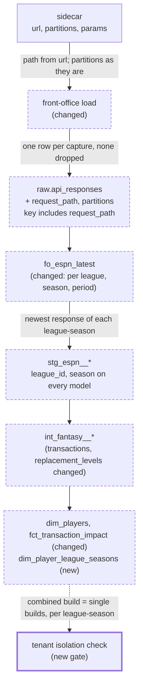

# League and season identity through raw storage and every model — design

Issue: #28 · Requirements: [requirements.md](requirements.md) · Tasks: [tasks.md](tasks.md)

## Overview

A capture's league and season exist today in two places that nothing downstream reads:
the URL path and the landing partitions, both in its sidecar. This design carries them
through. The loader stores the request path and the partitions on every raw row and keys
the table by the path. The latest-response macro picks the newest response *per league
and season*. The models that drop league and season gain them, and `dim_players` splits
into a player-level dimension and a per-league-season table. A second fixture of
four league-seasons, and a check that each builds the same combined as alone, prove it
and keep proving it. The real warehouse is rebuilt from the untouched landing zone into
a new file and compared before the owner swaps it.



Dashed boxes change; the thick one is new. The dotted edge is the check, not a dependency.

### dbt concepts this touches

- **A source is not a model.** `raw.api_responses` is created by the Python loader; dbt
  only declares it (`source()`), so dbt cannot migrate it. A change to its columns is a
  change to the loader and a rebuild of the table, with the `sources:` YAML updated to
  describe the new columns.
- **A grain is a promise about a key.** Adding league and season to a model's key is a
  grain change even when today's row count does not move. The uniqueness test is what
  states the grain, so each changed model's test moves to the full key.
- **Conformed dimension.** A dimension that means the same thing to every fact that joins
  it, whatever league or season the fact is about. `dim_players` becomes one: a row is a
  player, full stop. What is only true of him in one league-season moves to its own
  model at that grain (ADR 0012).
- **`--target` and environment variables.** A dbt *target* is a named connection in
  `profiles.yml`. The `ci` target's path is fixed today (`ci.duckdb`); it becomes
  `env_var('FO_CI_DUCKDB_PATH', 'ci.duckdb')`, so the isolation check can build several
  small warehouses with the same target and no new SQL, and nothing changes for a run
  that does not set the variable.

## Alternatives considered

### How a raw response is identified

| Criterion | A — path in the key, partitions as a column (chosen) | B — partitions in the key | C — full URL in the key | D — path folded into `request_key` |
|---|---|---|---|---|
| Separates leagues and seasons | yes | yes | yes | yes |
| Equivalent requests are equal | yes: path has no query string | yes | **no**: query order and form vary | yes |
| Identity is the request, not a folder choice | yes | **no**: `offset` is a partition on 2 of 3 transaction captures | yes | yes |
| Old sidecars rebuild unchanged | yes, 2,688 of 2,688 have a URL | yes | yes | yes |
| Existing readers of `request_key` | unchanged | unchanged | unchanged | **change**: `fo_request_param`, the audit |
| Staging can read league and season | from `partitions` | from the key string | by parsing the URL | by parsing the key |

**A.** The path is what ESPN uses to tell leagues and seasons apart, so it is the honest
key; partitions are stored because they are already structured and are what staging
should read. **B** makes a folder layout the definition of identity. **C** was the review
response's first proposal and the reviewer's follow-up rejected it for the query string.
**D** saves a column at the cost of changing what an existing one means. See
[ADR 0011](../../adr/0011-a-raw-response-is-identified-by-its-request-path-and-parameters.md).

### The grain of `dim_players`

| Criterion | A — per league-season | B — conformed player + per-league-season table (chosen by the owner) | C — one row per player, latest anywhere |
|---|---|---|---|
| Every attribute true at the grain | yes | yes | no: position and roster dates are per league-season |
| One place to refer to a player across leagues and seasons | no | yes | yes, but wrong |
| Combined build equals single build | yes | the per-league-season table yes; the player dimension by design no | no |
| Models to maintain | 1 | 2 | 1 |
| 2026 output | same 498 rows + 2 columns | 498 + 498; five columns move | unchanged |

A was the recommendation. The owner chose **B** on 2026-10-04: several seasons and
leagues are the known intent, so a single reference for a player is worth having now.

See [ADR 0012](../../adr/0012-players-have-a-conformed-dimension-and-a-league-season-table.md).

### How isolation is proved

| Criterion | A — combined build equals single builds (chosen) | B — per-model key tests only | C — make the main fixture multi-tenant |
|---|---|---|---|
| Catches a pool or window using the wrong league | yes | no | no |
| Names the leaking model | yes | n/a | no |
| Covers models written later | yes, automatically | only if someone writes the test | partly |
| Cost | 4 extra fixture builds per gate run | none | every fixture row count changes |

See [ADR 0013](../../adr/0013-isolation-is-proved-by-building-each-league-season-alone.md).

## Decisions

| ADR | Decision | Status |
|---|---|---|
| [0011](../../adr/0011-a-raw-response-is-identified-by-its-request-path-and-parameters.md) | The raw key gains the request path; partitions are stored for staging to read | proposed |
| [0012](../../adr/0012-players-have-a-conformed-dimension-and-a-league-season-table.md) | `dim_players` is one row per player everywhere; `dim_player_league_seasons` holds what is per league-season | proposed |
| [0013](../../adr/0013-isolation-is-proved-by-building-each-league-season-alone.md) | Isolation is a gate: every model, combined build against single builds | proposed |

## Detailed design

### Loader (`ingestion/src/front_office/landing.py`, `load.py`)

`LandingZone.request_path(url)` (new, static): `urlsplit(url).path` with a trailing `/`
removed. Empty string if the URL has no path.

`raw.api_responses` becomes:

| Column | Type | Meaning |
|---|---|---|
| `source`, `endpoint` | varchar | as now |
| `request_path` | varchar not null | new; from the sidecar's `url` |
| `request_key` | varchar not null | as now: canonical parameters |
| `fetched_at` | varchar not null | as now |
| `partitions` | json not null | new; the sidecar's `partitions`, as written |
| `payload`, `file_path` | | as now |

Primary key: (`source`, `endpoint`, `request_path`, `request_key`, `fetched_at`).

- A sidecar is loadable if it has `source`, `endpoint`, `fetched_at`, `request_key`,
  `url` and `partitions`. Anything less is skipped with the existing warning (the 201
  payloads with no sidecar are the case today).
- **Collisions fail.** If two files in a run have the same key, or a file has the key of
  an existing row with a different `file_path`, the load raises an error naming the
  files and inserts nothing. Today the first wins silently. The same file seen again is
  not a collision and inserts nothing (R1.7).
- **Old tables are refused.** If `raw.api_responses` exists without `request_path`, the
  load raises an error saying to load into a new warehouse file. It does not drop or
  alter the table.
- `audit.check_loaded` compares on the full key.

No extractor, sidecar or landed file changes.

### `fo_espn_latest` (changed macro)

Selects `payload`, `request_key`, `fetched_at` as now, plus `league_id` (text) and
`season` (integer) read from `partitions` through the `fo_json_*` macros. The window
partitions by league, season and, when `extra_partition` is given, that parameter. Its
nine callers get per-league-season selection with no change of their own, and keep
reading league and season from the payload as they do today.

`stg_espn__payload_identity_matches_partitions` (new singular test): for the settings,
teams, roster and matchups responses, the payload's `$.id` and `$.seasonId` equal the
partitions' `league_id` and `season` (R2.3). A capture landed under the wrong folder
would otherwise be attributed by its folder in one model and by its payload in another.

### `stg_espn__transactions` (changed)

Its own latest logic becomes per league-season: the pages whose `fetched_at` is the
maximum for that league and season. `league_id` and `season` come from `partitions` (the
communication payload carries neither) and are added as the first two columns. The
dedupe is per (league, season, message id). Key and uniqueness test:
(`league_id`, `season`, `transaction_id`).

### `stg_espn__scoring_periods` (changed)

`generate_series(1, final_scoring_period)` per anchor row, in place of one series to the
global maximum. The single-column `unique` tests on `scoring_period` and `scoring_date`
become combinations with league and season.

### Intermediate and marts

| Model | Change |
|---|---|
| `int_fantasy__transactions` | gains `league_id`, `season`; unique on (`platform`, `league_id`, `season`, `transaction_id`); the join to teams uses them |
| `int_fantasy__replacement_levels` | grain becomes (`platform`, `league_id`, `season`, `day_kind`, `component`). Free-agent days, pools, played days and totals are per league-season; N is that league-season's team count, by a join, not a scalar subquery. The spine is league-seasons × kinds × components |
| `dim_player_league_seasons` (new, table) | grain (`platform`, `league_id`, `season`, `platform_player_id`): every player on a roster day or in a transaction of that league-season. Columns: the key; `mlbam_player_id`, `player_resolution` and `player_name` as resolved **in that league-season** (the crosswalk row for a rostered player; the id map by id, name null, for a transaction-only one, as now); `default_position`, `replacement_group`, `first_rostered_date`, `last_rostered_date`, `is_transaction_only`, each computed within the league-season exactly as `dim_players` computes it today. The MLB totals used to group a position-less player are **of that season only** (`int_mlb__player_game_days.season` = the row's `season`): today they are summed over every MLB day loaded, which with two seasons would let 2027 starts change a 2026 group |
| `dim_players` | grain unchanged: (`platform`, `platform_player_id`), every player in any `dim_player_league_seasons` row. Columns: `platform`, `platform_player_id`, `mlbam_player_id`, `player_resolution`, `player_name`, all three copied from **one** row: his latest league-season (highest `season`, then latest `last_rostered_date` with nulls last, then lowest `league_id`). It is built *from* the league-season table, so the name shown and the name matched on are the same observation. It is a reference: no league-season model reads an MLBAM id from it |
| `fct_player_category_value` | joins `int_fantasy__replacement_levels` on league and season too |
| `fct_transaction_impact` | gains `league_id`, `season`; scoring bounds, next drop, next add, roster days, started days, replacement levels and category scales are all joined within the league-season. It reads `mlbam_player_id` and `replacement_group` from `dim_player_league_seasons`, not from `dim_players` |
| `int_fantasy__player_crosswalk` | grain becomes (`platform`, `league_id`, `season`, `platform_player_id`): one resolution per player **per league-season**. The canonical name is the one on his latest roster snapshot of that league-season (scoring period, then `fetched_at`, then name). The id map is tried by id first, as now. The name fallback matches only a name that belongs to exactly one MLB player **who appeared in that MLB season**, so loading another season can neither create nor destroy a match |
| `int_fantasy__roster_days` | joins the crosswalk on league and season as well as player; columns unchanged |
| `int_mlb__player_game_days` | gains `season`, the MLB season of that date's games (from `stg_mlb__games`), so "that season's MLB data" is one definition used by the crosswalk and by the totals below. It gets no league column |
| Other MLB and id-map models, `int_fantasy__stat_components`, seeds | unchanged: they describe no league |

Any other single-league assumption is whatever the isolation check names; each is fixed
by adding the key to a join, a window or a group. A fix that needs more than that is a
spec gap and is recorded as an amendment.

### The combined fixture (`fixtures/landing_multi/`)

Generated by `scripts/make_multi_fixtures.py` from `fixtures/landing/` alone, never from
`data/raw/`, so nothing new can reach it from the real league. Four league-seasons:

| League-season | Built from | Differs by |
|---|---|---|
| `111111`, 2026 | the existing fixture | nothing (copied) |
| `222222`, 2026 | the same | league id in payloads, partitions, URLs and paths; **same fetch timestamps**; one rostered player's name respelled (a public major leaguer, accent removed), so the conformed dimension has a real choice to make |
| `111111`, 2027 | the same | season; settings say the season is **one** scoring period long; only period 1's roster; matchups and transactions cut to that day; fetch timestamps one year later so the anchor puts period 1 on a 2027 date |
| `222222`, 2027 | the 2027 one | league id; same fetch timestamps as `111111`, 2027 |

MLB: the fixture's games for the first date are copied to the 2027 date with new
`gamePk`s and dates, and a 2027 schedule response lists them, so the 2027 league-seasons
have real production. The id map is copied.

The existing privacy test scans this root as well (R5.2).

### The isolation check (`scripts/check_tenant_isolation.py`, a gate)

1. Load `fixtures/landing_multi/` into a combined warehouse; `dbt build` it (models and
   tests).
2. For each of the four league-seasons: copy to a temporary root that league-season's
   ESPN folders, **that season's** MLB folders (`season=` is an MLB partition) and the id
   map; load into its own file (`FO_CI_DUCKDB_PATH`); `dbt run --target ci` (models only).
3. The set of relations in the staging, intermediate, marts and reconciliation schemas
   must be the same in every warehouse; a relation missing from one is reported.
4. For every relation:
   - with `league_id` and `season` columns: its rows for that league-season must equal
     the single warehouse's rows as **multisets** (`EXCEPT ALL` both ways, all columns),
     so a duplicated row on one side and a different duplicate on the other cannot cancel;
   - without them (MLB, id map, platform rules): every row of the single warehouse must
     be in the combined one (`EXCEPT ALL` one way). The combined build holds both
     seasons' MLB data, so it is a superset, never a different answer.
5. Print every relation and league-season that differs, with counts, and exit non-zero
   if any does.

`dim_players` is the one relation defined over everything loaded (ADR 0012), so it is
**exempt from step 4 by name**, in a one-entry list at the top of the script. It is held
to its own invariants instead (R4.9): it has exactly the players of
`dim_player_league_seasons`, and each row equals the league-season row it is taken from.
The respelled player in league `222222` makes the exemption real on the fixture: his
`dim_players` row differs between the combined build and the `111111`-only build, and
the check must still report no differences.

A relation that should carry league and season but does not fails step 4 and is named.
Because a single build holds only its own season's MLB data, a league-keyed model that
reads another season's MLB rows in the combined build also differs and is named; that is
how the `dim_players` totals above would have been caught. Floating-point columns are compared exactly: the same rows through the same SQL
must give the same bits. If an order-dependent aggregate makes that untrue, it is
recorded as an amendment and decided by the owner, as in #52.

`.agentic/gates` and CI run it after the main fixture build.

### Comparing warehouses (`scripts/compare_warehouses.py`)

Given two warehouse files: first the relation names, reporting any present in one and
not the other; then, for every relation in both, row counts and `EXCEPT ALL` both ways
over the columns they share, reporting columns only one side has. Used once for the real
rebuild (R6) and reusable. It shares its diff function with the isolation check.

### Rebuilding the real warehouse (owner-run steps, documented in the README)

```bash
uv run front-office load --db data/warehouse_r2.duckdb
cd dbt && FO_DUCKDB_PATH=../data/warehouse_r2.duckdb DBT_PROFILES_DIR=. uv run dbt build
uv run python scripts/compare_warehouses.py data/warehouse.duckdb data/warehouse_r2.duckdb
```

The old file is kept until the comparison is clean and the owner renames them.

## Test strategy

| Requirement | Test | Catches |
|---|---|---|
| R1.1, R1.2 | pytest: `request_path` for each real URL shape (league root, `/communication/`, schedule, boxscore, id map), with and without query string and trailing slash | a query string or host leaking into identity |
| R1.3, R5.4 | pytest: four captures, 2 leagues × 2 seasons, one second → 4 rows | today's 4 → 1 |
| R1.4 | pytest: two files with one key → error naming both, table unchanged | a silent first-wins |
| R1.5 | pytest: a table without `request_path` → error, table unchanged | an insert into the old shape, or a silent drop |
| R1.6 | pytest on the audit: a capture loaded under another league's key is reported | the audit matching on the old key |
| R1.7 | existing rerun test: loading twice inserts once | double loading |
| R2.1 | dbt unit test on a staging model through the macro: two leagues, the older capture of league A is not chosen for league B | a global latest |
| R2.2 | dbt unit test: two league-seasons whose newest transaction runs differ in time both keep their pages | one league's log hidden by another's later run |
| R2.3 | singular `stg_espn__payload_identity_matches_partitions` | a capture landed in the wrong folder |
| R3.1 | not_null on `league_id`, `season`; unique on the full key | transactions with no owner |
| R3.2 | singular: each league-season's periods run 1 to its own final period, with no gaps | a short season padded to a long one's length |
| R3.2 | existing `stg_espn__scoring_periods_start_on_opening_day`, changed to compare each league-season's first date with the first MLB game of **its** season (today it takes the earliest MLB date of everything loaded, so a 2027 season would be held to 2026's opening day) | a test that passes only while one season is loaded |
| R3.3 | YAML uniqueness on full keys for every ESPN staging model | a key that only held for one league |
| R4.1 | unique on the full key of each of the three models | a grain that only held for one league |
| R4.11 | dbt unit tests on the crosswalk: (a) a name unique among 2026's MLB players and shared by two players in 2027 still resolves in 2026 and is unresolved in 2027; (b) a player absent from the id map who has no roster in 2026 and is rostered in 2027 is unresolved in 2026 and matched by name in 2027; (c) one player spelled two ways in two leagues resolves in each league from that league's own spelling | another season creating or destroying a match (review 2, F1); one league's spelling deciding another's match |
| R4.12 | dbt unit test on `fct_transaction_impact`: a 2026 drop of a player resolved only in 2027 has a null `total_value`; the isolation check | an earlier season's transaction valued through a later season's match |
| R4.7 | unique on (`platform`, `platform_player_id`), as today; dbt unit test: a player in two leagues and two seasons has one row, equal to his latest league-season's | a player doubled by a second league; a name and an id taken from different observations (review 2, F3) |
| R4.8 | unique on the full key; existing `dim_players_covers_every_league_player` and `dim_players_resolved_players_have_a_group`, moved to the new model and scoped by league-season; last task: its seven attribute columns equal today's `dim_players` on 2026 | a player missing from a league-season; values changing in the move |
| R4.9 | `relationships` both ways between the two models; singular `dim_players_equal_their_latest_league_season` | the two models out of step; the exemption from the isolation check hiding a wrong row (review 2, F2) |
| R4.10 | singular `dim_player_league_seasons_rostered_players_are_resolved`, severity warn: rostered players with resolution `unresolved` (0 on 2026) | an unmatched player noticed on the build that causes it instead of in a zero later |
| R4.2 | dbt unit test: two leagues of different sizes get pools of their own size, from their own free agents | N counted over all leagues; another league's roster removing a free agent |
| R4.3 | dbt unit test: a drop in a short season ends at that season's last date | a window running to another season's end |
| R4.6 | dbt unit test on `dim_player_league_seasons`: a position-less player who relieves in 2026 and starts in 2027 is `RP` on his 2026 row and `SP` on his 2027 row; unique + not_null on `int_mlb__player_game_days` (`mlbam_player_id`, `game_date`) unchanged, `season` not null | one season's appearances deciding another season's group; a date split across two seasons |
| R4.4, R4.5 | the isolation check | a join missing league or season, in any model |
| R5.1, R5.2 | pytest: the generator reproduces the committed `landing_multi` byte for byte; the privacy test scans it | a hand edit; member data |
| R5.3 | the isolation check, as a gate | cross-attribution anywhere |
| R6.1 | pytest: the comparison reports a changed value, a missing row, an added column, a relation missing from one side, and the equal-count case (A, A, B, C against A, B, B, C) | a comparison that passes on anything; `EXCEPT` hiding duplicates |
| R6.2 | last task, on the real landing zone | any 2026 number moving |

Tests are written before the code they test. Existing dbt unit tests that mock
`raw.api_responses`, `int_fantasy__replacement_levels` or `int_fantasy__transactions`
gain the new columns in their mock rows; those that mock `dim_players` for its
`replacement_group` mock `dim_player_league_seasons` instead.

## Risks

- **The isolation check finds more than five models.** Likely: the five are what reading
  found, and singular tests assume one league too. Each is a missing key on a join; the
  check is the worklist.
- **The exact-bits comparison trips on an order-dependent aggregate.** Possible, as #52
  found with `stddev_pop`; that aggregate is gone since #58, and averages over small
  fixtures are usually exact. If it happens it goes to the owner, not to a tolerance.
- **Fixture generation for 2027 is fiddly**: the anchor date, the trimmed matchup, new
  `gamePk`s. Bounded by generating from the committed fixture with a byte-for-byte test.
- **Gate time grows.** Four fixture builds; measured in the build and reported.
- **Readers of the moved columns.** `fct_transaction_impact` reads `replacement_group`
  from `dim_players` today and must read it from `dim_player_league_seasons`; the YAML
  relationship test on `fct_player_category_value.platform_player_id` stays on
  `dim_players`. Task 5 greps for every reader of the five columns.
- **`dim_players` is not the same alone as combined**, by design, and is exempt from
  the gate by name. Its own invariants (R4.9) replace the row comparison, and no
  league-season number reads from it.
- **The crosswalk's grain changes.** It is ephemeral (inlined as a CTE) and read by
  `int_fantasy__roster_days` only; the join gains two keys. On 2026 every roster day's
  `mlbam_player_id` and `player_resolution` must be unchanged, which is an expected
  value.
- **The real rebuild differs.** If any shared column differs, nothing is swapped and the
  difference is investigated; that is the point of building beside the old file.

## Open questions

- **Whether pre-2018 ESPN seasons use a different path.** Believed so (#57). The key
  handles any path; whether staging can parse those payloads is #57's question.
- **How a collision is resolved, once one has been seen.** Decided by the owner on
  2026-10-04: the load fails and inserts nothing (R1.4), and choosing which of two
  colliding files to keep is deliberately *not* designed now. Some mechanism will be
  needed eventually; it waits until collisions have been observed in live operation and
  what causes them is understood. Until then the only resolution is a person removing or
  fixing a file.
- **MLB as the source of truth for players.** Raised by the owner on 2026-10-04 and
  split out as #60. `dim_players` here is keyed by the platform's player id; keying it by
  the MLB id is the intended direction and is not part of this build.
- **One player, two MLB ids.** With resolution per league-season, a name match could in
  principle give the same ESPN player different MLB ids in different seasons (a namesake
  appears). The league-season rows would each be right for their season; `dim_players`
  would show the latest. Not handled further here; #60, which keys the dimension by MLB
  id, has to decide what that case means.
- **Whether a relabelled league is enough of a second league.** It proves isolation. It
  cannot show that a league with different categories or roster slots builds; no such
  data is available without fetching it.
- **Gate time.** Not measured until the check exists.

## Evidence

Read-only checks of `data/raw/` and `data/warehouse.duckdb`, run 2026-10-04.

| Claim | Measured |
|---|---|
| The collision | a temporary landing zone with 4 settings captures (2 leagues × 2 seasons, one `fetched_at`): `load_landing_zone` inserts 1 row, payload of the first league and season |
| Sidecars | 2,688, none missing `url`, `partitions`, `params`, `request_key` or `fetched_at`; 2,889 payloads, so 201 have no sidecar |
| The new key | 2,688 distinct keys, 0 collisions (the old key also gives 2,688 on one league-season) |
| Paths | ESPN: `/apis/v3/games/flb/seasons/2026/segments/0/leagues/<id>` for settings, teams, roster, matchups, and the same with `/communication` for transactions (the URL has a trailing slash). MLB: `/api/v1/schedule`, `/api/v1/game/<pk>/boxscore`. Id map: `/PLAYERIDMAPCSV` |
| Partitions | ESPN: `league_id`, `season` on all; `scoring_period` on roster; `offset` on 2 of 3 transaction captures. MLB: `season` with `game_type` or `game_pk`. Id map: `provider` |
| Loaded today | 2,688 rows: settings 3, teams 3, roster 180, matchups 2, transactions 3, schedule 2, boxscore 2,494 (2,430 games), id map 1 |
| Models without league and season | of 39 relations: `stg_espn__transactions`, `int_fantasy__transactions`, `int_fantasy__replacement_levels`, `dim_players`, `fct_transaction_impact`; and by design the MLB and id-map models and `int_fantasy__stat_components` |
| Global aggregates | `stg_espn__scoring_periods`: `generate_series(1, (select max(final_scoring_period) …))`; `int_fantasy__replacement_levels`: `(select count(*) from int_fantasy__teams)` twice; `fct_transaction_impact`: `scoring_bounds` cross-joined, and the category scales joined on category alone |
| Single-column uniqueness | `stg_espn__scoring_periods.scoring_period` and `.scoring_date`; `stg_espn__transactions.transaction_id`; `dim_players.platform_player_id` (which stays) |
| `fo_espn_latest` callers | 9 staging models; `stg_espn__transactions` has its own global `max(fetched_at)` |
| Fixture today | one league (`111111`), 2026, two scoring periods, 11 payloads, 2 boxscores |

## Review log

| Source | Finding | Resolution |
|---|---|---|
| design-review 2026-10-04 | F1 (P0): `dim_players` sums MLB appearances over every season loaded, so one season's starts could change another season's group, and the isolation check could not see it because every single build held all the MLB data | Changed: the totals are per season (R4.1, unit test); and single builds now load only their own season's MLB data, so a cross-season read of MLB rows is something the check does see |
| design-review | F2 (P1): `stg_espn__scoring_periods_start_on_opening_day` compares every league-season with the earliest MLB date loaded and would fail the combined build | Changed: the test is scoped to the season, in task 4 and the test strategy |
| design-review | F3 (P1): the `ci` target's path is fixed, so the single builds could not be pointed at separate files | Changed: the `ci` path reads `FO_CI_DUCKDB_PATH`, defaulting to `ci.duckdb` |
| design-review | F4 (P1): `EXCEPT` compares distinct rows, so equal counts with different duplicates pass | Changed: `EXCEPT ALL` both ways, with a test for that case |
| design-review | F5 (P2): comparing only relations present in both files hides a missing relation | Changed: relation names are compared first and a missing one is reported |
| design-review, second pass 2026-10-04 (after the owner chose the two-table player shape) | F1 (P0): the league-season table took its MLBAM id from the global `dim_players`, whose name match looks at every season loaded, so a 2027 match could value a 2026 transaction | Changed, by the owner's decision (reversing the earlier deferral to #60): resolution is per league-season (R4.11, R4.12); the league-season table carries the id; no league-season model reads `dim_players`; three crosswalk unit tests and one on the transaction fact |
| design-review, second pass | F2 (P1): the gate held `dim_players` to the row comparison while ADR 0012 said its rows may differ, and the copied fixture hid the contradiction | Changed: `dim_players` is exempt by name and held to R4.9; the fixture respells one player in the second league so the exemption is exercised |
| design-review, second pass | F3 (P2): `dim_players` chose a name by one ordering and the crosswalk matched on a name chosen by another | Changed: `dim_players` is built from the league-season table, so name, id and resolution are one observation |

## Amendments

