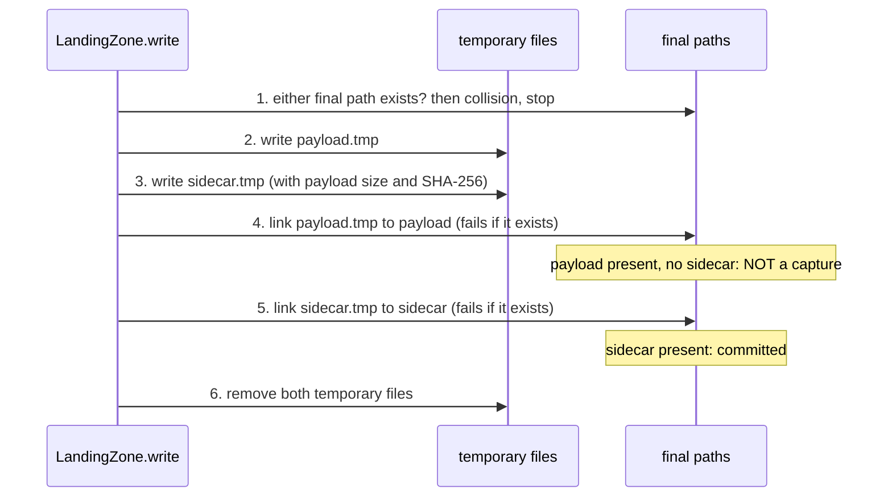

# Committed captures — design

Issue: #29 · Requirements: [requirements.md](requirements.md) · Tasks: [tasks.md](tasks.md)

## Overview

A capture becomes a thing with one definition: a payload and a sidecar that are both in
place and agree. The writer publishes the payload first and the sidecar last, each
without replacing anything, so the sidecar's presence is the commit. Every reader, the
fetch logic included, asks one function for committed captures. Anything else found
under the landing root is moved to a quarantine directory beside it at the start of the
next run, under a lock that allows one writer at a time, and the entity is fetched again.
Nothing is deleted, and no file already landed changes.

A failure before step 4 leaves only temporary files. A failure between steps 4 and 5
leaves a payload with no sidecar. Both are swept on the next run.

### Python concepts this touches

Nothing here is dbt. Two operating-system facilities carry the design:

- **A hard link** (`os.link`) gives a file a second name. Creating it fails if the name
  is taken, and it is atomic, so it is a publish that cannot replace anything.
  `Path.replace`, used today, is atomic too but overwrites.
- **An advisory lock** (`fcntl.flock`) is held on an open file and released by the kernel
  when the process ends, however it ends.

## Alternatives considered

### How a pair is made to land together

| | A — sidecar as commit marker (chosen) | B — a directory per capture | C — one envelope file | D — exclusive create on the final path |
|---|---|---|---|---|
| Pair is atomic | no, but a half-written pair is recognisable and never read | yes: one directory rename | yes: one file | no |
| Existing 5,118 captures | untouched | every one moves | every one is rewritten | untouched |
| Payload saved exactly as it arrived | yes | yes | no | yes |
| Refuses to replace | yes (`os.link`) | yes (rename onto a non-empty directory fails) | yes (`os.link`) | yes |
| A reader can see a file mid-write | no | no | no | **yes** |

See [ADR 0014](../../adr/0014-a-capture-is-committed-by-its-sidecar.md). B is the better
shape for a new project; here it means migrating the landing zone, its readers and the
backup to fix a window that the commit marker already makes harmless.

### What happens to a partial capture

| | A — sweep at the start of a backfill, under a lock (chosen) | B — leave it, readers ignore it | C — repair command only | D — delete |
|---|---|---|---|---|
| Entity is refetched | yes | yes | yes | yes |
| Landing root stays clean | yes | no: audit errors accumulate | only if someone runs it | yes |
| Can lose the only copy | no | no | no | **yes** |
| Needs a lock | yes | no | yes | yes |

See [ADR 0015](../../adr/0015-incomplete-captures-are-quarantined-under-a-writer-lock.md).
B is correct and simplest, and is what the landing zone has effectively run on since
September: 201 such files, and an audit that has reported 5 errors on every run.

## Decisions

| ADR | Decision | Status |
|---|---|---|
| [0014](../../adr/0014-a-capture-is-committed-by-its-sidecar.md) | The sidecar is the commit marker, published last by hard link; a collision stops the run; new sidecars record the payload's size and SHA-256 | proposed |
| [0015](../../adr/0015-incomplete-captures-are-quarantined-under-a-writer-lock.md) | Uncommitted files are moved to a quarantine beside the landing root at the start of a backfill, under an exclusive `flock`; nothing is deleted | proposed |

## Detailed design

All in `ingestion/src/front_office/`. No dbt file changes.

### `landing.py`

**`LandingZone.write`** follows the six steps in the diagram.

- Temporary names stay as now (`<name>.tmp-<pid>`), beside the final file, so the link is
  within one directory and one filesystem.
- New sidecar fields: `payload_bytes` (int) and `payload_sha256` (hex), computed from the
  exact bytes written. Existing fields and their order are unchanged; the two are added
  at the end.
- `LandingCollision(Exception)`: raised in step 1 if either final path exists, and in
  step 4 or 5 if `os.link` raises `FileExistsError`. The message names the path. If step
  5 collides after step 4 succeeded, the payload just published is unlinked again before
  raising, so a collision publishes nothing (R1.3).
- The temporary files are removed in a `finally`.
- The payload is serialised once to bytes; that is what is written and hashed.

**`LandingZone.committed(source=None, endpoint=None, partitions=None)`** (new): yields a
`Capture` (path, parsed sidecar, and the payload loaded only when asked for) for every
committed capture, sorted by path. With `partitions` given, only that entity's folder is
examined, which is what the fetch logic needs.

**`LandingZone.check(path, deep=False)`** (new) is the one place that decides, and
returns either "committed" or the reason it is not. Shallow, the default:

1. the payload and the sidecar both exist;
2. the sidecar parses as JSON and has `source`, `endpoint`, `partitions` (a mapping),
   `request_key`, `fetched_at` and `url`, each of the expected type;
3. the sidecar agrees with where the pair is: its source, endpoint, partitions and
   `fetched_at` are the ones the path spells out. This is the audit's existing
   `_sidecar_disagreement`, moved here, so a pair filed under the wrong entity is not
   counted for that entity;
4. if the sidecar has `payload_bytes`, the payload's size on disk equals it.

Deep adds: the payload parses as JSON, and if the sidecar has `payload_sha256` the
payload hashes to it. The shallow check reads one small file and stats another, so the
fetch logic can afford it for every entity on every run; the deep check reads every
payload (2.1 GB today) and is for the audit and `repair --deep`. A capture that passes
shallow and fails deep is still committed, and is an audit error: for a capture written
by this code the size check already rules out truncation, so it means corruption at
rest, which a person should look at before anything moves. The loader, which parses
each payload anyway, fails naming the file if one does not parse (R2.7).

Every reader treats a file that vanishes between listing and reading as not committed
(R2.8): a sweep may move an uncommitted file while `load` or `audit` is running, and
neither holds the lock.

**`LandingZone.has_landed`** and **`iter_landed`** are rebuilt on `committed`:
`has_landed(source, endpoint, partitions)` is true when the entity's folder holds at
least one committed capture, whatever its name; `iter_landed` yields committed captures
only (today it yields a lone payload with empty metadata).

**`LandingZone.scan`** keeps classifying every file (`committed`, `payload_only`,
`sidecar_only`, `temp`, `other`) and gains `invalid` for a pair that exists but fails the
committed test. It ignores nothing: the lock file and the quarantine are not under the
root.

**`LandingZone.sweep(run_stamp, dry_run=False, deep=False)`** (new): for every scanned
file whose kind is not `committed`, move it to
`<quarantine root>/<run_stamp>/<relative path>` with `os.rename` after creating the
directories; for `invalid`, both files of the pair move; with `deep`, committed pairs
that fail the deep check move too. Before the first move it creates the quarantine root
and writes a `.gitignore` containing `*` into it, so the directory is ignored by git
wherever the landing root is (R3.2); a `--raw-root` other than the default would
otherwise put private payloads in a path the repository's own ignore rules do not
cover.
Returns the list of (kind, relative path). If the destination exists (the same stamp
swept twice), a numeric suffix is added to the run directory; nothing is overwritten.
`dry_run` returns the list and moves nothing. The quarantine root is
`<landing root>_quarantine`, so `data/raw` sweeps to `data/raw_quarantine`, on the same
filesystem (a rename, not a copy).

**`LandingZone.writer_lock()`** (new): a context manager that opens
`<landing root>.lock`, takes `fcntl.flock(LOCK_EX | LOCK_NB)`, and raises
`LandingLocked` naming the lock file if another process holds it.

### Fetch logic

`mlb/boxscore.py` and `espn/rosters.py` lose their private `_has_landed` helpers and call
`zone.has_landed(...)` with the entity's partitions. `games_from_landed_schedule` already
goes through `iter_landed`, so it reads committed schedules only once that changes.

In the backfill loops, `LandingCollision` is re-raised alongside `AuthExpired`: it stops
the run instead of being counted as one failed entity (R1.4).

### `cli.py`

- Every `backfill` subcommand runs inside `zone.writer_lock()`, sweeps first, logs what
  moved, then fetches. `LandingLocked` and `LandingCollision` exit non-zero with their
  message.
- New `front-office repair [--raw-root] [--dry-run]`: takes the lock (not for
  `--dry-run`), sweeps, and prints one line per file and a count.
- `load` and `audit` are unchanged in what they lock: nothing.

### `load.py`

Reads through `iter_landed`, so it loads committed captures only. Its own
"no complete metadata sidecar" skip remains as a second check and should now never fire
after a sweep.

### `audit.py`

- `check_landing` uses the same committed test as `LandingZone.committed`; its existing
  errors for `payload_only`, `sidecar_only`, `temp` and unreadable pairs stay (R5.1).
- New: for a committed capture whose sidecar has `payload_sha256`, hash the payload and
  report a mismatch as an error (R5.2). Old captures are skipped, with one INFO line
  counting how many could and could not be verified.
- New: count files under the quarantine root; WARN if any, naming the run directories
  (R5.3).

### `.gitignore`

Add `data/raw_quarantine/` and `data/*.lock`. Today's rules ignore `data/raw/` and
top-level `data/*.json`, which would not cover a payload several folders deep in a
sibling directory. This is the second line of defence; the first is the ignore file the
sweep writes inside the quarantine itself, which also covers a non-default root.

### Order with #21

#21 archives and deletes the 201 spike payloads; the owner has approved that and it is
waiting on the NAS backup. This build should start after it. If it has not happened, the
first sweep moves exactly those 201 files to `data/raw_quarantine/`, which loses nothing
and changes #21 into "archive the quarantine".

## Test strategy

All pytest, in temporary directories; no real landing zone is written.

| Requirement | Test | Catches |
|---|---|---|
| R1.1 | the order of publishes, observed by wrapping `os.link` | a sidecar published before its payload |
| R1.2, R1.3 | write the same capture twice: `LandingCollision`; both existing files byte-identical afterwards; no temporary file left | today's silent overwrite |
| R1.3 | a sidecar already present but no payload, and the reverse: collision, nothing published | a collision at the second publish leaving the first published |
| R1.4 | a backfill whose second game collides stops with the error, and the third game is not fetched | a collision counted as one failed game |
| R1.5 | the sidecar's size and SHA-256 equal those of the payload on disk | a hash of something other than the bytes written |
| R1.6, R3 | **fault injection on a settled boxscore, one case per point**, each with its own expected state (table below), then a second backfill | the R3 defect at every boundary, not only the first |
| R2.1 | a pair whose payload size differs from `payload_bytes` is not committed; a sidecar that is not JSON, lacks a required field, or names another partition than its folder is not committed, and is not counted as landed for either entity | a pair that exists but does not agree; a capture filed under the wrong entity |
| R2.6 | the deep check reports a payload that is not JSON and one whose hash differs; the shallow check on the same pairs says committed; `needs_fetch` reads no payload (asserted by making payload reads raise) | the fetch logic made slow; corruption unnoticed |
| R2.7 | the loader raises, naming the file, for a committed capture whose payload is not JSON | a silently skipped capture |
| R2.8 | a file removed between listing and reading is skipped by `committed`, `iter_landed`, the loader and the audit without an error | a reader crashing because a sweep ran |
| R2.2 | a settled game with a lone payload needs fetching; a closed roster period likewise | the fetch logic counting any payload (today: `needs_fetch` is false) |
| R2.3, R2.4 | the loader inserts nothing for a lone payload; the newest schedule is the newest committed one when a newer lone payload exists | a reader with its own idea of landed |
| R2.5 | a sidecar with no size or checksum is committed | old captures rejected |
| R3.1–R3.3 | the sweep moves each kind, keeps relative paths, never overwrites (sweeping twice with one stamp), and `--dry-run` moves nothing | a deleted or overwritten file |
| R3.2 | the quarantine root is not under the landing root; with the landing root at an arbitrary path inside a git work tree, `git check-ignore` passes for a file nested in its quarantine | private data in a committable place, including under a non-default `--raw-root` |
| R3.5 | `front-office repair --dry-run` lists and exits 0 with the tree unchanged | a dry run that moves |
| R4.1–R4.3 | a second writer is refused while the first holds the lock; after the first process is killed the lock is free | a stale lock; two writers |
| R4.4, R4.5 | the lock file is beside the root; `load` and `audit` run while the lock is held | a lock in the scanned tree; readers blocked |
| R5.1–R5.3 | the audit reports a lone payload as an error, a checksum mismatch as an error, and a non-empty quarantine as a warning | silent corruption; forgotten quarantine |

Fault-injection cases and what each must leave. "Second run" is a backfill of the same
settled game with a later stamp.

| Failure point | On disk afterwards | After the second run |
|---|---|---|
| writing the payload temp | nothing: the `finally` removed the temp | fetched; committed once; quarantine empty |
| writing the sidecar temp | nothing | fetched; committed once; quarantine empty |
| publishing the payload (an error other than a collision) | nothing | fetched; committed once; quarantine empty |
| publishing the sidecar | the payload alone, under its final name | the lone payload is in quarantine; fetched; committed once |
| removing the temps, after both publishes | a committed capture and one or two temp files; `write` returns normally and logs a warning, because the capture is complete | the temps are in quarantine; **not** fetched again; committed once |
| the process killed between any two steps (simulated by leaving the files as that step would) | temps, and from step 4 a lone payload | all of it in quarantine; fetched unless step 5 had completed; committed once |

"Committed once" is asserted on an entity endpoint. Snapshot endpoints (schedule,
settings, teams, matchups) add a capture on every run by design, so for them the
assertion is that no run leaves anything uncommitted.

The existing `test_crash_mid_write_leaves_no_partial_file` fails only the first write; it
is replaced by this matrix. Tests are written before the code they test.

## Risks

- **A filesystem without hard links.** The landing zone is on btrfs, where the publish
  was checked. A FAT or some network mounts would make every write fail, loudly.
- **`flock` over NFS.** Linux emulates it, but if the landing root ever moves to a
  network share the lock needs re-checking. Stated, not designed for.
- **The first real sweep.** It moves files in the real landing zone. The build runs
  `repair --dry-run` on it and shows the list before any backfill is run with the new
  code; the expected list is empty after #21.
- **A reader mid-write or mid-sweep.** `load` can run during a backfill and see a payload
  whose sidecar is not yet published, or list a file the sweep then moves. It skips it;
  the next load picks up whatever was committed (R2.8).
- **Old and new sidecars differ.** Only captures written from now on can be checksum
  verified. Rewriting 5,118 sidecars to add hashes is a no-go; the backup manifest
  covers them.

## Open questions

- **Should `load` also refuse to run while a backfill holds the lock?** Designed as no:
  readers never block. The owner may prefer a warning.
- **Whether quarantined files are ever cleared.** Not by the package. A person reads the
  audit's warning and archives or deletes them; no retention rule is designed.
- **How a collision is resolved once seen.** As in #28: it stops the run, and choosing
  between two files is left until one has been observed.

## Evidence

Probes in temporary directories and a read-only scan of `data/raw/`, 2026-10-05.

| Claim | Measured |
|---|---|
| The orphan | with the sidecar write made to fail, the directory holds only the payload; `needs_fetch` for that settled game returns False; `load_landing_zone` inserts 0; `scan` reports `payload_only` |
| The overwrite | two writes to one path leave the second payload and raise nothing |
| The mismatched pair | a second write that fails at its sidecar leaves the second payload beside the first sidecar, and `scan` reports `committed` |
| The landing zone now | 5,118 committed, 201 `payload_only`, 0 `sidecar_only`, 0 `temp` |
| Where the 201 are | `espn/roster_matchup` 194, `settings` 2, `teams` 2, `transactions` 2, `matchups` 1; none in a folder the roster or boxscore skip logic consults |
| No-replace publish | on `data/` (btrfs), `os.link` onto an existing name raises `FileExistsError` |
| Skip logic | `mlb/boxscore.py::_has_landed` and `espn/rosters.py::_has_landed` each return true for any `*.json` that is not a sidecar; `LandingZone.has_landed` checks one exact path |
| Readers | `iter_landed` yields a lone payload with empty metadata; the loader then skips it; the audit alone uses `scan` |
| Git | `.gitignore` covers `data/raw/`, `data/*.csv`, `data/*.json` and `*.duckdb`; a nested file under `data/raw_quarantine/` would not be ignored |
| A long-held lock is realistic | the 2026-10-05 refresh ran 9.5 hours because the machine was suspended for 8 of them |

## Review log

| Source | Finding | Resolution |
|---|---|---|
| design-review 2026-10-05 | F1 (P0): the ignore rule covered only `data/raw_quarantine/`, so a non-default `--raw-root` would put private payloads in a path git does not ignore | Changed: the sweep writes an ignore-everything file into the quarantine before moving anything (R3.2); tested under an arbitrary root |
| design-review | F2 (P1): the committed test checked keys and size but not that the sidecar describes its path or that the payload is readable, so readers would still disagree | Changed: one `LandingZone.check`, shallow for every reader (now including path agreement) and deep for the audit and `repair --deep`; the loader fails on an unparseable payload (R2.1, R2.6, R2.7) |
| design-review | F3 (P1): the fault-injection matrix demanded quarantine debris and exactly one capture after every failure, which the write sequence cannot give | Changed: each failure point has its own expected state; a cleanup failure after commit is a successful capture with a warning; "once" is asserted on an entity endpoint |
| design-review | F4 (P2): readers do not hold the lock and could read a path the sweep has moved | Changed: readers treat a vanished file as not committed (R2.8), with a test |

## Amendments

