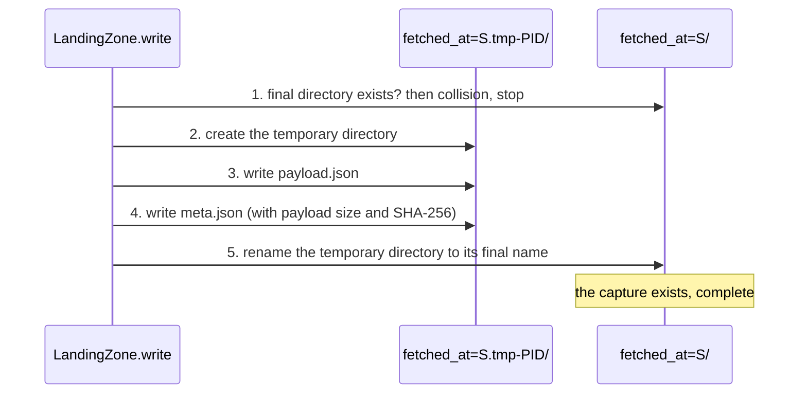

# Committed captures — design

Issue: #29 · Requirements: [requirements.md](requirements.md) · Tasks: [tasks.md](tasks.md)

## Overview

A capture becomes one directory holding its payload and its sidecar. The writer builds
the directory under a temporary name and publishes it with a single rename, so a capture
is visible complete or not at all, and a write whose destination exists is refused.
Every reader, the fetch logic included, asks one function for committed captures.
Whatever else is found under the landing root, in practice a temporary directory left by
a killed run, is moved to a quarantine beside it at the start of the next run, under a
lock that allows one writer at a time. The 5,118 captures already landed are moved into
the new layout by rename alone, checked against a checksum manifest, and the warehouse
is rebuilt beside the old one and compared. Nothing is deleted and no file's contents
change.

```
before   …/game_pk=822678/fetched_at=20261005T121147Z.json
         …/game_pk=822678/fetched_at=20261005T121147Z.meta.json

after    …/game_pk=822678/fetched_at=20261005T121147Z/payload.json
         …/game_pk=822678/fetched_at=20261005T121147Z/meta.json
```



A failure before step 5 leaves nothing, because the writer removes its temporary
directory; a kill before step 5 leaves the temporary directory, which the next run
sweeps. There is no step after 5.

### Python concepts this touches

Nothing here is dbt. Two operating-system facilities carry the design:

- **Renaming a directory** (`os.rename`) is one atomic step: other processes see the old
  name or the new one, never a mixture. Onto an existing non-empty directory it fails;
  onto an existing *empty* one it succeeds and replaces it, which is why the writer
  checks first.
- **An advisory lock** (`fcntl.flock`) is held on an open file and released by the kernel
  when the process ends, however it ends.

## Alternatives considered

### How a pair is made to land together

| | A — sidecar as commit marker | B — a directory per capture (chosen by the owner) | C — one envelope file | D — exclusive create on the final path |
|---|---|---|---|---|
| Pair lands in one step | no; a half-written pair is recognisable and never read | yes: one rename | yes: one file | no |
| Existing 5,118 captures | untouched | every one moves, by rename | every one is rewritten | untouched |
| Payload saved exactly as it arrived | yes | yes | no | yes |
| A reader can see a file mid-write | no | no | no | **yes** |
| Recovery needed for | a lone payload, which would otherwise freeze an entity | a leftover temporary directory, which is only clutter | a leftover temporary file | a partial final file |
| Other costs | none | the warehouse is rebuilt (its `file_path` values change); 84 fixture files move; the backup is refreshed | a new file format | none |

A was the recommendation and what #29 had agreed. The owner chose **B** on 2026-10-05,
preferring the more solid design once its cost was laid out: about twice the build, most
of it a one-time migration, at the cheapest moment there will be. See
[ADR 0014](../../adr/0014-a-capture-is-a-directory-published-by-one-rename.md).

### What happens to what is not a capture

| | A — sweep at the start of a backfill, under a lock (chosen) | B — leave it, readers ignore it | C — repair command only | D — delete |
|---|---|---|---|---|
| Landing root stays clean | yes | no: audit errors accumulate | only if someone runs it | yes |
| Can lose the only copy | no | no | no | **yes** |
| Needs a lock | yes | no | yes | yes |

Under the directory layout nothing uncommitted can block a fetch, so B is correct and is
a more defensible choice than it was under the old layout. A is chosen so that an audit
error keeps meaning something. See
[ADR 0015](../../adr/0015-incomplete-captures-are-quarantined-under-a-writer-lock.md).

## Decisions

| ADR | Decision | Status |
|---|---|---|
| [0014](../../adr/0014-a-capture-is-a-directory-published-by-one-rename.md) | A capture is a directory published by one rename; a collision stops the run; new sidecars record the payload's size and SHA-256; existing captures move by rename alone | accepted |
| [0015](../../adr/0015-incomplete-captures-are-quarantined-under-a-writer-lock.md) | Anything that is not a capture is moved to a quarantine beside the landing root at the start of a backfill, under an exclusive `flock`, within a size limit; nothing is deleted; readers do not wait but warn | accepted |

All nine points put to the owner were decided on 2026-10-05 and are recorded in the PR.

## Detailed design

All in `ingestion/src/front_office/` and `scripts/`. No dbt model changes.

### Layout

A capture's directory is `<root>/<source>/<endpoint>/<key=value>…/fetched_at=<stamp>/`,
holding exactly `payload.json` and `meta.json`. The partition folders are unchanged; the
capture's name moves from a file stem to a directory name.

### `landing.py`

**`LandingZone.write`** follows the five steps in the diagram.

- The temporary directory is `fetched_at=<stamp>.tmp-<pid>`, beside the final one, so
  the rename is within one folder and one filesystem.
- Step 1 refuses any existing final directory, empty or not, with `LandingCollision`
  naming the path. Nothing has been written at that point.
- New sidecar fields `payload_bytes` (int) and `payload_sha256` (hex), computed from the
  exact bytes written; existing fields and their order are unchanged and the two are
  added at the end. The payload is serialised once to bytes; that is what is written and
  hashed.
- The temporary directory is removed in a `finally` unless the rename succeeded.
- If the rename itself raises because the destination appeared (possible only without
  the lock), that is a `LandingCollision` too.

**`LandingZone.check(capture_dir, deep=False)`** is the one place that decides whether
something is a committed capture, and returns either "committed" or the reason it is not.
Shallow, the default:

1. the directory is named `fetched_at=<stamp>` and holds `payload.json` and `meta.json`,
   and nothing else;
2. the sidecar parses as JSON and has `source`, `endpoint`, `partitions` (a mapping),
   `request_key`, `fetched_at` and `url`, each of the expected type;
3. the sidecar agrees with where the capture is: its source, endpoint, partitions and
   `fetched_at` are the ones the path spells out. This is the audit's existing
   `_sidecar_disagreement`, moved here;
4. if the sidecar has `payload_bytes`, the payload's size on disk equals it.

Deep adds: the payload parses as JSON, and if the sidecar has `payload_sha256` the
payload hashes to it. The shallow check reads one small file and stats another; the deep
check reads every payload (2.1 GB today). Shallow is used by the fetch logic, the loader
and the sweep; deep by the audit and `repair --deep`. A capture that passes shallow and
fails deep is still committed, and is an audit error: it means corruption at rest, which
a person should look at before anything moves. The loader, which parses each payload
anyway, fails naming the file if one does not parse (R2.7).

**`LandingZone.committed(source=None, endpoint=None, partitions=None)`** yields a
`Capture` (directory, parsed sidecar, and the payload loaded only when asked for) for
every committed capture, sorted by path. With `partitions` given, only that entity's
folder is examined, which is what the fetch logic needs. `has_landed` and `iter_landed`
are rebuilt on it: `has_landed(source, endpoint, partitions)` is true when the entity's
folder holds at least one committed capture.

**`LandingZone.scan`** classifies every entry under the root:

| Kind | What it is |
|---|---|
| `committed` | a `fetched_at=` directory that passes the shallow check |
| `temp` | a `….tmp-<pid>` directory, whatever it holds |
| `invalid` | a `fetched_at=` directory that fails the shallow check, including an empty one |
| `loose` | a file that is not inside a capture or temporary directory: the old layout and the spike payloads |
| `empty` | any other directory with nothing in it, such as a partition folder left behind when its contents moved |

A source, endpoint or partition folder that leads to at least one entry of another kind
is structure and is not reported. The lock file, the quarantine and the migration
directory are not under the root.

Every reader treats an entry that vanishes between listing and reading as not committed
(R2.8).

**`LandingZone.sweep(run_stamp, dry_run=False, deep=False, force=False)`**: refuses
with `NotMigrated` if the landing zone is not wholly in the directory layout (below).
Otherwise it builds the **complete plan** before doing anything: every scanned entry
that is not `committed` (with `deep`, also committed captures that fail the deep check),
plus every folder that would be left with nothing in it once those are gone, worked out
on paper up the tree, not by moving and rescanning. Where a folder and everything in it
are both in the plan, the folder alone is listed and moves whole, so nothing is counted
or moved twice. The dry run prints that plan and the size limit is applied to it, so
what is reported, what is checked and what is moved are the same list. If the count exceeds `max(50, 1% of the files under the root)` and
`force` is false, it raises `SweepTooLarge` with the count and the first few paths and
moves nothing (R3.6). Otherwise it creates the quarantine root, writes a `.gitignore`
containing `*` into it, and moves each entry to
`<quarantine root>/<run_stamp>/<relative path>` with `os.rename`; a directory moves
whole. If the destination exists, a numeric suffix is added to the run directory;
nothing is overwritten. The quarantine root is `<landing root>_quarantine`, on the same
filesystem.

**`LandingZone.writer_lock()`**: a context manager on `<landing root>.lock` taking
`fcntl.flock(LOCK_EX | LOCK_NB)`, retrying for up to two seconds before raising
`LandingLocked`. **`LandingZone.writer_active()`**: tries a shared lock without blocking
and releases it at once; true if it could not get it. The brief retry in `writer_lock`
exists because that probe holds the lock for an instant.

### Fetch logic

`mlb/boxscore.py` and `espn/rosters.py` lose their private `_has_landed` helpers and call
`zone.has_landed(...)` with the entity's partitions. In the backfill loops,
`LandingCollision` is re-raised alongside `AuthExpired`: it stops the run (R1.4).

### `cli.py`

- Every `backfill` subcommand runs inside `zone.writer_lock()`, sweeps first, logs what
  moved, then fetches. `LandingLocked`, `LandingCollision` and `SweepTooLarge` exit
  non-zero with their message; a backfill that cannot sweep fetches nothing.
- `front-office repair [--raw-root] [--dry-run] [--deep] [--force]`: takes the lock
  (not for `--dry-run`), sweeps, and prints one line per entry and a count.
- `load` and `audit` take no lock and print one warning line if `writer_active()`.

### `load.py`

Reads through `iter_landed`, so it loads committed captures only. `file_path` is the
capture's `payload.json`. Because existing rows carry the old paths and #28 made "same
key, different path" a collision, the loader cannot be pointed at a warehouse built
before the migration; the rebuild below is the supported path, and the loader's error in
that case says so.

### `audit.py`

- `check_landing` uses `LandingZone.check` and reports `temp`, `invalid`, `loose` and
  `empty` entries as errors (R5.1), and says so in one line when the landing zone is not
  wholly in the directory layout.
- For a committed capture whose sidecar has `payload_sha256`, it runs the deep check and
  reports a failure as an error (R5.2), with one INFO line counting how many captures
  could and could not be checksum-verified.
- It counts entries under the quarantine root and WARNs if any (R5.3).

### The migration (`scripts/migrate_landing_layout.py`)

One script, used on the real landing zone and on both fixture trees.

- Under the writer lock. For every old-layout pair (`X.json` beside `X.meta.json`) whose
  sidecar passes the old equivalent of the shallow check: create `X.migrating/`, rename
  the two files into it as `payload.json` and `meta.json`, then rename the directory to
  `X/`. Only renames; no file is opened for writing. The working name is `.migrating`,
  not `.tmp-<pid>`, so it is never confused with a writer's temporary directory and is
  the same on a rerun by another process.
- **The journal.** It lives in `<landing root>_migration/`, a directory created first
  with a `.gitignore` containing `*`, because it holds paths that include the league id
  and the root may be anywhere, including a fixture tree in the public repository. It is
  an append-only file with two records per capture: `begin <old stem> <new directory>`
  written and flushed before the first rename, and `done <old stem>` after the last. A
  first record `start` and a last record `finished` bracket the run.
- **Resuming (R6.6).** On start the script reads the journal. For a capture with `begin`
  and no `done` it works out the state from what is on disk and completes it: either or
  both files may already be inside `X.migrating/`, or the final rename may already have
  happened. Each of those states has a test. Only then does it continue with captures
  not yet begun.
- **Journal states.** `start` with no `finished`: in progress. `finished`: migrated.
  `reversed` after either: back in the old layout. A migration run again after a
  reversal appends a new `start`, so the last bracket in the file is the one that counts.
- **The interlock (R6.7).** `LandingZone.sweep`, and therefore every backfill and
  `repair`, refuses to run unless the landing zone is wholly in the directory layout.
  It is not when the journal's last state is in progress or reversed, or when any
  old-layout pair (`X.json` beside `X.meta.json`) is found under the root, journal or
  no journal. The second condition does not depend on size, so a small unmigrated tree
  such as a fixture is protected as well as a large one. Without the interlock, a
  backfill on such a tree would sweep historical captures, or the pieces of a half-moved
  one, into quarantine and fetch the entities again, silently replacing history with
  fresh captures.
- `--dry-run` lists the moves and what would be left behind. `--reverse` reads the
  journal and undoes every capture it shows begun, from whatever state it is in, then
  appends `reversed`. The package cannot use the reversed tree; the only way forward
  from there is to migrate again, which is tested.
- Anything that is not an old-layout pair is left where it is and reported (R6.3). After
  #21 there should be nothing; if the 201 spike payloads are still there they stay
  loose, and the sweep's size limit then stops the first backfill until a person
  decides.
- Run on a tree already migrated, it finds no old-layout pairs and does nothing (R6.4).

`scripts/make_fixtures.py` and `scripts/make_multi_fixtures.py` read and write the new
layout. The committed fixture trees are moved by the migration script, so their file
contents are unchanged and only paths differ in the diff; the journals that produces are
in ignored directories and are not committed.

`make_multi_fixtures.py` reads only the committed base fixture, and its byte-for-byte
test keeps holding. `make_fixtures.py` reads the real landing zone, which is still in
the old layout until task 11. So it is exercised in task 8 against a migrated copy of
`data/raw/` (a reflink copy on the same filesystem, in an ignored directory, removed
afterwards) and again against the real root after the migration. Any difference between
what it generates and the committed base fixture is reported, not accepted: the base
fixture was generated before the 2026-10-05 refresh, and a newer capture of one of its
games could legitimately differ.

### Verifying the real migration

`scripts/verify_migration.py` checks two things.

*Files.* For every line of the checksum manifest taken on 2026-10-05, the file at the
path the journal maps it to must exist and hash to the same value; no file under the
root may be absent from that mapping. The 201 spike payloads are in the manifest and
gone from the tree after #21; the script takes the list of deleted paths and requires
the two to account for every manifest line exactly.

*Raw rows.* Given the current warehouse and the rebuilt one, every row of
`raw.api_responses` must match on its key (source, endpoint, request path, request key,
fetch time), its partitions and its payload, and the old row's `file_path` mapped
through the journal must equal the new row's. `compare_warehouses.py` compares model
relations only, so without this a raw row could change while every model happened to
agree.

### Rebuilding the warehouse

As in #28, and for the same reason: the raw table is derived, so a change is a rebuild.

```bash
uv run front-office load --db data/warehouse_r3.duckdb
cd dbt && FO_DUCKDB_PATH=../data/warehouse_r3.duckdb DBT_PROFILES_DIR=. uv run dbt build
cd .. && uv run python scripts/compare_warehouses.py --strict-columns data/warehouse.duckdb data/warehouse_r3.duckdb
```

The comparison is exact, with no rounding: builds have been reproducible since #28.
`compare_warehouses.py` gains `--strict-columns`, which makes a column present on only
one side a failure; today it is printed and passed over, which was right for #28, where
columns were meant to change, and is wrong here, where none should. The owner swaps the
files.

### `.gitignore`

Add `data/raw_quarantine/`, `data/raw_migration/` and `data/*.lock`. These are the second
line of defence. The first is the ignore-everything file written into the quarantine and
into the migration directory before anything else is put there, which covers a root
that is not the default.

### Order of work on the real data (owner's decision)

1. The owner backs up the current layout to the NAS and verifies it (#20).
2. #21: the spike payloads are deleted, their archive being on the NAS.
3. This build; then the migration, its verification, the warehouse rebuild and compare.
4. The owner swaps the warehouse and refreshes the NAS backup.

## Test strategy

All pytest, in temporary directories. The real landing zone is touched only by the
migration, in the last tasks.

| Requirement | Test | Catches |
|---|---|---|
| R1.1, R1.2 | a written capture is a directory with exactly the two files; while the write is in progress (observed by wrapping `os.rename`) the final name does not exist | a capture visible half-built |
| R1.3 | a second write to the same capture raises `LandingCollision` and leaves both existing files byte-identical and no temporary directory | today's silent overwrite |
| R1.3 | an existing **empty** final directory is also a collision | the rename silently replacing an empty directory |
| R1.4 | a backfill whose second game collides stops with the error, and the third game is not fetched | a collision counted as one failed game |
| R1.5 | the sidecar's size and SHA-256 equal those of the payload on disk | a hash of something other than the bytes written |
| R1.6, R3 | **fault injection on a settled boxscore, one case per point** (table below), then a second backfill | a failure at any boundary leaving something a reader could mistake for a capture |
| R2.1 | a capture directory missing a file, holding an extra file, with a sidecar that is not JSON, lacks a field, names another partition, or records a different size, is not committed and is not counted as landed for any entity | a capture that exists but does not agree; one filed under the wrong entity |
| R2.2 | a settled game whose only trace is a temporary directory, or a loose old-layout payload, needs fetching; a closed roster period likewise | the fetch logic counting debris (today: `needs_fetch` is false for a lone payload) |
| R2.3, R2.4 | the loader inserts nothing for debris; the newest schedule is the newest committed one | a reader with its own idea of landed |
| R2.5 | a sidecar with no size or checksum is committed | old captures rejected |
| R2.6 | the deep check reports a payload that is not JSON and one whose hash differs; the shallow check on the same captures says committed; `needs_fetch` reads no payload (asserted by making payload reads raise) | the fetch logic made slow; corruption unnoticed |
| R2.7 | the loader raises, naming the file, for a committed capture whose payload is not JSON | a silently skipped capture |
| R2.8 | an entry removed between listing and reading is skipped by `committed`, `iter_landed`, the loader and the audit without an error | a reader crashing because a sweep ran |
| R3.1–R3.3 | the sweep moves each kind whole, keeps relative paths, never overwrites (sweeping twice with one stamp), and `--dry-run` moves nothing | a deleted or overwritten file |
| R3.1, R5.1 | an empty `fetched_at=` directory is `invalid`; an empty partition folder is `empty`; both are swept and both are audit errors; a partition folder that becomes empty because its last entry was swept goes in the same sweep | debris that holds no file and so is never seen |
| R3.2 | with the landing root at an arbitrary path inside a git work tree, `git check-ignore` passes for a file nested in its quarantine | private data in a committable place |
| R3.5 | `repair --dry-run` lists and exits 0 with the tree unchanged; `--deep` moves a capture whose checksum fails | a dry run that moves |
| R3.6 | 51 stray files in a tree of 100 captures: the sweep raises and moves nothing; with `force` it moves them; 3 temporary directories move without `force` | a mass move caused by a bug |
| R3.5, R3.6 | 49 temporary directories, each alone in its own partition folder: the plan lists the 49 folders, not 98 items, the dry run prints exactly what the real sweep then moves, and the count used for the limit is that list's | a limit and a dry run that undercount what moves |
| R4.1–R4.3 | a second writer is refused while the first holds the lock; after the first process is killed the lock is free; a writer still gets the lock while a reader probes it | a stale lock; two writers; a writer refused by a reader's probe |
| R4.4–R4.6 | the lock file is beside the root; `load` and `audit` run while the lock is held and print the warning; no warning when it is free | a lock in the scanned tree; readers blocked; a silent incomplete load |
| R5.1–R5.3 | the audit reports debris as an error, a checksum mismatch as an error, and a non-empty quarantine as a warning | silent corruption; forgotten quarantine |
| R6.1, R6.3 | the migration moves a tree of old-layout pairs, leaves a lone payload where it is and reports it; `--dry-run` moves nothing | a spike payload paired with the wrong sidecar; a dry run that moves |
| R6.1 | every file's SHA-256 is the same before and after, and no file was opened for writing (the tree is made read-only except for directory entries) | the migration changing contents |
| R6.2 | `--reverse` restores the original tree byte for byte, from a finished migration and from each interrupted state; with the root at an arbitrary path inside a git work tree, `git check-ignore` passes for the journal | an irreversible move; a list of private paths left committable |
| R6.6 | a migration killed after each of its four steps for one capture (simulated by stopping there): a second run completes that capture and the rest, and the result equals an uninterrupted migration | a capture left in pieces |
| R6.7 | `backfill` and `repair` exit non-zero naming the migration, and move nothing, in each of: a journal started and not finished; a journal reversed; a small tree of old-layout pairs with no journal at all. After the migration finishes they run. A tree migrated, reversed and migrated again equals one migrated once | a backfill sweeping historical captures, or a half-moved one, and replacing them with fresh fetches; a reversed tree left unusable or, worse, usable |
| R6.2, all | the raw-row comparison reports a changed payload, a changed partition and a `file_path` that does not map; `compare_warehouses.py --strict-columns` fails on a column present on one side only | a comparison that proves less than it says |
| R6.4 | the migration run twice does nothing the second time | double nesting |
| R6.5 | `make_multi_fixtures.py` reproduces its committed tree byte for byte in the new layout (pytest); `make_fixtures.py` is run against a migrated copy and, later, the real root, with any difference reported; the privacy test and the pre-commit guard still cover every ESPN payload | a hand-moved fixture; a payload escaping the privacy checks under its new name |

Fault-injection cases and what each must leave. "Second run" is a backfill of the same
settled game with a later stamp.

| Failure point | On disk afterwards | After the second run |
|---|---|---|
| creating the temporary directory | nothing | fetched; committed once; quarantine empty |
| writing `payload.json` | nothing: the `finally` removed the temporary directory | fetched; committed once; quarantine empty |
| writing `meta.json` | nothing | fetched; committed once; quarantine empty |
| the rename (an error other than a collision) | nothing | fetched; committed once; quarantine empty |
| the process killed after any step before the rename (simulated by leaving the temporary directory as that step would) | a temporary directory with zero, one or two files | the temporary directory is in quarantine; fetched; committed once |
| the process killed after the rename | a committed capture | not fetched again; committed once; quarantine empty |

"Committed once" is asserted on an entity endpoint. Snapshot endpoints (schedule,
settings, teams, matchups) add a capture on every run by design, so for them the
assertion is that no run leaves anything uncommitted.

The existing `test_crash_mid_write_leaves_no_partial_file` is replaced by this matrix.
Tests that assert old paths are rewritten to the new layout. Tests are written before
the code they test.

## Risks

- **The migration moves every file in the real landing zone.** Mitigated by: the owner's
  verified NAS backup beforehand; renames only; a journal that records each capture's
  move beginning and ending; resumption from any interrupted state; a refusal to
  backfill or sweep while it is unfinished; verification of every file against the
  manifest and every raw row against the current warehouse; and a tested reversal.
- **The roster captures cannot be re-created** if lost, which is why the backup comes
  first.
- **A second warehouse rebuild and swap.** About five minutes of machine time, compared
  exactly.
- **A large, mechanical diff.** 84 fixture files move and about 80 test lines that name
  paths change. Contents of fixture files do not change, which the generators' byte-for-
  byte tests show.
- **The rename onto an empty directory.** Handled by the explicit check under the lock;
  without the lock (a foreign writer) an empty directory could be replaced, which loses
  nothing.
- **`flock` over NFS**, and filesystems where a directory rename is not atomic. The
  landing zone is on btrfs. Stated, not designed for.
- **The first real sweep.** Dry-run first and shown to the owner; expected to be empty.
- **A load during a backfill** is correct but incomplete; it now says so.

## Open questions

- **Whether quarantined items are ever cleared.** Not by the package. No retention rule
  is designed.
- **How a collision is resolved once seen.** As in #28: it stops the run, and choosing
  between two captures is left until one has been observed.
- **The sweep's limit** (the larger of 50 and 1%) is a judgement, not a measurement.
- **Durability across a power cut** (`fsync` of the files and the directory before the
  rename) is not designed. A torn capture would fail the size check and be swept.

## Evidence

Probes in temporary directories and a read-only scan of `data/raw/`, 2026-10-05.

| Claim | Measured |
|---|---|
| The orphan | with the sidecar write made to fail, the directory holds only the payload; `needs_fetch` for that settled game returns False; `load_landing_zone` inserts 0; `scan` reports `payload_only` |
| The overwrite | two writes to one path leave the second payload and raise nothing |
| The mismatched pair | a second write that fails at its sidecar leaves the second payload beside the first sidecar, and `scan` reports `committed` |
| The landing zone now | 5,118 committed (10,236 files), 201 `payload_only`, 0 `sidecar_only`, 0 `temp`; 2,129,565,147 bytes in 10,437 files |
| Where the 201 are | `espn/roster_matchup` 194, `settings` 2, `teams` 2, `transactions` 2, `matchups` 1 |
| Directory rename | on `data/` (btrfs): onto a non-empty directory, "Directory not empty"; onto an empty directory, it replaces it without error |
| Manifest | SHA-256 of every file under `data/raw/` taken 2026-10-05; the manifest's own SHA-256 is `59b4bf092510fe53db367d4aa7d005314e2bbc0dd47a3159d656b060ed618f8c` |
| What names the old layout | in the package: 10 mentions of `.meta.json`, 27 of `fetched_at=`; in tests 11 and 66; in scripts 10 and 3; in dbt, none |
| `file_path` | stored on every raw row; since #28 the loader raises on the same key with a different path; no dbt model exposes it (the latest-response macro uses it only as a tie-break) |
| Fixtures | 84 tracked files in two trees |
| Git | `.gitignore` covers `data/raw/`, `data/*.csv`, `data/*.json` and `*.duckdb`; a nested file under `data/raw_quarantine/` would not be ignored |
| A long-held lock is realistic | the 2026-10-05 refresh ran 9.5 hours because the machine was suspended for 8 of them |

## Review log

| Source | Finding | Resolution |
|---|---|---|
| design-review 2026-10-05, first pass (on the commit-marker design, since replaced) | F1 (P0): the ignore rule covered only `data/raw_quarantine/`, so a non-default `--raw-root` would put private payloads in a path git does not ignore | Kept in this design: the sweep writes an ignore-everything file into the quarantine before moving anything (R3.2) |
| design-review, first pass | F2 (P1): the committed test did not require the sidecar to describe its path or the payload to be readable | Kept: one `LandingZone.check`, shallow and deep (R2.1, R2.6, R2.7) |
| design-review, first pass | F3 (P1): the fault-injection matrix demanded outcomes the write sequence could not give | Kept in spirit: each failure point has its own expected state, rewritten for the rename protocol |
| design-review, first pass | F4 (P2): readers could read a path the sweep had moved | Kept: readers treat a vanished entry as not committed (R2.8) |
| design-review 2026-10-05, second pass (on this design) | F1 (P1): a migration interrupted between a capture's renames had no recovery, and the next backfill could sweep its pieces into quarantine | Changed: a begin/done journal, resumption from every interrupted state, and a refusal to backfill or sweep while a migration is unfinished (R6.2, R6.6, R6.7) |
| design-review, second pass | F2 (P1): the base fixture generator was to be verified before its real-data input was migrated | Changed: it is run against a migrated copy in task 8 and against the real root after task 11; only the multi generator has a byte-for-byte test |
| design-review, second pass | F3 (P1): the journal's ignore rule covered only the default root, and it holds paths with the league id | Changed: the journal lives in a directory made git-ignored before the first record, as the quarantine is |
| design-review, second pass | F4 (P2): the prescribed comparison covers model relations only and passes over column differences | Changed: a raw-row comparison through the journal, and `--strict-columns` |
| design-review, second pass | F5 (P2): the sweep's dry run before the migration exceeds the limit, and the task did not say that was expected | Changed: the expected refusal is an expected value; task 10 runs only the migration's dry run before, and the sweep's after |
| design-review, second pass | F6 (P2): empty and unexpected directories had no classification | Changed: `invalid` covers an empty capture directory, a new kind `empty` covers the rest, both swept and audited |
| design-review 2026-10-05, third pass | F1 (P1): a reversed migration either blocked backfill for ever or let it sweep the old layout | Changed: journal states are defined; the interlock refuses unless the tree is wholly in the directory layout, which also covers old-layout pairs with no journal; reverse then migrate again is tested |
| design-review, third pass | F2 (P1): the sweep counted before moving and then moved newly empty folders, so its limit and dry run undercounted | Changed: one complete plan, including folders that would be left empty, is what is printed, limited and moved |
| design-review, third pass | F3 (P2): the audit's list omitted the new `empty` kind | Changed |
| design-review, third pass | F4 (P2): the comparison command omitted `--strict-columns` | Changed |

## Amendments

