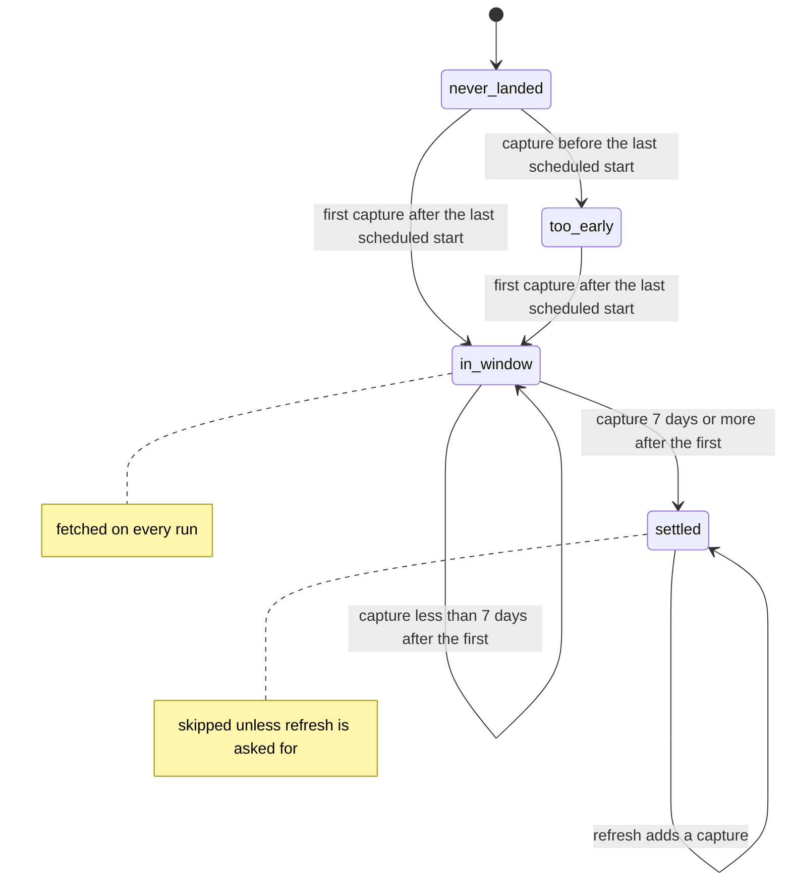

# Settled boxscores — design

Issue: #30 · Requirements: [requirements.md](requirements.md) · Tasks: [tasks.md](tasks.md)

## Overview

A boxscore is fetched only for a game the landed schedule shows as played, so the first
boxscore capture of a game is itself evidence that the game was over by then. The settle
clock starts there: a game is settled when some capture is at least 7 days later than
its first capture. Everything is a comparison of `fetched_at` stamps, which every
sidecar has, so there are no dates, no timezones and no dependence on when the fetch
logic happens to run. One guard covers suspended games: a capture taken before the
game's last scheduled start, read from the newest schedule's `gameDate`, cannot have
seen the finished game and does not start the clock. The audit calls the same functions.

What states a played game moves through, and what moves it:



Nothing here is dbt. Staging reads the newest capture of each game, and the newest
capture of a settled game is the one that settled it or a later refresh.

## Evidence

Read from the real landing zone on 2026-10-07; nothing was fetched.

- **The newest schedule** has 2,459 entries for 2,430 games. Every entry has a `gameDate`
  that parses as a UTC instant. Played games are `Final` (2,427) or `Completed Early` (2).
- **`gameDate` is the scheduled start of that entry's session.** For all 28 postponed
  games the played entry's `gameDate` equals the postponed entry's `rescheduleDate`. For
  the one resumed game, 824912, there are two entries with official date 2026-06-16: one
  with `gameDate` 2026-06-16T23:15:00Z and `resumeDate` 2026-06-17T18:00:00Z, the other
  with `gameDate` 2026-06-17T18:00:00Z and `resumedFrom` 2026-06-16T23:15:00Z. Its
  boxscore says first pitch 7:16 PM, which is 23:16Z.
- **`resumeDate` is when the game restarted**, not when it ended. Nothing in the schedule
  or the boxscore records an end time: the boxscore's `info` has first pitch, a duration
  and the official date as text.
- **The official date is not the UTC date of the start** for 582 played entries (night
  games), so date arithmetic on it needs a timezone to mean anything.
- **Captures.** 4,923 boxscore captures over 2,430 games (938 MB, 190 KB each), from four
  runs. `fetched_at` is the run's stamp. No capture predates its game's last scheduled
  start.
- **How a suspended game is listed before it resumes is not in the landed data**: the
  first schedule capture is from September, three months after the only suspension.

Checked against MLB's public API on 2026-10-07, at the owner's request for more than the
2026 schedule. These responses were read for the spec and are not landed.

- **Resumed games, 2022–2025** (`/api/v1/schedule`, one request per season): 15 games.
  Every one has exactly two entries sharing the original official date; the first has
  `resumeDate` and the second `resumedFrom`, and in 15 of 15 the first entry's
  `resumeDate` equals the second entry's `gameDate`. Game 746942 has official date
  2024-06-26 and a second entry starting 2024-08-26T18:05:00Z, two months later.
- **Actual play times** (`/api/v1.1/game/{pk}/feed/live`) for four of them:

  | Game | First entry `gameDate` | First play | Second entry `gameDate` | Last play ended |
  |---|---|---|---|---|
  | 746942 | 2024-06-26T23:10Z | 23:12Z | 2024-08-26T18:05Z | 2024-08-26T20:24Z |
  | 777861 | 2025-05-19T23:40Z | 23:40Z | 2025-05-21T17:10Z | 2025-05-21T19:16Z |
  | 824912 | 2026-06-16T23:15Z | 23:16Z | 2026-06-17T18:00Z | 2026-06-17T20:01Z |
  | 716404 | 2023-09-28T23:10Z | 23:10Z | 2023-10-02T17:10Z | 2023-09-29T01:22Z |

  So `gameDate` is the scheduled start of a session, to within three minutes of the
  first pitch. In the three games that were resumed, the last play ended about two hours
  after the second entry's `gameDate`, with innings played on that day. Game 716404 was
  never resumed: it was declared `Completed Early: Rain` and its last play is from the
  original night, three days before the listed resume start. A resume date is therefore
  neither a completion nor even a promise of more play, and the latest `gameDate` can be
  later than the real end, which only delays the window.
- **MLB's status table** (`/api/v1/gameStatus`, 210 rows): all 34 `Suspended` states have
  `abstractGameState` `Live`. The backfill takes only games whose abstract state is
  `Final`, so by MLB's own classification a suspended game is not fetched until it is
  finished or declared complete. This is a reference table, not an observation of a
  suspended game in a schedule; #69 tracks the observation.
- **Under the rule below**, 2,402 games are settled. 27 are not: games of 2026-09-26 and
  2026-09-27 first captured `20260928T215618Z` and last captured `20261005T121147Z`,
  6.6 days later. The audit's present date rule calls all 2,429 settled.

## Alternatives considered

### What the settle clock starts from

| | A — the game's first capture after its last scheduled start (recommended) | B — the first schedule capture showing the game played | C — last scheduled start plus a margin | D — official date, or resume date (the audit today) |
|---|---|---|---|---|
| Is the game known to be over at that point | yes: a boxscore is fetched only for a played game | yes | no: a start is not an end | no |
| Read to decide | sidecars, and the newest schedule | every schedule capture, 3.5 MB each | the newest schedule | the newest schedule |
| Dates or timezones | none | none | none | Eastern dates |
| Daily operation | each game captured on 8 or 9 runs | the same | the same | about 7 runs |
| Backfilling a finished season | needs a second pass 7 days later | the same | settles in one pass | settles in one pass |
| 2026 as landed | 27 games need one more fetch | the same 27 | depends on the margin: 0 at 12 hours, 14 at 24 | 0 |
| Resumed game with an old official date | handled by the guard | handled | handled | relies on `resumeGameDate` meaning completion, which it does not |

**A — the first capture.** The conservative first-observed-Final boundary the reviewer
asked for, read from sidecars. It can only be later than the true end of the game, so
the window can only be longer than seven days, never shorter. Its cost is that a season
backfilled long after it ended is not settled until a second pass a week later, though
its seven days are long gone; the audit says so and the second pass needs no flag.

**B — the first schedule capture showing Final.** The same idea, stated more directly,
and never later than A. It loses on cost: a season of daily runs leaves about 180
schedule captures, 630 MB to parse on every run, to learn what the first boxscore
sidecar already says. On 2026 it gives the same 27.

**C — the scheduled start plus a margin.** Lets a backfill settle in one pass. It loses
because the margin is an assumption about how long a game can take, which is exactly
what a suspended game breaks, and the reviewer asked for a boundary that is validated
or conservative.

**D — the official or resume date.** The rule being replaced. The follow-up rules it
out as the fix on its own.

### How a suspended game is kept from settling early

| | A — ignore captures before the last scheduled start (recommended) | B — nothing: trust that a suspended game is never listed as played | C — restart the clock whenever the schedule entry changes |
|---|---|---|---|
| Needs to know how MLB lists a suspended game | no | yes, and it is not in the landed data | no |
| Extra data read or stored | `gameDate`, from the schedule already read | none | the previous schedule, or a copy of the entry in each sidecar |
| Can only delay settling | yes | — | yes |

**A.** A game cannot be over before its last session starts, so a capture older than
that start has not seen the finished game, whatever the schedule called it at the time.
`gameDate` is used only as a lower bound, which is the one thing a scheduled start
proves.

**B.** Correct if a suspended game is listed as in progress until it finishes. MLB's
status table says it is (every `Suspended` state is `Live`), but no schedule capture has
ever shown a suspended game, and being wrong would freeze a boxscore missing its resumed
innings. The guard costs one comparison on a field already read.

**C.** Catches the same case and more, by comparing schedule captures or storing the
entry with each capture. More to store and read for no case A misses.

## Decisions

| ADR | Decision | Status |
|---|---|---|
| [0019](../../adr/0019-a-boxscores-settle-window-runs-from-its-first-capture.md) | A boxscore's settle window runs from the game's first capture | accepted |
| [0020](../../adr/0020-a-capture-before-a-games-last-scheduled-start-does-not-count.md) | A capture taken before a game's last scheduled start does not start the settle window | accepted |

## Detailed design

### The schedule gives each game a last scheduled start

`ScheduledGame` gains `last_start: dt.datetime | None`. `games_from_landed_schedule`
already walks every entry of the newest schedule; it now also keeps, per `gamePk`, the
latest `gameDate` over **all** entries for that game, played or not (R1.1). Taking the
latest over every entry can only make the guard stricter, and it is what lets a session
that is scheduled but not yet played hold the game open. `gameDate` is parsed as an
ISO-8601 instant with its offset (`Z`). If **any** entry of a game has a `gameDate` that
is missing or does not parse, the game gets `last_start = None` and a warning (R1.3):
the unreadable entry might be the later session, so no start can be trusted. Such a game
is still fetched; it is simply never settled.

### Settled is recomputed, never stored

Settlement is worked out on every run and every audit from the newest schedule and the
captures then committed (R2.7). Nothing marks a game as settled. So if MLB lists a
suspended game as played before its resumed session is in the schedule, and the game is
captured and settles in the meantime, the next schedule that carries the later session
moves `last_start` past every existing capture: the game has no first-final capture
again and is fetched on every run until one settles it. Between those two schedules the
game is settled on a partial boxscore, which is all that could be known; the guard
guarantees the repair, not foresight.

### One definition, in `mlb/boxscore.py`

Pure functions, no I/O, so the audit can call them with its own objects:

```python
def parse_stamp(fetched_at: str) -> dt.datetime:
    """A capture's compact UTC stamp (20260926T162307Z) as an aware instant."""


def first_final(
    stamps: Iterable[dt.datetime], last_start: dt.datetime | None
) -> dt.datetime | None:
    """The earliest capture taken after the game's last scheduled start, or None."""


def is_settled(
    stamps: Iterable[dt.datetime],
    last_start: dt.datetime | None,
    settle_window: dt.timedelta = SETTLE_WINDOW,
) -> bool:
    """True when some capture is at least `settle_window` later than the first-final one."""
```

Both functions accept any iterable and read it once into a list, so a generator is
safe. `first_final` is `None` when `last_start` is `None` or no stamp is strictly later
than it. `is_settled` is false when `first_final` is `None`, and otherwise true when any
stamp is `>= first_final + settle_window`. The comparison is inclusive: a capture exactly
168 hours later settles the game. A stamp that does not parse is ignored with a warning;
a committed capture always has one.

`fetched_at` is the run's stamp, taken when the run starts, a few seconds before its
schedule and boxscore requests. A game that ends in those seconds could have a first
capture stamped just before its end. The error is the length of a run's start-up against
a window of seven days, and is accepted.

### The fetch path

`backfill_boxscores` does one pass before its loop: the `fetched_at` of every committed
boxscore capture whose `season` partition matches, grouped by `game_pk`
(`zone.committed(source, endpoint)`, sidecars only). `needs_fetch` becomes a pure
function:

```python
def needs_fetch(
    scheduled: ScheduledGame, stamps: Iterable[dt.datetime], *, refresh: bool = False
) -> bool:
    return refresh or not is_settled(stamps, scheduled.last_start)
```

"Never landed" needs no branch: no stamps, not settled. The `today` argument of
`needs_fetch` and of `backfill_boxscores` is removed, since nothing depends on the date
(R1.4). After a successful fetch the run's own stamp is added to that game's stamps;
it changes nothing within the run, because each game is visited once.

How the cases in the issue play out, for a game that ends on day 0:

| Runs | Captures | Outcome |
|---|---|---|
| daily, days 1–8 | day 1 … day 8 | fetched on each; the day-8 capture settles it if its run started no earlier in the day than the day-1 run, otherwise day 9 does |
| day 0 only, then nothing until day 8 | day 0, day 8 | day 8 is fetched (today's code skips it) and settles the game |
| a week missed: days 1–3, then day 12 | days 1, 2, 3, 12 | day 12 is fetched and settles it |
| first captured on day 30 (old official date) | day 30 | not settled; fetched on every run until one is 7 days later |
| suspended on day 0, resumed day 20; captured on day 1 and from day 21 | day 1, days 21–28 | the day-1 capture predates the last scheduled start and is ignored; the clock starts on day 21; settled on day 28 |

### The audit

`check_mlb` drops its own date rule, including the `completed` and `resumed` bookkeeping
and the "resumed game(s) settle from their resume date" line, and calls `first_final`
and `is_settled` with each played game's capture stamps and `last_start`. For a played
game with captures:

- settled: nothing reported;
- not settled, and `first_final + SETTLE_WINDOW` is at or before the audit's as-of
  instant: counted in a warning, `N game(s) not captured after their settle window
  closed; run front-office backfill mlb --season <season>` (R3.2);
- not settled, window still open: counted in the existing information line (R3.3);
- no first-final capture: counted in a warning, `N game(s) captured only before their
  last scheduled start` (R3.4).

`run_audit` and `check_mlb` take `as_of: dt.datetime` in place of `today: dt.date`. The
command passes the current instant, or, with `--today D`, the first instant of the day
after `D` in `America/New_York` (R3.5). `as_of` is only the threshold that separates "window closed"
from "window open" for a game that is not settled; it does not hide captures taken
after it, so this is not a reconstruction of what an earlier audit would have said.
`eastern_date` stays for the ESPN anchor check.

The audit judges the captures that pass its own deep check, and reports one that fails
as an error, as it does today. The fetch logic uses the shallow check, as spec 0029
requires of it. So the two agree wherever no capture is corrupt, and where one is, the
audit is the stricter and says why; `front-office repair --deep` moves the corrupt
capture aside, after which the fetch logic no longer counts it either.

### What it costs

With one run a day each game is captured on 8 or 9 runs, against 7 under today's rule:
the ninth happens when the day-8 run starts a little earlier in the day than the day-1
run did, since the window is 168 hours and not a count of days. At 190 KB per capture
that is 3.7 to 4.2 GB a season against 3.2 GB. A run requests the games of the last 8
or 9 days, about 120 to 135.

## Test strategy

All in pytest with a fake transport; no dbt test changes.

| Requirement | Test | Catches |
|---|---|---|
| R1.1 | a game with a postponed and a played entry, and one with two played entries (resumed), gets the latest `gameDate` | the first entry's start used; only played entries considered |
| R1.2, R4.2 | resumed game: a capture before the last scheduled start, then captures after it; the clock starts at the first one after | a boxscore missing its resumed innings frozen |
| R1.3 | an entry with no `gameDate`, and one that does not parse: fetched on every run, never settled, warned; a resumed game whose later entry is the unreadable one is not settled by a capture after its first session | a crash; a game settled with no boundary; an unreadable later session weakening the guard |
| R2.7 | a game settled under one schedule; a newer schedule adds a later session, played or still scheduled: not settled, fetched, and settled again only 7 days after the first capture that follows the new start | a partial boxscore staying settled; settlement stored somewhere |
| R2.1 | `first_final` and `is_settled` given a generator | the stamps consumed by the first pass |
| R1.4, R4.2 | a game with an official date a month old, first captured now, is not settled | the official date surviving in the rule |
| R1.4 | the decision is the same whatever the system clock says (time frozen far in the future) | today's date surviving in the rule |
| R2.1 | a second capture 7 days less one second after the first does not settle; exactly 7 days does | an off-by-one at the boundary; `>` for `>=` |
| R2.2, R4.2 | captured on day 0 only, run on day 8: fetched, then skipped on day 9 | the R4 defect itself |
| R2.2, R4.2 | a missed week: captures on days 1–3, run on day 12: fetched, then skipped | a skipped run freezing a game |
| R2.3 | `--refresh` fetches a settled game | refresh ignored |
| R2.4 | the fetch decision with boxscore payload reads made to raise (the existing 0029 test, re-pointed) | the fetch made slow |
| R2.5 | a capture under another season's partition, and debris beside a capture, settle nothing | cross-season leakage; debris counted |
| R2.6 | the existing limit, failure, credentials and collision tests pass unchanged | a regression in the loop |
| R3.1–R3.4 | audit: settled is silent; window closed warns and names the command; window open is information; captures only before the last start warn; a resumed game is judged by the guard, not by `resumeGameDate` | the audit and the fetch logic disagreeing |
| R3.5 | `--today` on the day the window closes and the day before; a settling capture taken after `--today` still counts | the as-of instant off by a day; `--today` read as a time machine |

## Risks

- A correction arrives more than 7 days after a game — known, unchanged — `--refresh`.
- The first capture of a game is stamped seconds before the game ends — negligible
  against 7 days — accepted, above.
- MLB changes `gameDate` after the fact to something later than the real start — the
  guard only gets stricter: captures are ignored until one is later, and the audit
  warns if none ever is.
- A finished season backfilled in one sitting stays unsettled until a second pass —
  by design; the audit names the command.

## Open questions

- **How MLB lists a suspended game before it resumes.** MLB's status table classes every
  suspended state as `Live`, so the game should not be fetched until it is over; this has
  not been observed in a schedule. If it were listed as played before its later session
  appears, the game could settle on a partial boxscore until that session appears, and
  is then reopened (R2.7). The owner accepted this on 2026-10-07; #69 checks it on the
  first suspension of 2027.
- **Whether corrections ever land after 7 days.** Unmeasured. Comparing a game's
  captures across its window, which this design now collects, would be the evidence;
  not built here.

## Review log

| Source | Finding | Resolution |
|---|---|---|
| design-review | F1 (P1): skipping an unparseable `gameDate` could drop the later session and weaken the guard | Fixed: any unreadable `gameDate` among a game's entries leaves it with no last start, so it is never settled (R1.3); tested with a resumed game. |
| design-review | F2 (P1): the audit and the fetch logic pass different capture sets where a capture fails the deep check | Not changed, and now stated: the audit keeps its deep check and reports the corruption; the fetch logic keeps the shallow check that spec 0029 requires. They agree wherever nothing is corrupt. |
| design-review | F3 (P1): the guard works only once the newest schedule shows the later session | Fixed in the claim and the rule: settlement is recomputed on every run (R2.7), so a game is reopened when the later session appears; the interim is described, and ADR 0020 no longer says "either way". |
| design-review | F4 (P2): `--today` reads as an as-of audit but later captures still count | Fixed: R3.5 defines it as a threshold only; tested. |
| design-review | F5 (P2): the functions take an iterable but read it twice | Fixed: they read it once into a list; tested with a generator. |

## Amendments

- **2026-10-07 — R4.1, one more test encoded "one capture settles a game".** R4.1 names
  six tests to replace. A seventh, `test_a_process_killed_after_the_rename_is_not_fetched_again`
  in `test_cli_landing.py`, also relied on a single committed capture being enough. It is
  kept, with its purpose unchanged (a capture that survived the kill is counted and not
  quarantined), and now lands two captures a week apart, which is what settles a game
  under R2.1. Within the goals; no decision changes.

- **2026-10-07 — R1.3 and R3.4, what the audit says about a game with no readable start
  (review round 1).** R3.4 covers games whose captures all predate their last scheduled
  start; the design counted a game with an unreadable `gameDate` in the same warning,
  which claims a start that does not exist. Built: such a game gets its own warning,
  `game(s) with an unreadable gameDate in the schedule … they cannot settle`. A boxscore
  capture whose `fetched_at` is not a UTC stamp is not counted as evidence and is
  reported, as the fetch path already ignores it. Within the goals; no decision changes.
