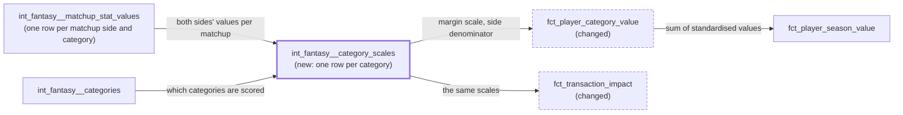

# Total value scaled by the matchup margin — design

Issue: #55 · Requirements: [requirements.md](requirements.md) · Tasks: [tasks.md](tasks.md)

## Overview

Value over replacement is untouched. What changes is the number each category's value is
divided by before the categories are added up. Today it is the spread of that value
across players. This design divides by the **matchup margin**: how far apart two teams
typically finish in that category in a matchup. One new intermediate model measures that
scale per category from the matchups already modelled, and the two value facts read it.
The result is in "matchup margins added over a free agent", the unit a head-to-head
categories league is decided in.

The thick border is the new model; dashed ones change.

### dbt concepts this touches

- **A model that exists to hold a parameter.** `int_fantasy__category_scales` has 17 rows.
  It is a model, not a CTE repeated in two facts, for the reason macros are shared here:
  two facts that must divide by the same number read it from one place. The DAG (dbt's
  dependency graph, built from `ref()`) then shows that player value depends on matchup
  results, which is new and worth seeing.
- **A changed macro signature is a contract change.** `fo_standardised_value` gains an
  argument; every caller and every unit test that feeds it changes with it.

## Alternatives considered

| | B — matchup margin (chosen) | A — player spread (today, ADR 0003) | C — no scalar across sides | D — fitted win probability |
|---|---|---|---|---|
| Divides by | how far apart two teams finish in the category | how far apart players are in it | n/a: batting total and pitching total kept apart | each category's fitted margin distribution |
| Unit | matchup margins | player standard deviations | two units | expected category wins |
| Top 20 on 2026 | 10 SP, 10 hitters | 15 SP, 5 hitters | not comparable | not measured |
| Median, hitter / SP / RP | 1.32 / 1.56 / 0.89 | 0.78 / 1.52 / 0.67 | n/a | not measured |
| Parameters | none | none | none | a model per category |
| Hitter-for-pitcher transactions | comparable | comparable | not comparable | comparable |
| Depends on matchup results | yes | no | no | yes |

**B — matchup margin.** A category is won by finishing ahead of the other team, so a
unit of production matters in proportion to the usual gap. Innings gaps are wide (47
outs), so an extra 25 outs over a season of starts is worth about half a margin; steals
gaps are narrow (3.6), so seven steals over replacement is worth two. The scale is
measured from the league's own 143 matchups and has no knob.

**A — player spread.** Keeps what was approved in #11, costs nothing, and is independent
of matchup results. It loses because its unit is not the league's: it prices a margin of
innings at nearly four times a margin of steals, and after #52 that tilt is what puts
starters on top.

**C — no scalar across sides.** Report `batting_value` and `pitching_value` and stop.
Honest, and enough for #12, where a hitter never competes with a pitcher for a slot. It
loses because `fct_transaction_impact` exists to say whether dropping one player for
another helped, and half of those swaps cross sides.

**D — fitted win probability.** The principled end point named by ADR 0003. Not chosen
now: the first-order version (wins ≈ 0.4 × margins) is visibly rough on 2026. Across
teams, a margin of value goes with 0.26 net category wins in RBI and 1.60 in SV+HD.
Fitting each category's distribution on 143 matchups is a milestone of its own.

## Decisions

| ADR | Decision | Status |
|---|---|---|
| [0010](../../adr/0010-category-values-are-scaled-by-the-matchup-margin.md) | A category's value is divided by its matchup margin, not by the spread across players | proposed |

It supersedes the denominator of
[ADR 0003](../../adr/0003-total-value-is-a-sum-of-standardised-category-values.md); the
sum and "no mean subtracted" stand.

## Detailed design

### `int_fantasy__category_scales` (new, table)

Grain: one row per (`platform`, `league_id`, `season`, `category_key`), for every row of
`int_fantasy__categories`.

| Column | Meaning |
|---|---|
| `platform`, `league_id`, `season`, `category_key` | the key |
| `matchups_measured` | matchups in which both sides have a non-null value for the category |
| `margin_scale` | `sqrt(avg((home value − away value)²))` over those matchups; null if there are none |
| `side_denominator` | mean of the category's `denominator` over matchup sides whose `stat_value` is not null, so a side with a zero denominator (an undefined rate) is in neither this mean nor the margins; null for a count category |

Source: `int_fantasy__matchup_stat_values` (one row per matchup side and stat, with
`numerator`, `denominator`, `stat_value`), self-joined home to away on the matchup, and
restricted to scored categories by joining `int_fantasy__categories` on `stat_key`.
Reading the intermediate keeps an `int_` model from depending on a mart; the expected
values are the check that it gives the same margins as `fct_matchup_category_scores`.

Root mean square about zero, not a standard deviation about the mean: which side is
"home" is arbitrary, and a deviation about the mean would change if the two were
swapped. Every matchup counts once, including the two long periods and any with
unverified inputs (none in 2026). The spine is the category list left-joined to the
margins, so a category with no measurable matchup has a row with a null scale (R1.5).

The header states the definition, the rate conversion, the sample (143 matchups, one
season) and the sensitivity to the two long periods.

### `fo_standardised_value` (changed macro)

Signature becomes `fo_standardised_value(value_over_replacement, played_days,
margin_scale, side_denominator, is_rate)`:

- `played_days = 0` → 0;
- value over replacement null → null;
- `margin_scale` null or 0 → 0;
- a rate whose `side_denominator` is null or 0 → 0;
- a count → `value / margin_scale`;
- a rate → `value / side_denominator / margin_scale`.

A rate's value over replacement is in numerator units over the player's own denominator
(earned runs × 27 saved over his outs). Dividing by the typical side denominator turns it
into the change it makes to a typical team's rate, which is the unit the margin is in.
`is_rate` is "the category has a denominator part in `int_fantasy__stat_components`",
as `fct_player_category_value` already derives it.

### `fct_player_category_value` (changed)

Everything up to and including `value_over_replacement` is untouched. The `category_spread`
CTE (the `stddev_pop`) is removed; the model joins `int_fantasy__category_scales` on
(`platform`, `league_id`, `season`, `category_key`) and calls the macro. Columns and
their names are unchanged; `standardised_value` now means matchup margins.

### `fct_player_season_value` (unchanged SQL)

`total_value` is still the sum; its header and YAML description are reworded.

### `fct_transaction_impact` (changed)

Its `category_spread` CTE, which re-reads the season fact's spread, is replaced by a join
to `int_fantasy__category_scales` on `category_key`. Like the rest of that model it
assumes the one league-season loaded (#28). Windows, counts, components and rows are
unchanged; only `total_value` moves.

### Singular test `fct_transaction_impact_reads_the_season_facts_spread` (replaced)

It guards that both facts divide by the same number. It becomes
`value_facts_share_the_category_scales`: for every row of the category fact with played
days and a non-zero scale, `standardised_value × margin_scale × (side_denominator or 1)`
equals `value_over_replacement` within 1e-9. Together with the whole-season-add test
this ties the transaction fact to the same scale.

## Test strategy

| Requirement | Test | Catches |
|---|---|---|
| R1.1, R1.4 | unique + not_null on the key; singular: categories in the scales = categories in `int_fantasy__categories` | a missing or hardcoded category |
| R1.2 | unit test: two matchups with margins +3 and −4 → scale `sqrt(12.5)`; the same with home and away swapped gives the same scale | a deviation about the mean; dependence on which side is home |
| R1.2 | unit test: a matchup where one side's value is null is not counted | a null read as zero |
| R1.3 | unit test: a rate category's `side_denominator` is the mean over sides; a count's is null | a count given a denominator |
| R1.3 | unit test: a side with zero outs (ERA null) is left out of the mean, so sides of 180 and 0 outs give 180, not 90 | an undefined rate halving the divisor and inflating every player's rate value (none in 2026) |
| R1.5 | unit test: a scored category with no matchup rows still has a row, null scale | a category vanishing from the facts through an inner join |
| R2.1 | unit tests on the category fact: a count (value 6, scale 3 → 2) and a rate (value 54, side denominator 180, scale 0.1 → 3) | the rate conversion being skipped; the wrong divisor |
| R2.2, R2.3 | unit tests: no played day → 0; scale 0 → 0; scale null → 0; value null → null | a division error on small fixtures; a null level read as 0 |
| R2.4 | existing season-fact tests | a partial total |
| R2.5 | last task: all 9,860 rows compared with the pre-build snapshot | anything upstream of the standardisation moving |
| R2, R3.1 | singular `value_facts_share_the_category_scales` | the two facts on different scales |
| R3.1 | existing transaction unit tests, re-fed with scales; expected totals restated with the arithmetic | a window standardised differently from a season |
| R3.2 | existing `…an_add_covering_a_pair_reproduces_the_season_fact` | the two facts drifting |
| R3 | last task: the four sums of `total_value` in the expected values | plausible but wrong arithmetic |
| R4 | review of the header, ADR 0003, the index and the note on #12 | the old meaning surviving in prose |

Existing unit tests that assert a `standardised_value` or `total_value` computed from a
spread are restated against a mocked scale, each saying why its expected value changed.
`…zero_spread_standardises_to_zero…` becomes the zero-scale case. Tests are written
before the models they test.

## Risks

- **It may not pass the eye test either.** The top 20 becomes 10 and 10, hitters hold 17
  of the bottom 20, and relievers stay out of the top 20. That is the measured outcome,
  not a target. The owner read the top and bottom 20 on 2026-10-04 before approving:
  "mostly reasonable", to be refined against historical seasons when they are loaded
  (#57). So this scale is accepted as a working answer, not a final one. Points to watch
  when refining: batter strikeouts carry the second-largest weight (a 118-day regular
  falls from 58th worst to 19th worst on it), and no reliever reaches the top 20.
- **It cannot be shown to be better.** Stated in ADR 0010: 12 teams.
- **CI fixtures hold two matchups.** A category whose two margins are zero has scale 0
  and every standardised value 0 there. Structure is still tested; R2.3 makes it safe.
- **Value now moves when a matchup is restated** (#10's 10/5 refresh, #25, #30). Expected
  values here are as of 2026-10-03 and are re-measured if those land first.
- **Unit-test churn.** Every unit test that mocks the spread changes. Mechanical, but the
  largest part of the diff.

## Open questions

- **Whether `standardised_value` should be renamed** now that it is not divided by a
  standard deviation of players. Kept: it is still a value on a standard scale, and
  renaming a column across two facts and #12 is churn. The owner may prefer otherwise.
- **Whether a fitted scale would do better.** Decided by the owner on 2026-10-03: matchup
  margin for now, and #57 to land earlier seasons' matchup scores and backtest a fitted
  win-probability scale. The league has 17 earlier seasons; whether ESPN still serves
  their category totals is not verified.
- **Why RBI behaves oddly** in the team check (0.26 net wins per margin, correlation
  0.29). Not investigated; it does not affect the scale.

## Evidence

Read-only queries against `data/warehouse.duckdb`, run 2026-10-03 after #54.

| Claim | Measured |
|---|---|
| Matchups | 143 matchups, 286 sides, 17 categories, no null side value; 22 periods of 7 days, one of 12, one of 14 |
| Margin scale (rms) | H 12.78, AVG 0.045, HR 4.10, TB 22.84, B_BB 8.40, R 8.48, RBI 9.91, SB 3.62, B_SO 12.39, IP 47.17, WHIP 0.265, ERA 1.637, K 20.32, K/9 1.959, W 2.64, L 2.49, SV+HD 3.60 |
| Side denominators | 207.83 at-bats; 172.40 outs |
| One player-sd in margins | IP 0.54, L 0.80, W 0.81, AVG 0.97, K 1.02, RBI 1.09, H 1.11, TB 1.26, SV+HD 1.26, K/9 1.31, ERA 1.34, R 1.40, WHIP 1.43, HR 1.47, B_BB 1.60, B_SO 1.81, SB 2.01 |
| Without the two long periods | 131 matchups; scales within 7% (IP 43.88, H 12.18, B_SO 11.72, W 2.49; rates within 2%) |
| Medians | hitter 0.78 → 1.32, SP 1.52 → 1.56, RP 0.67 → 0.89 |
| Top 20 / 50 / 100 | SP 15 → 10, 23 → 19, 42 → 37; hitter 5 → 10, 23 → 28, 49 → 54; RP 0 → 0, 4 → 3, 9 → 9 |
| Bottom 20 | hitter 13 → 17, SP 5 → 2, RP 2 → 1 |
| Starters by category, average | IP 0.67 → 0.36, W 0.54 → 0.44, L 0.42 → 0.34; ERA 0.71 → 0.96, WHIP 0.70 → 1.00, K/9 0.53 → 0.69, K 0.65 → 0.66 |
| Hitters by category, average | SB 0.38 → 0.77, B_BB 0.33 → 0.53, R 0.62 → 0.87, HR 0.30 → 0.44, B_SO −0.19 → −0.34 |
| Sums | batting 862 → 1,139; pitching 1,152 → 1,250 |
| Rank agreement | rank correlation 0.992 between the two totals |
| Team check | team sum of player totals against net category wins, 12 teams: correlation 0.85 (B), 0.81 (A) |
| Linear wins approximation | net category wins per margin of team value, by category: from 0.26 (RBI) and 0.38 (ERA) to 1.34 (H) and 1.60 (SV+HD) |
| Transaction impact | the harness reproduces all 737 built totals to 4e-15 first. Under B: hitter adds 172.17 → 221.09, pitcher adds 426.05 → 457.47, hitter drops 134.42 → 170.37, pitcher drops 440.35 → 451.72 |
| CI fixtures | 2 matchups, 17 categories, 240 pairs |

## Review log

| Source | Finding | Resolution |
|---|---|---|
| design-review 2026-10-03 | F1 (P1): the side denominator averaged every non-null denominator, so a side with zero outs (undefined rate, excluded from the margins) would still drag the divisor down | Changed: R1.3 and the model take the mean over sides whose rate is defined; unit test with a zero-denominator side |
| design-review | F2 (P2): ADR 0010 said "equal weight per category win" stands, but the sum is of margins, and the spec excludes a wins conversion | Changed: the ADR says each category's matchup margin carries equal weight, and that a unit of `total_value` is not a category win |

## Amendments

