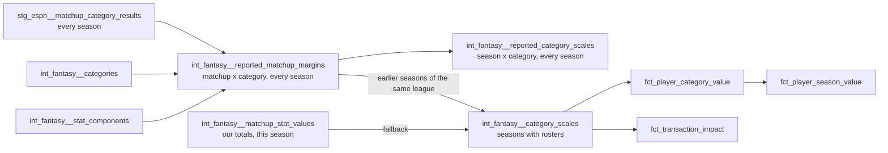

# Category scales from the league's earlier seasons — design

Issue: #57 · Requirements: [requirements.md](requirements.md)

## Overview

Two new intermediate models describe what the platform reported, for every league-season
loaded: the margin of every decided matchup in every scored category, and the scale those
margins give per league-season. `int_fantasy__category_scales`, which the value facts
already read, then chooses per category: pooled from the league's earlier seasons where
they hold enough matchups, the season's own matchups otherwise.

The value facts do not change. They divide by `margin_scale` and `side_denominator` as
they do today; what changes is which matchups those two numbers were measured from.

## Alternatives considered

The owner chose between the first three on 2026-10-08, after the measurements in
requirements.md.

| | A. Measure only | **B. Earlier seasons where there are enough, the season's own otherwise** | C. Both, selectable | D. Blend, weighted by how much of the season is played |
|---|---|---|---|---|
| Scale on day one of a season | none until matchups are decided | yes, for a league with history | either | yes |
| Moves when a matchup is restated | yes | no, with history | depends | yes, less |
| Players inside the sample that scales them | yes | no, with history | depends | partly |
| Works for a new league or a new category | yes | yes, by falling back | yes | yes |
| Parameters | none | one threshold | one threshold and a switch | a weighting curve |
| Cost | leaves the early-season noise | 2026 values move (median 0.09 of a top value of 36) | a second grain on both value facts, or a build variable, for a 0.999 rank correlation | a fitted parameter, which ADR 0010 ruled out |

- **A lost** because the scale is noisiest when a valuation is most used: 19% typical
  error after two matchup periods against 7% from earlier seasons.
- **C lost** because the two methods agree too closely to justify two answers to "what
  is this player worth".
- **D lost** because the weighting is a tunable, and past a third of a season it buys
  nothing measurable.

Within B, three narrower choices:

- **Which earlier seasons.** All of them. A window of the last 2, 3 or 4 does no better
  (requirements.md), and "all" has no parameter.
- **Whose totals for the earlier seasons.** The platform's reported ones, always, even
  for an earlier season that has rosters (2026, when 2027 is valued). One source for
  every earlier season; the reconciliation already shows ours and ESPN's agree (largest
  2026 difference in a scale: ERA, 1.1%). The alternative, ours where there are rosters
  and ESPN's elsewhere, makes the pooled scale depend on which seasons happen to be
  covered.
- **The denominator of a rate.** From the same matchups as the scale (ADR 0027). A
  rate's gaps are wider when sides pitch fewer innings, so a scale measured on sides of
  159 outs does not belong with a denominator of 172. Measured both ways, the values of
  2026 multiply by: WHIP 0.975 together against 0.900 mixed; ERA 0.959 against 0.885;
  AVG 1.018 against 0.970; K/9 1.142 against 1.053. Three of four move less together.
  K/9 moves more, and that is a finding and not an artefact: 2026's K/9 gaps are wide
  for its innings.

## Decisions

| ADR | Decision | Status |
|---|---|---|
| [0027](../../adr/0027-a-category-scale-is-pooled-from-the-leagues-earlier-seasons.md) | A category's scale, and a rate's denominator with it, is pooled from the league's earlier seasons where they hold enough matchups; amends ADR 0010 | proposed |

## Detailed design

### `int_fantasy__reported_matchup_margins`

Grain: (`platform`, `league_id`, `season`, `matchup_id`, `category_key`). A table. Every
league-season loaded.

| Column | Meaning |
|---|---|
| `platform`, `league_id`, `season`, `matchup_id` | the matchup |
| `category_key` | a category the league-season scores |
| `margin` | home's reported total minus away's |
| `is_rate` | the category has a denominator rule in `int_fantasy__stat_components` |
| `home_denominator`, `away_denominator` | for a rate, each side's reported denominator; null for a count, and for a rate whose denominator is not reported |

Built from `stg_espn__matchup_category_results` (one row per side and stat, with
`is_scored_category`) joined home to away, for matchups whose `winner` in
`stg_espn__matchups` is not `UNDECIDED`. ESPN reports a bye as a one-sided entry and as
`UNDECIDED`; both conditions exclude it.

The denominator uses the bridge `rec_espn__matchup_stat_differences` already uses: a
component of the rules is matched to the platform stat whose rule is exactly that
component, numerator, weight 1. A rate's denominator is the weighted sum of its
denominator components' reported totals, and null if any is not reported. For this
league that is at-bats (ESPN stat 0) for AVG and outs (34) for WHIP, ERA and K/9. ESPN
reports stats beyond the scored ones from 2019 on; in 2018 it reports only the scored
ones, so 2018 has outs and no at-bats.

The bridge is moved into a macro so that the two models share one definition.

### `int_fantasy__reported_category_scales`

Grain: (`platform`, `league_id`, `season`, `category_key`). A table. Every league-season
loaded, every scored category, spined on `int_fantasy__categories` so that a category or
a season with nothing to measure is a row and not an absence.

| Column | Meaning |
|---|---|
| `matchups_measured` | margins behind the scale; for a rate, only matchups with both denominators |
| `margin_scale` | root mean square of those margins; null when none |
| `side_denominator` | for a rate, mean reported denominator over the sides of those matchups; null for a count or when none |

This is the model the owner required on #57: 2020, which was not played, is 18 rows with
`matchups_measured` 0. It is also where "is this season typical" is read from. Nothing
downstream of it computes a value.

### `int_fantasy__category_scales`

Same grain, same seasons (those with rosters, ADR 0026), same three numeric columns the
facts read. Per category of a league-season:

1. `prior`: over `int_fantasy__reported_matchup_margins` rows of the same platform and
   league with `season` less than this one, restricted for a rate to rows with both
   denominators: the count, the root mean square, the mean denominator over sides, and
   the number of distinct seasons.
2. `own`: today's computation from `int_fantasy__matchup_stat_values`, unchanged.
3. If `prior`'s count is at least `var('fantasy_scale_min_prior_matchups', 100)`, the row
   takes `prior`'s scale, denominator, count and seasons, with `scale_source`
   `prior_seasons`. Otherwise it takes `own`'s, `seasons_measured` 1 (0 if no matchup
   was measured), `scale_source` `current_season`.

New columns: `scale_source`, `seasons_measured`. `matchups_measured` keeps its name and
now counts the matchups behind the scale in use.

**The threshold.** A root mean square of *n* near-normal margins has a relative standard
error of about 1/√(2n): 7% at 100, which is the season-to-season spread measured. Below
that the pooled scale is no better than the noise it is meant to remove. 100 is under
one full season for a 12-team league (143) and for a 10-team one (about 110), so one
complete earlier season qualifies. It is a dbt variable so that unit tests can lower it;
it is not a method switch.

**Why a rate falls back whole.** If earlier seasons report a rate's margins and never
its denominator, the pooled count for that category is zero by R2.3's rule and the
category takes the season's own scale and denominator. A pooled scale is never paired
with the season's own denominator.

**A category the league used to score.** SV and CG are in the margins and the reported
scales for 2018 to 2021 and in no row of `int_fantasy__category_scales` for 2026, which
does not score them. SVHD has four earlier seasons (590 matchups).

### The value facts

No SQL change. Their headers, and the model header of `int_fantasy__category_scales`
(which records ADR 0010's three accepted costs and its one-season sample), are rewritten
to say what holds now. ADR 0010's unit and formula stand.

### What a league-season now depends on

Until now every model's rows for a league-season depended only on that league-season's
captures, and `scripts/check_tenant_isolation.py` checks exactly that, by building each
alone and comparing. With this change a league-season's scales, and so its value facts,
depend on the same league's earlier seasons. Another league's captures still never
affect them. The check keeps passing in CI because no fixture league-season has 100
earlier matchups; its docstring is changed to say what it does and does not establish.
Making it build a league with its history is not needed while that is true.

## Test strategy

| Requirement | Test | Catches |
|---|---|---|
| R1.1–R1.6, R4.1 | unit tests on the margins model | a bye or an undecided matchup measured; a non-scored stat measured; a denominator taken from the wrong stat |
| R2.1–R2.4, R4.2 | unit tests on the reported scales; singular test that every scored category of every league-season has a row | an unplayed season vanishing; a rate measured from matchups without denominators |
| R3.1–R3.5, R4.3 | unit tests on `int_fantasy__category_scales`, with the threshold lowered by `overrides: vars` | the season's own or a later season's matchups pooled; another league's pooled; a mean of season scales in place of a pooled one; a pooled scale with the season's own denominator |
| R3.6, R4.4 | singular tests on `scale_source` against `matchups_measured`, and on rate rows | a scale labelled pooled that rests on too little |
| R3.7, R4.5 | the existing coverage and scale tests | a category dropped or added |
| R3.8 | `git diff` of the three facts shows comments only; `value_facts_share_the_category_scales` | a fact computing its own scale |
| R5.1–R5.3 | real build; every relation compared with a copy kept before; the expected values | any movement this document does not state |

A dbt unit test can set a variable for one test with `overrides: vars:`, which is how the
threshold is exercised at 2 matchups without changing it for the build.

## Risks

- **The owner reads values that moved.** Stated per category in requirements.md; the
  build stops if they differ from it.
- **Earlier seasons' sides were smaller** (159 outs against 172). Handled by taking the
  denominator from the same matchups; what remains is K/9, whose values rise 14%: the
  2026 season has an unusually wide K/9 scale for its innings.
- **A league whose settings changed** (size, roster slots, categories) pools seasons that
  are not the same game. For this league the size was 12 throughout and the 16 common
  categories kept their direction. Nothing detects a change of size; see *Open
  questions*.
- **AVG has one season fewer** (876 matchups, six seasons) because 2018 reports no
  at-bats.

## Open questions

- **Whether a change of league size, or of the lineup, should cut the history.** Not
  observed in this league. A general rule would compare `stg_espn__league_settings`
  across seasons.
- **Whether the linear form should give way to the normal curve for transaction
  impact**, where a window can be a whole season and contributions are larger. Measured
  only for one matchup's contribution.
- **How often a matchup turns on one category**, and whether that should weight
  categories. Out of scope by the owner's narrowing of 2026-10-08.

## Review log

## Amendments
