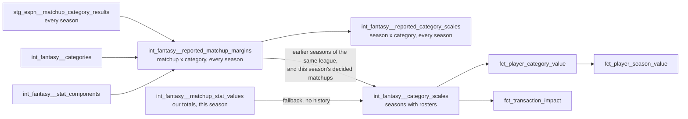

# Category scales from the league's earlier seasons and the season so far — design

Issue: #57 · Requirements: [requirements.md](requirements.md)

## Overview

Two new intermediate models describe what the platform reported, for every league-season
loaded: the margin of every decided matchup in every scored category, and the scale those
margins give per league-season. `int_fantasy__category_scales`, which the value facts
already read, then chooses per category: where the league's earlier seasons hold enough
matchups, a blend of those seasons and the season's own decided matchups, the earlier
seasons counting as a fixed 100; the season's own matchups alone otherwise.

The value facts do not change. They divide by `margin_scale` and `side_denominator` as
they do today; what changes is which matchups those two numbers were measured from.

## Alternatives considered

The owner chose on 2026-10-08, after the measurements in requirements.md: first B over A
and C, then E over B when asking how rule changes and changes in pitcher usage would be
followed.

| | A. Measure only | B. Earlier seasons alone, where there are enough | C. Both methods, selectable | D. Earlier seasons, adjusted for the season's volume | **E. Earlier seasons counted as 100 matchups, plus the season's decided matchups** |
|---|---|---|---|---|---|
| Scale on day one of a season | none | yes | either | yes, unadjusted | yes |
| Follows a rule change | in the season, noisily | no: pooled history, for years | depends | a change of volume only, and worse for the first month | yes, as matchups are decided |
| Follows a change no one can name (pitcher usage) | yes, noisily | no | depends | no | yes |
| Moves during the season | yes | no | depends | a little | yes, damped: at most 56% of the gap by the end of a 126-matchup regular season |
| Parameters | none | one threshold | a threshold and a switch | a threshold and a functional form | one number, used as threshold and weight |
| Error predicting the rest of a season, after 2 / 8 / 16 periods | 23.8% / 11.9% / 11.5% | 9.0% / 9.5% / 12.7% | | worse than B for the first month (11.9% against 8.5% after 2 periods, before the final rule) | 9.1% / 8.9% / 11.4% |

- **A lost** because the scale is noisiest when a valuation is most used.
- **B lost** to E because it cannot follow a change: 11.7% error on the pitching
  categories at mid-season against 9.3%, and the stolen-base scale of 2023 would have
  been 21% low all year.
- **C lost** because the methods agree too closely to justify two answers to "what is
  this player worth".
- **D lost** on measurement. A count's scale does follow the square root of its volume,
  but the season's volume is not known early (the opening matchup period is long), and
  it does nothing for changes that are not changes of volume.
- **A declared list of rule changes** (cutting the history at a break) was also
  considered: it needs someone to keep it, and in the season of a change it falls back
  to that season alone, which is A.

Within E, four narrower choices:

- **The weight of the earlier seasons.** The threshold itself, 100. Not a second number
  and not fitted: a scale from 100 matchups has a standard error of about 7%, which is
  how much seasons differ, so that is where history and the season are equally good
  evidence.
- **Which earlier seasons.** All of them, pooled. A window of the last 2, 3 or 4 does no
  better. With the season's own matchups now in the blend, recency is supplied by the
  season itself.
- **Whose totals.** The platform's reported ones, for the earlier seasons and for the
  season's own part of the blend, whether or not a season has rosters. One source for
  everything blended; ours and ESPN's 2026 scales differ by at most 1.1%. Decided
  matchups only, so a matchup in progress does not enter.
- **Which matchups.** Regular season only, each restated for a period of usual volume
  (see *Detailed design*). The alternatives were every decided matchup counted once, as
  ADR 0010 has it, which inflates a counting scale by about 4%; leaving the long periods
  out, which needs a cutoff and costs a tenth of the matchups; and a fitted exponent.
- **The denominator of a rate.** From the same matchups as the scale, with the same
  weights (ADR 0027). A rate's gaps are wider when sides pitch fewer innings, so a scale
  and a denominator from different matchups do not belong together.

## Decisions

| ADR | Decision | Status |
|---|---|---|
| [0027](../../adr/0027-a-category-scale-blends-the-leagues-earlier-seasons-with-the-season-so-far.md) | A category's scale, and a rate's denominator with it, blends the league's earlier seasons, counted as 100 matchups, with the season's decided matchups; amends ADR 0010 | proposed |
| [0028](../../adr/0028-a-league-season-may-read-its-leagues-earlier-seasons.md) | A league-season may read its own league's earlier seasons; isolation is checked by building it with them; amends ADR 0013 | proposed |

## Detailed design

### `int_fantasy__reported_matchup_margins`

Grain: (`platform`, `league_id`, `season`, `matchup_id`, `category_key`). A table. Every
league-season loaded.

| Column | Meaning |
|---|---|
| `platform`, `league_id`, `season`, `matchup_id` | the matchup |
| `category_key` | a category the league-season scores |
| `is_regular_season` | the matchup is not a playoff matchup of any tier |
| `margin` | home's reported total minus away's |
| `relative_volume` | how much was played in the matchup period, against the league-season's usual regular-season period; null for a playoff matchup |
| `standard_margin` | the margin restated for a period of usual volume: over √`relative_volume` for a count, times it for a rate |
| `is_rate` | the category has a denominator rule in `int_fantasy__stat_components` |
| `home_denominator`, `away_denominator` | for a rate, each side's reported denominator; null for a count, and for a rate whose denominator is not reported |
| `is_measured` | whether the row counts toward a scale: a regular-season matchup, and for a rate both denominators reported and above zero |

Built from `stg_espn__matchup_category_results` (one row per side and stat, with
`is_scored_category`) joined home to away, for matchups whose `winner` in
`stg_espn__matchups` is not `UNDECIDED`. ESPN reports a bye as a one-sided entry and as
`UNDECIDED`; both conditions exclude it.

The denominator uses the bridge `rec_espn__matchup_stat_differences` already uses: a
component of the rules is matched to the platform stat whose rule is exactly that
component, numerator, weight 1. A rate's denominator is the weighted sum of its
denominator components' reported totals, and null if any is not reported. For this
league that is at-bats (ESPN stat 0) for AVG and outs (34) for WHIP, ERA and K/9. ESPN
reports stats beyond the scored ones from 2019 on; in 2018 it reports only the scored
ones, so 2018 has outs and no at-bats.

A rate on a zero denominator is undefined. ESPN reports it as zero all the same (it does
for the zero-out sides of byes), and a reported 0.00 ERA would otherwise enter a scale
as the best ERA possible. `is_measured` applies the rule
`int_fantasy__matchup_stat_values` already applies to our own totals. No decided matchup
of 2018 to 2026 has such a side; the rule is there for the league that does.

**Regular season only.** A playoff matchup is not measured: by the owner's decision of
2026-10-08, a consolation matchup is not a contest both sides are trying to win, and a
value should be in units of a week that is. The winners' bracket goes with it, five
matchups a season, for one rule in place of two. Playoff rows stay in the model,
unmeasured, so that what was left out can be seen.

**Relative volume.** Matchup periods are not the same length: the opening period and
the All-Star break hold about one and a half usual weeks, and a count's margins are 38%
wider in them. Days are known for two seasons only and mislead where they are known
(2025's 13-day opening period holds 0.65 of a week's play), so length is measured by
what was played. For a matchup period: over the counting categories the league-season
scores, the median of (the period's mean reported side total ÷ the median of that mean
over the league-season's regular-season periods). A median over categories, so that one
low-count category's noisy week, or a week with none of it at all, does not move it; a
category whose usual total is zero is left out. Nothing here names a stat.

**Standard margin.** A count summed over more play has gaps that grow with the square
root of how much; a rate over more play has gaps that shrink by the same factor. So a
count's margin is divided by √`relative_volume` and a rate's multiplied by it, and a
rate's side denominator is divided by the relative volume. The square root is how sums
of independent days behave and is not fitted; measured, counts grow somewhat faster
(exponent 0.7) and rates shrink somewhat slower (0.42), so after standardising the long
periods are still 12% and 9% wide. That residual is on a tenth of the matchups and
comes to about 1% of a scale.

**Early in a season** the usual period is the median of the periods decided so far. With
one period decided its relative volume is 1 by construction, so a long opening period
enters unadjusted until two or three more are decided. The season then carries about 6%
of the blend.

The bridge is moved into a macro so that the two models share one definition.

### `int_fantasy__reported_category_scales`

Grain: (`platform`, `league_id`, `season`, `category_key`). A table. Every league-season
loaded, every scored category, spined on `int_fantasy__categories` so that a category or
a season with nothing to measure is a row and not an absence.

| Column | Meaning |
|---|---|
| `matchups_measured` | rows with `is_measured` behind the scale |
| `margin_scale` | root mean square of those rows' standard margins; null when none |
| `side_denominator` | for a rate, mean over those matchups' sides of the reported denominator divided by the relative volume; null for a count or when none |

This is the model the owner required on #57: 2020, which was not played, is 18 rows with
`matchups_measured` 0. It is also where "is this season typical" is read from. Nothing
downstream of it computes a value.

### `int_fantasy__category_scales`

Same grain, same seasons (those with rosters, ADR 0026). `margin_scale`,
`side_denominator` and `matchups_measured` keep their names; the facts read the first
two. With *w* = `var('fantasy_scale_prior_matchups', 100)`, per category of a
league-season:

1. `prior`: over the `is_measured` rows of `int_fantasy__reported_matchup_margins` of
   the same platform and league with `season` less than this one: the count *P*, the
   sum of squared standard margins, their root mean square *p*, the mean standardised
   denominator over sides *q*, and the number of distinct seasons. Sums in (`season`, `matchup_id`) order.
2. `reported_own`: the same over this league-season's own `is_measured` rows: the count
   *n*, the sum of squares *S*, the sum of side denominators *D*.
3. `own`: today's computation from `int_fantasy__matchup_stat_values`, unchanged.
4. If *P* ≥ *w*: `margin_scale` = √((*S* + *w*·*p*²) / (*n* + *w*)); for a rate,
   `side_denominator` = (*D* + 2*w*·*q*) / (2*n* + 2*w*); `matchups_measured` = *n*;
   `scale_source` = `prior_and_current_seasons`.
5. Otherwise the row is `own`'s, with `scale_source` = `current_season` and the three
   `prior_` columns as measured (so a league one season short of the threshold shows
   how far short) except `prior_margin_scale`, which is null.

New columns: `scale_source`, `prior_matchups_measured` (*P*), `prior_seasons_measured`,
`prior_margin_scale` (*p*).

**One number.** A scale from *n* near-normal margins has a relative standard error of
about 1/√(2n): 7% at 100, the season-to-season spread measured. Below 100 earlier
matchups, history is noisier than seasons differ and is not used. At or above it,
history counts as exactly 100, however much there is: more seasons make *p* more
precise, not more relevant to this season. 100 is under one full regular season for a
12-team league (126) and about one for a 10-team league. It is a dbt variable so that tests and the
isolation check can lower it; it is not a method switch.

**Through a season.** With no decided matchup the scale is *p*. After 12 matchup periods
of a 12-team league (72 matchups) the season carries 42% of the weight; after a full
regular season (126), 56%. The scale therefore moves during a season, by design and gradually:
that is how a change in the game reaches it.

**Why a rate falls back whole.** If earlier seasons report a rate's margins and never
its denominator, *P* is zero by `is_measured` and the category takes `own`'s scale and
denominator. A blended scale is never paired with another source's denominator.

**A category the league used to score.** SV and CG are in the margins and the reported
scales for 2018 to 2021 and in no row of `int_fantasy__category_scales` for 2026, which
does not score them. SVHD has four earlier seasons (522 matchups).

### The value facts

No SQL change. Their headers, and the model header of `int_fantasy__category_scales`
(which records ADR 0010's three accepted costs and its one-season sample), are rewritten
to say what holds now: with history, the three costs remain in damped form, since the
season's own matchups are part of the blend. ADR 0010's unit and formula stand.

### What a league-season now depends on, and the isolation check

Until now every model's rows for a league-season depended only on that league-season's
captures, and `scripts/check_tenant_isolation.py` checks exactly that, by building each
alone and comparing (ADR 0013). With this change a league-season's scales, and so its
value facts, depend on the same league's earlier seasons. Another league's captures, and
a later season's, must still never affect them.

Left alone, the check would keep passing only because no fixture league-season has 100
earlier matchups: it would say nothing about the new dependency, and would fail on
correct results the day a fixture qualified. So the check changes
([ADR 0028](../../adr/0028-a-league-season-may-read-its-leagues-earlier-seasons.md)):

- A single build holds the league's captures for the season under test **and every
  earlier season**, with those seasons' MLB data. `copy_single` takes the seasons up to
  the one under test; the comparison is still of that league-season's rows only.
- Every build of the check, combined and single, passes
  `fantasy_scale_prior_matchups: 2`. The fixture seasons have two decided matchups
  each, so (111111, 2026) blends in 2025, (111111, 2027) blends in 2025 and 2026, (222222, 2027)
  blends in 2026, and (222222, 2026), which has no earlier season, falls back. Both paths
  run, and league 222222's history differs from 111111's, so a scale blended across
  leagues or from a later season shows as a difference.
- The main CI build keeps the default of 100 and so keeps today's values.

## Test strategy

| Requirement | Test | Catches |
|---|---|---|
| R1.1–R1.10, R4.1 | unit tests on the margins model | a bye, an undecided or a playoff matchup measured; a non-scored stat measured; a denominator taken from the wrong stat; a long period counted at face value; a rate standardised the way a count is; one category's empty week moving the relative volume |
| R2.1–R2.5, R4.2 | unit tests on the reported scales; singular test that every scored category of every league-season has a row | an unplayed season vanishing; a rate measured from matchups without denominators |
| R3.1–R3.6, R4.3 | unit tests on `int_fantasy__category_scales`, with the variable lowered by `overrides: vars`, against hand-computed blends | a later season's or another league's matchups used; an undecided matchup used; a mean of season scales in place of a pooled one; history weighted by its size and not by the variable; a blended scale with another source's denominator |
| R3.7, R4.4 | singular tests on `scale_source` against `prior_matchups_measured`, and on rate rows | a scale labelled blended that rests on too little history |
| R3.8, R4.5 | the existing coverage and scale tests | a category dropped or added |
| R3.9 | `git diff` of the three facts shows comments only; `value_facts_share_the_category_scales` | a fact computing its own scale |
| R5.1–R5.4 | the isolation check, each league-season built with its league's earlier seasons, the variable set to 2; pytest of `copy_single`'s season selection | another league's or a later season's matchups in a blended scale; a check that passes only because nothing blends |
| R6.1–R6.3 | real build; every relation compared with a copy kept before; the expected values | any movement this document does not state |

A dbt unit test can set a variable for one test with `overrides: vars:`, which is how the
threshold is exercised at 2 matchups without changing it for the build.

## Risks

- **The owner reads values that moved.** Stated per category in requirements.md; the
  build stops if they differ from it.
- **Values move during a season again**, which pooling alone would have ended. Accepted
  by the owner as the price of following a change; damped by the weight of history.
- **The first season after a rule change is still valued mostly on the old scale early
  on.** With 24 matchups decided the season carries 19% of the weight. Stolen bases in
  2023 would have started 21% low and closed the gap through the year.
- **Earlier seasons' sides were smaller** (157 outs against 170, for a period of usual
  volume). Handled by blending
  the denominator with the scale.
- **A league whose settings changed** (size, roster slots, categories) blends seasons
  that are not the same game. For this league the size was 12 throughout and the 16
  common categories kept their direction. Nothing detects a change of size; see *Open
  questions*.
- **Standardising is partial.** Long periods stay 12% (counts) and 9% (rates) wide,
  about 1% of a scale. Accepted in preference to a fitted exponent.
- **A fixture season has one matchup period**, so every relative volume in CI is 1 and
  only unit tests exercise standardising. The real build is where it is seen at work.
- **A scale blended from two fixture matchups may be zero or tiny** in the isolation
  check's builds (two tied margins). The facts already handle a zero scale; if a test
  of the combined build objects, that is found in task 7 and taken to the owner, not
  worked around by changing the variable.
- **AVG has one season fewer** (774 matchups, six seasons) because 2018 reports no
  at-bats.

## Open questions

- **Whether a change of league size, or of the lineup, should cut the history.** Not
  observed in this league. A general rule would compare `stg_espn__league_settings`
  across seasons.
- **Whether the linear form should give way to the normal curve for transaction
  impact**, where a window can be a whole season and contributions are larger. Measured
  only for one matchup's contribution.
- **How often a matchup turns on one category**, and whether that should weight
  categories. Out of scope by the owner's narrowing of 2026-10-08.

## Review log

| Source | Finding | Resolution |
|---|---|---|
| design-review | F1 (P1): a reported denominator of zero would be measured, against the existing rule that a rate on a zero denominator is undefined | Changed: R1.7 and `is_measured`; R2.3 measures only those rows; a unit test of a decided matchup with a zero-denominator side |
| design-review | F2 (P1): "a rate's scale and denominator are both null or both present" contradicts today's fallback, which can give a denominator and no scale | Changed: R4.4 holds only rows that use history to it |
| design-review | F3 (P1): the isolation gate passes only because no fixture qualifies, and cannot validate the new dependency | Changed: R5, ADR 0028 (proposed, the owner's decision): single builds include the league's earlier seasons, and the check runs at a threshold of 2 so the pooled path is exercised |
| design-review | F4 (P2): the pooled sum's order is not unique, matchup ids repeat across seasons | Changed: R2.4 orders by (`season`, `matchup_id`) |

## Amendments

Before approval, 2026-10-08, going through the decisions with the owner: the scale
pooled from earlier seasons alone (first draft) was replaced by the blend, after the
owner asked how rule changes and changes in pitcher usage would be followed. A volume
adjustment was proposed, accepted, then withdrawn the same day when an out-of-sample
test showed it worse than no adjustment for the first month of a season. Playoff
matchups were then left out and margins standardised for each period's volume, both at
the owner's request. R1 to R3, the expected values and ADR 0027 were rewritten; the design review's findings F1 to F4 were
made against the first draft and their resolutions carry over unchanged.
