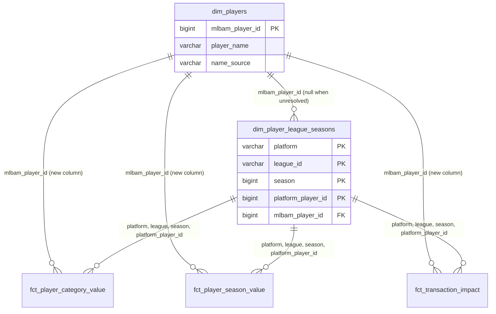

# The player dimension is keyed by MLB id — design

Issue: #60 · Requirements: [requirements.md](requirements.md) · Tasks: [tasks.md](tasks.md)

## Overview

`dim_players` is rewritten as one row per MLB player, keyed by `mlbam_player_id`: every
player in the loaded game logs, plus every MLB id a league-season resolved a platform
player to. Its one attribute is a name, from the boxscores already landed. The table
that used to be `dim_players` (one row per platform player, his latest match) is not
kept: `dim_player_league_seasons`, unchanged, is the bridge from a platform's player id
to an MLB id, because a league-season is the grain at which that match is made. The
three player facts keep their grain and their platform id and gain `mlbam_player_id`,
so they join the dimension directly.

`dim_players` is rewritten; `dim_player_league_seasons` is unchanged; the three facts
each gain one column.

## Evidence

Read-only, 2026-10-09. Real season unless marked.

- 498 platform players, 498 distinct MLB ids, none null, one to one.
- 1,472 MLB players in `int_mlb__player_game_days`; the union with the 498 is 1,477.
  The 5 extra are rostered players with no 2026 game. All 5 have a platform name.
- One name per MLB id across every 2026 boxscore line (1,472 id-name pairs).
- MLB's public season list (`/api/v1/sports/1/players?season=2026`, one request, no
  credentials, fetched once for this spec and not kept): 1,511 players. It contains all
  1,472 with the same `fullName` as the boxscores, and 1 of the 5 with no game.
- The id map: 3,657 rows, one MLB id per ESPN id and the reverse; 1,209 of the 1,472.
- CI fixture warehouse: 325 platform players, 318 resolved and 7 `unresolved`
  (transaction-only); 74 MLB players with a game; union 363, so 289 are named only by
  the platform. Both fallback branches and the no-row case are exercised in CI.
- Nothing outside `dbt/` and `scripts/check_tenant_isolation.py` reads `dim_players`.
  In dbt: its own tests, and three `relationships` tests that point at it.

## Alternatives considered

Four separable choices. The first matrix is the shape; the others follow from it.

### The shape of the dimension and the bridge

| | A — MLB-keyed dimension; the league-season table is the bridge (chosen) | B — MLB-keyed dimension plus a platform-grain bridge | C — one dimension, composite key | D — leave it (ADR 0012) |
|---|---|---|---|---|
| One reference across platforms | yes | yes | yes | no |
| Free agents and dropped players have a row | yes | yes | yes | no |
| Every row true at its grain | yes | no: the bridge must pick one league-season's match | yes | yes |
| A player with no MLB id | no dimension row; visible in the league-season table | a bridge row with a null id | a row keyed by his platform id | a row |
| Models | 2 (one rewritten) | 3 (one rewritten, one new) | 2 (one rewritten) | 2 |
| Needs a "latest league-season" rule | only for 5 fallback names | yes, for every row of the bridge | yes | yes |
| 2026 rows | 1,477 + 498 | 1,477 + 498 + 498 | 1,477 | 498 + 498 |

**A.** The match from a platform player to an MLB player is made per league-season
(#28), so the table at that grain already is the bridge, and it does not change.

**B.** What the issue's title describes. It loses because a (platform, player) to MLB id
mapping is only a function if one league-season's answer is chosen, which is the
"latest" rule ADR 0012 accepted as a cost. It would be today's `dim_players` under a
new name, kept for no reader: nothing reads it but tests.

**C.** A key such as `mlb:691781` or `espn:42404`, so that an unresolved player has a
row. It loses because the key stops being an id anything else carries, every join needs
the prefix logic, and a player's key changes the day the id map catches up with him.

**D.** Costs nothing now, and every later mart is built on a key that is ESPN's.

### Who is in the dimension

| | Every MLB player loaded, plus every resolved id (chosen) | Only players a league touched |
|---|---|---|
| Rows, 2026 | 1,477 | 498 |
| Names the replacement pools' players | yes | no |
| Depends on which leagues are loaded | no, except for the 5 with no game | yes |

The narrower table is today's coverage with a different key. The issue's own evidence
is that free agents and dropped players' later production have no name.

### What the facts carry

| | Keep grain and platform id, add `mlbam_player_id` (chosen) | Re-key the facts by MLB id | Leave the facts; join through the league-season table |
|---|---|---|---|
| 2026 values at risk | none: one added column | yes: grain and keys change in three facts and their tests | none |
| A fact joins `dim_players` directly | yes | yes | no: two joins, four key columns |
| An unresolved player's rows | kept, id null | lost, or need an invented key | kept |
| Two platform ids for one MLB player | two rows, as the platform has them | merged | two rows |

Re-keying buys nothing the added column does not, and it is the option the issue itself
flags as risking the 2026 numbers.

### Where a name comes from

| | Boxscores already landed, platform name as fallback (chosen) | Land MLB's season player list | The id map |
|---|---|---|---|
| New ingestion | none | one public request a season, a landing folder, a staging model, fixtures | none |
| Names for the 1,472 with a game | all | all, identical | 1,209 |
| Names for the 5 with no game | from the platform | 1 of 5; the rest still from the platform | unknown |
| Other attributes | none | handedness, birth date, debut, primary position | team, position (third party) |

The endpoint is cheap and good, and this spec does not need it: it changes no name and
covers one more player. It is the right source the day handedness or age is wanted.

## Decisions

| ADR | Decision | Status |
|---|---|---|
| [0033](../../adr/0033-the-player-dimension-is-one-row-per-mlb-player.md) | The player dimension is one row per MLB player, for every player loaded; a player with no MLB id has no row. Amends 0012 | proposed |
| [0034](../../adr/0034-the-league-season-table-is-the-bridge-and-facts-carry-the-mlb-id.md) | The league-season table is the bridge from a platform's player to an MLB player; no platform-grain table is kept; facts keep their grain and gain the MLB id | proposed |
| [0035](../../adr/0035-a-players-name-comes-from-the-boxscores-already-landed.md) | A player's name comes from the boxscores already landed, with the platform's name as fallback; no people endpoint | proposed |

## Detailed design

### `dim_players.sql` (rewritten)

Grain: one row per `mlbam_player_id`. Materialized as a table, in `marts`.

| Column | Type | Meaning |
|---|---|---|
| `mlbam_player_id` | bigint, not null, unique | MLB's id for the player |
| `player_name` | varchar, nullable | MLB's name where a game is loaded, else the platform's |
| `name_source` | varchar, nullable | `mlb`, `platform`, or null when there is no name |

CTEs, named for what they hold:

- `game_names`: from `stg_mlb__batting_game_logs` and `stg_mlb__pitching_game_logs`
  (unioned), joined to `stg_mlb__games` for `official_date`, where `player_name` is
  not null: one row per (`mlbam_player_id`, `game_pk`) with the name on that line.
- `latest_game_names`: one row per `mlbam_player_id`, by `official_date desc, game_pk
  desc, player_name` (the name last, so the choice never depends on input order).
- `platform_names`: from `dim_player_league_seasons` where `mlbam_player_id` and
  `player_name` are not null: one row per `mlbam_player_id`, by `season desc,
  last_rostered_date desc nulls last, league_id, platform, platform_player_id`. The
  filter comes first on purpose (R1.4): the fallback is the latest name there is, not
  the name on the latest row.
- `known_players`: `select mlbam_player_id from int_mlb__player_game_days` union
  `select mlbam_player_id from dim_player_league_seasons where mlbam_player_id is not
  null`.
- Final select: `known_players` left-joined to both name CTEs;
  `coalesce(latest_game_names.player_name, platform_names.player_name)`, and
  `name_source` by which side supplied it. Both CTEs hold only non-null names, so the
  `coalesce` falls through to the platform only when no game line names him.

Deduplication is at the entity grain with a deterministic tie-break (rule 5), written
with `qualify row_number()` as the current model does; `fo_latest_by_entity` appends a
`qualify` to a select and may be used where it fits the CTE.

The header comment says why: the key is MLB's because production is measured by it; the
table holds everyone loaded so a free agent has a name; it is defined over everything
loaded, so it is not the same in a combined build as in a single one.

### `dim_player_league_seasons.sql`

Not edited, apart from two comment lines that name `dim_players` as built from it in
the old sense. Its `relationships` test from `platform_player_id` to `dim_players` is
replaced by one from `mlbam_player_id` to `dim_players.mlbam_player_id` (R2.2). A
`relationships` test passes on a null, so an unresolved player does not fail it.

### The facts

- `fct_player_category_value` and `fct_player_season_value`: the final select
  left-joins `dim_player_league_seasons` on (`platform`, `league_id`, `season`,
  `platform_player_id`) and selects its `mlbam_player_id` last. That key is unique in
  the league-season table, so the join cannot add rows; the facts' existing
  uniqueness tests would fail if it did.
- `fct_transaction_impact` already left-joins `dim_player_league_seasons` in its
  `windows` CTE and carries `mlbam_player_id` from there through `measured` (by
  `windows.*`). Its final select, which reads from `measured`, appends
  `measured.mlbam_player_id` last. No join is added.
- YAML, each fact: `mlbam_player_id` with a `relationships` test to `dim_players`
  (R3.3). The two value facts' existing `relationships` test on `platform_player_id`,
  which points at `dim_players`, is removed: a one-column test would pass on a player
  who exists only in another league, so the singular test below replaces it (R3.4). The
  descriptions say the column is the MLB id
  of the row's own league-season, and null for an unresolved player.

### Tests added and removed

- `dbt/tests/dim_players_hold_exactly_the_known_mlb_players.sql` (R4.2): a full outer
  join of `dim_players` with the union R1.1 names, returning ids on one side only. It
  restates the union on purpose, as the independent definition the model is checked
  against.
- `dbt/tests/dim_player_league_seasons_a_player_keeps_one_mlb_id.sql` (R2.3),
  `severity: warn`: (`platform`, `platform_player_id`) with more than one distinct
  non-null `mlbam_player_id`, with the ids and seasons.
- `dbt/tests/player_facts_carry_their_league_seasons_mlb_id.sql` (R3.4): the three
  facts' distinct (`platform`, `league_id`, `season`, `platform_player_id`,
  `mlbam_player_id`), each labelled with its fact, left-joined to
  `dim_player_league_seasons` on the first four; returns a row with no match, or whose
  `mlbam_player_id` `is distinct from` the matched row's.
- Unit test `dim_players_names_come_from_the_latest_game_then_the_platform` (R4.3),
  inputs given for the three staging models, `int_mlb__player_game_days` and
  `dim_player_league_seasons`:
  1. two games with different spellings → the later game's name, `mlb`;
  2. resolved, no game, two league-season rows → the later season's name, `platform`;
  3. a game and a platform name that differ → MLB's, `mlb`;
  4. resolved, no game, transaction-only with a null name → row kept, both null;
  5. an MLB player in the logs no league touched → row, `mlb`;
  6. a platform player with a null MLB id → no row;
  7. resolved, no game, a named earlier league-season and a later transaction-only one
     with a null name → the earlier name, `platform`;
  8. a later game line with a null name and an earlier one with a name → the earlier
     name, `mlb`.
- Removed with the model they describe (R4.4):
  `dbt/tests/dim_players_equal_their_latest_league_season.sql` and the unit test
  `dim_players_one_row_per_player_equal_to_his_latest_league_season`.
- Each fact: one existing unit test gains `mlbam_player_id` in its expected rows, for a
  resolved and an unresolved player. (A dbt unit test compares only the columns its
  expected rows name, so the other unit tests are untouched.)

### `scripts/check_tenant_isolation.py`

`dim_players` stays in `EXEMPT_FROM_ROW_COMPARISON` and `OWN_TESTS` is unchanged. Only
the comment changes: the reason is now that a name is taken from the latest game of
everything loaded, and a single build never holds a later season. No logic changes.

### Sequencing with #12

#12 (`fct_lineup_decisions`) is specced after this one, on the owner's instruction of
2026-10-09. What it takes from here: a new fact keeps the platform's player id at its
grain and carries `mlbam_player_id` beside it, and names players through `dim_players`.

## Test strategy

| Requirement | Test | Catches |
|---|---|---|
| R1.1, R4.2 | `dim_players_hold_exactly_the_known_mlb_players` | a free agent dropped by an inner join; a row for an id nothing holds |
| R1.2 | `unique`, `not_null` on `mlbam_player_id` | a fan-out from two names on one day |
| R1.3–R1.6, R4.3 | the unit test, eight cases | a name from the wrong game; the platform's name preferred over MLB's; a nameless player dropped; an unresolved player given a row |
| R2.1 | `except all` both ways against task 1's copy, real season | any change to the league-season table |
| R2.2, R3.3 | `relationships` tests | a fact or league-season id with no dimension row |
| R3.4 | `player_facts_carry_their_league_seasons_mlb_id` | a fact row whose player exists only in another league-season; an id taken from the wrong one; a null where the league-season row has an id |
| R2.3 | the warning test | a name match that changed between seasons, unnoticed |
| R2.4 | none automated; the model no longer exists | — |
| R3.1 | the facts' unit tests | the column missing, or not last |
| R3.2 | `except all` both ways on existing columns, real season; the facts' uniqueness tests | a changed value; a join that fans out |
| R4.1, R4.5 | `.agentic/gates` | a leak the exemption was hiding |

## Risks

- A reader or a saved query expects `dim_players.platform_player_id` — low; nothing in
  the repo does — the column moves to no table of the same name, and the PR description
  says so.
- One platform splits a two-way player into two ids that map to one MLB id — possible
  on ESPN in past seasons; 0 in 2026 — the facts keep two rows and the dimension one,
  which is right; a query grouping by MLB id sums both, which is also right. Not
  tested, because nothing is wrong when it happens.
- The multi-league fixture trips R2.3's warning (it respells one player in the second
  league) — unmeasured — task 1 records it. If it does, CI gains one named warning, and
  the owner is told before the PR is opened.
- A name MLB changes mid-season moves `dim_players` for every season — certain in
  principle, 0 in 2026 — accepted: the dimension shows who he is now, and no number
  reads a name.
- `dim_players` goes from 498 to 1,477 rows and reads three staging models — negligible
  on DuckDB.

## Open questions

- **Whether the multi-league fixture produces an R2.3 warning.** Task 1 measures it.
- **The 4 of 5 no-game players absent from MLB's 2026 season list** were not looked up
  one by one (`/people/{id}` would say who they are). It does not affect this design:
  their names come from the platform either way.
- **Past seasons' boxscores are not loaded**, so "one spelling per MLB id" is measured
  on one season only. The latest-game rule covers more than one spelling; nothing
  measures how common that is.

## Review log

| Source | Finding | Resolution |
|---|---|---|
| design-review | F1 (P1): a one-column `relationships` test on `platform_player_id` passes when the player exists only in another league, and a null MLB id then passes too, so R3.1 and R3.3 were not enforced | Changed: R3.4 and the singular test `player_facts_carry_their_league_seasons_mlb_id`, joined on all four keys with a null-safe comparison. The one-column test is removed, not re-pointed |
| design-review | F2 (P2): the design filtered null platform names before choosing the latest row while R1.4 read as "the latest row"; a null game name could fall through to the platform | Changed: R1.3 and R1.4 now say the latest non-null name, on both sides; the design says why the filter comes first; unit cases 7 and 8 added |
| design-review | F3 (P2): `players.mlbam_player_id` is out of scope in `fct_transaction_impact`'s final select | Changed: the design names `measured.mlbam_player_id`, which the model already carries, and adds no join |

## Amendments
