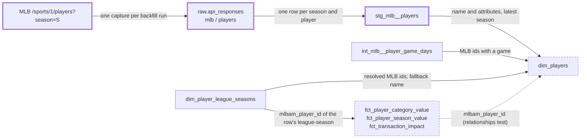

# The player dimension is keyed by MLB id — design

Issue: #60 · Requirements: [requirements.md](requirements.md) · Tasks: [tasks.md](tasks.md)

## Overview

MLB's season player list is landed as a new raw capture and staged as
`stg_mlb__players`. `dim_players` is rewritten as one row per MLB player, keyed by
`mlbam_player_id`: everyone in a landed player list, everyone in the loaded game logs,
and every MLB id a league-season resolved a platform player to. It carries MLB's name
and five attributes from the list. The table that used to be `dim_players` (one row per
platform player, his latest match) is not kept: `dim_player_league_seasons`, unchanged,
is the bridge from a platform's player id to an MLB id, because a league-season is the
grain at which that match is made. The three player facts keep their grain and their
platform id and gain `mlbam_player_id`, so they join the dimension directly.

Solid border, thick: new. Dashed border: changed. `dim_player_league_seasons` and
`int_mlb__player_game_days` are unchanged.

## Evidence

Read-only, 2026-10-09. Real season unless marked.

- 498 platform players, 498 distinct MLB ids, none null, one to one.
- 1,472 MLB players in `int_mlb__player_game_days`. One name per MLB id across every
  2026 boxscore line.
- MLB's season list (`/api/v1/sports/1/players?season=2026`: public, one request, about
  1.5 MB, fetched once for this spec and not kept): 1,511 players, distinct ids. It
  holds all 1,472 with a game, with a `fullName` identical to the boxscore's, and 494 of
  the 498 resolved players. So the union is 1,515, and 4 resolved players (rostered,
  no 2026 game) are in no list.
- In the list, `fullName`, `primaryPosition`, `batSide`, `pitchHand` and `birthDate` are
  present for all 1,511; `mlbDebutDate` is missing for 21. `batSide`: R 952, L 470,
  S 89. `pitchHand`: R 1,202, L 307, S 2. `active` is true for every row, so it says
  nothing. The payload has no season field. The 2025 list has 1,470 players.
- The list carries `firstName`, `lastName` and similar keys. They are public MLB data
  and the privacy patterns are scoped to ESPN paths, but nothing here reads them.
- The id map: 3,657 rows, one MLB id per ESPN id and the reverse; 1,209 of the 1,472.
- CI fixture warehouse: 325 platform players, 318 resolved and 7 `unresolved`
  (transaction-only); 74 MLB players with a game; union 363.
- The loader is generic over source and endpoint; the isolation script selects MLB
  folders by `season=` whatever the endpoint. `fixtures/landing` is 1.2 MB; the list's
  seven read fields for all 1,511 players would be 300 KB.
- Nothing outside `dbt/` and `scripts/check_tenant_isolation.py` reads `dim_players`.

## Alternatives considered

Five separable choices. The owner decided the first four on 2026-10-09; the matrices
record what was weighed.

### The shape of the dimension and the bridge

| | A — MLB-keyed dimension; the league-season table is the bridge (chosen) | B — MLB-keyed dimension plus a platform-grain bridge | C — one dimension, composite key | D — leave it (ADR 0012) |
|---|---|---|---|---|
| One reference across platforms | yes | yes | yes | no |
| Free agents and dropped players have a row | yes | yes | yes | no |
| Every row true at its grain | yes | no: the bridge must pick one league-season's match | yes | yes |
| A player with no MLB id | no dimension row; visible in the league-season table | a bridge row with a null id | a row keyed by his platform id | a row |
| Models | 2 (one rewritten) | 3 (one rewritten, one new) | 2 (one rewritten) | 2 |
| Needs a "latest league-season" rule | only for the fallback name | yes, for every row of the bridge | yes | yes |

**A.** The match from a platform player to an MLB player is made per league-season
(#28), so the table at that grain already is the bridge, and it does not change.

**B.** What the issue's title describes. For the 489 players the id map resolves, the
mapping really is platform-level, and a one-row lookup is convenient. It loses because
it needs the "latest" rule ADR 0012 accepted as a cost, stays exempt from the isolation
gate, and no model would read it. The owner asked why not, and chose A.

**C.** A key such as `mlb:691781` or `espn:42404`. The key stops being an id anything
else carries, and a player's key changes the day the id map catches up with him.

**D.** Every later mart is built on a key that is ESPN's.

### Who is in the dimension

| | Every MLB player loaded, plus every resolved id (chosen) | Only players a league touched |
|---|---|---|
| Rows, 2026 | 1,515 | 498 |
| Names the replacement pools' players | yes | no |
| Depends on which leagues are loaded | only for the 4 in no list | yes |

"Loaded" now includes the landed player list, so 39 listed players with no 2026 game
have a row too.

### What the facts carry

| | Keep grain and platform id, add `mlbam_player_id` (chosen) | Re-key the facts by MLB id | Leave the facts; join through the league-season table |
|---|---|---|---|
| 2026 values at risk | none: one added column | yes: grain and keys change in three facts and their tests | none |
| A fact joins `dim_players` directly | yes | yes | no: two joins, four key columns |
| An unresolved player's rows | kept, id null | lost, or need an invented key | kept |

### Where names and attributes come from

| | Land MLB's season player list (chosen) | Boxscores already landed | The id map |
|---|---|---|---|
| New ingestion | one public request a run, a landing folder, a staging model, fixtures | none | none |
| Names for the 1,472 with a game | all, identical to the boxscores | all | 1,209 |
| Of the 5 resolved players with no game | 1 | 0 | unknown |
| Other attributes | handedness, birth date, debut, primary position | none | team, position (third party) |

The recommendation was the boxscores, because the list changes no name. The owner chose
the list for its attributes. The boxscore name stays as the second source and the
platform's as the third, so a row is named whichever of the three holds him.

### How the list is captured

| | A — a snapshot on every `backfill mlb` run (proposed) | B — once per season, refetched only with `--refresh` | C — fetched only when a boxscore names an unlisted player |
|---|---|---|---|
| A mid-season call-up appears | the next run | when someone remembers | when he plays |
| Landing growth | about 1.5 MB a run; some 280 MB over a season of daily runs | 1.5 MB a season | small |
| Same policy as the schedule and the pro schedule | yes | no | no |
| Ingestion interprets data | no | no | yes: it reads boxscores to decide |

**A** follows ADR 0024's rule for a season-level capture. **B** is cheap and silently
stale. **C** breaks "ingestion never interprets data".

## Decisions

| ADR | Decision | Status |
|---|---|---|
| [0033](../../adr/0033-the-player-dimension-is-one-row-per-mlb-player.md) | The player dimension is one row per MLB player, for every player loaded; a player with no MLB id has no row. Amends 0012. Chosen by the owner 2026-10-09 | proposed |
| [0034](../../adr/0034-the-league-season-table-is-the-bridge-and-facts-carry-the-mlb-id.md) | The league-season table is the bridge; no platform-grain table is kept; facts keep their grain and gain the MLB id. Chosen by the owner 2026-10-09 | proposed |
| [0035](../../adr/0035-a-players-name-and-attributes-come-from-mlbs-season-player-list.md) | A player's name and attributes come from MLB's season player list, with the boxscore and then the platform as fallback for the name. Source chosen by the owner 2026-10-09; the column set is still to confirm | proposed |
| [0036](../../adr/0036-the-player-list-is-a-season-level-snapshot-landed-on-every-mlb-run.md) | The player list is a season-level snapshot landed on every MLB run; a failure does not stop the boxscores | proposed |

## Detailed design

### Ingestion: `ingestion/src/front_office/mlb/players.py` (new)

Modelled on `mlb/schedule.py`. Fetch-and-save only.

- `SOURCE = "mlb"`, `ENDPOINT = "players"`.
- `backfill_players(*, zone, client, season, fetched_at) -> Path`: `client.get(
  f"{BASE_URL}/sports/1/players", params={"season": season})`, then `zone.write(
  source, endpoint, partitions={"season": season}, name=f"fetched_at={fetched_at}",
  payload=response.json(), request={"url": ..., "params": params}, fetched_at=...)`.
  The capture is `mlb/players/season=<year>/fetched_at=<stamp>/`.
- `cli.py`, `backfill mlb`: `endpoints` becomes `("schedule", "players", "boxscore")`,
  run in that order. The players step is wrapped as `land_pro_schedule` is: an HTTP
  error is echoed to stderr, the run goes on to the boxscores, and the command exits 1
  at the end (R5.3). A boxscore failure already exits 1; both are reported.
- `audit.py`, `check_mlb`: a `Severity.WARNING` finding, `no committed player-list
  capture`, when the season has a schedule capture and no `mlb/players` capture (R5.5).
  A warning, because no number depends on the list.
- No credential is read: `HttpClient("mlb")` is the public client the schedule uses.
- Tests in `ingestion/tests/test_mlb_players.py`, with the HTTP transport faked as the
  schedule's tests do: the request made, the capture's path and sidecar, the payload
  landed byte for byte; `--only players`; a failing request leaves the boxscore step
  run and the exit code 1; the audit finding present and absent.

### `stg_mlb__players.sql` (new)

Grain: one row per (`season`, `mlbam_player_id`). A view, like the other small staging
models; `table` only if the build measures a reason.

| Column | From | Type |
|---|---|---|
| `season` | the request's `season` parameter (`fo_request_param`) | bigint |
| `mlbam_player_id` | `id` | bigint |
| `player_name` | `fullName` | varchar |
| `primary_position` | `primaryPosition.abbreviation` | varchar |
| `bats` | `batSide.code` | varchar |
| `throws` | `pitchHand.code` | varchar |
| `birth_date` | `birthDate` | date |
| `mlb_debut_date` | `mlbDebutDate` | date, nullable |
| `fetched_at` | the capture | timestamp |

- `responses`: `raw.api_responses` where `source = 'mlb'` and `endpoint = 'players'`.
- `header`: `season`, `fetched_at`, and `fo_json_array('payload', '$.people[*]')` as
  `people`. The payload goes no further (rule 1).
- `listed`: `unnest(people)` beside `season` and `fetched_at` only.
- Final select through `fo_json_int` / `fo_json_text` / `fo_json_date`, deduplicated
  with `fo_latest_by_entity` on (`season`, player id): the newest capture that lists
  him (rule 5). A player a later capture drops keeps his last row.
- YAML: `unique_combination_of_columns` on (`season`, `mlbam_player_id`); `not_null` on
  both, on `player_name` and on `primary_position`; `accepted_values` on `bats` and
  `throws` (`L`, `R`, `S`). Source freshness is not declared here (#13).

`primary_position` is MLB's designation as of the fetch (`P`, `SS`, `TWP`, …). Like
ESPN's eligibility (#52) it is the value at `fetched_at`, not on a date in the season.

### `dim_players.sql` (rewritten)

Grain: one row per `mlbam_player_id`. Materialized as a table, in `marts`.

| Column | Type | Meaning |
|---|---|---|
| `mlbam_player_id` | bigint, not null, unique | MLB's id for the player |
| `player_name` | varchar, nullable | by R1.3 to R1.5 |
| `name_source` | varchar, nullable | `mlb_players`, `mlb_boxscore`, `platform`, or null |
| `primary_position` | varchar, nullable | MLB's designation, latest listed season |
| `bats` | varchar, nullable | `L`, `R` or `S` |
| `throws` | varchar, nullable | `L`, `R` or `S` |
| `birth_date` | date, nullable | |
| `mlb_debut_date` | date, nullable | null also for a listed player with no debut |

CTEs, named for what they hold:

- `listed_players`: from `stg_mlb__players`, one row per `mlbam_player_id`: his row of
  the highest `season`.
- `game_names`: `stg_mlb__batting_game_logs` and `stg_mlb__pitching_game_logs`
  (unioned), joined to `stg_mlb__games` for `official_date`, where `player_name` is not
  null.
- `latest_game_names`: one row per `mlbam_player_id`, by `official_date desc, game_pk
  desc, player_name` (the name last, so the choice never depends on input order).
- `platform_names`: from `dim_player_league_seasons` where `mlbam_player_id` and
  `player_name` are not null: one row per `mlbam_player_id`, by `season desc,
  last_rostered_date desc nulls last, league_id, platform, platform_player_id`. The
  filter comes first on purpose (R1.5): the fallback is the latest name there is, not
  the name on the latest row.
- `known_players`: the union of `mlbam_player_id` from `stg_mlb__players`,
  `int_mlb__player_game_days`, and `dim_player_league_seasons` where it is not null.
- Final select: `known_players` left-joined to the three;
  `coalesce(listed_players.player_name, latest_game_names.player_name,
  platform_names.player_name)`; `name_source` by which supplied it; the five attributes
  from `listed_players` only. All three name CTEs hold only non-null names, so the
  `coalesce` falls through only when the earlier source does not name him.

Each "one row per" is a `qualify row_number()` or `fo_latest_by_entity` at the entity
grain with the tie-break stated (rule 5).

The header comment says why: the key is MLB's because production is measured by it; the
table holds everyone loaded so a free agent has a name; it is defined over everything
loaded, so it is not the same in a combined build as in a single one.

### `dim_player_league_seasons.sql`

Not edited, apart from comment lines that describe `dim_players` in the old sense. Its
`relationships` test from `platform_player_id` to `dim_players` is replaced by one from
`mlbam_player_id` to `dim_players.mlbam_player_id` (R2.2). A `relationships` test
passes on a null, so an unresolved player does not fail it.

### The facts

- `fct_player_category_value` and `fct_player_season_value`: the final select
  left-joins `dim_player_league_seasons` on (`platform`, `league_id`, `season`,
  `platform_player_id`) and selects its `mlbam_player_id` last. That key is unique in
  the league-season table, so the join cannot add rows; the facts' existing
  `unique_combination_of_columns` tests would fail if it did.
- `fct_transaction_impact` already left-joins `dim_player_league_seasons` in its
  `windows` CTE and carries `mlbam_player_id` from there through `measured` (by
  `windows.*`). Its final select, which reads from `measured`, appends
  `measured.mlbam_player_id` last. No join is added.
- YAML, each fact: `mlbam_player_id` with a `relationships` test to `dim_players`
  (R3.3). The two value facts' existing `relationships` test on `platform_player_id`,
  which points at `dim_players`, is removed: a one-column test would pass on a player
  who exists only in another league, so the singular test below replaces it (R3.4;
  approved by the owner 2026-10-09). The descriptions say the column is the MLB id of
  the row's own league-season, and null for an unresolved player.

### Tests added and removed

- `dbt/tests/dim_players_hold_exactly_the_known_mlb_players.sql` (R4.2): a full outer
  join of `dim_players` with the union R1.1 names, returning ids on one side only. It
  restates the union on purpose, as the independent definition the model is checked
  against.
- `dbt/tests/dim_player_league_seasons_a_player_keeps_one_mlb_id.sql` (R2.3),
  `severity: warn`: (`platform`, `platform_player_id`) with more than one distinct
  non-null `mlbam_player_id`, with the ids and seasons.
- `dbt/tests/player_facts_carry_their_league_seasons_mlb_id.sql` (R3.4): the three
  facts' distinct (`platform`, `league_id`, `season`, `platform_player_id`,
  `mlbam_player_id`), each labelled with its fact, left-joined to
  `dim_player_league_seasons` on the first four; returns a row with no match, or whose
  `mlbam_player_id` `is distinct from` the matched row's.
- Unit test `dim_players_take_names_and_attributes_from_the_best_source` (R4.3), inputs
  given for `stg_mlb__players`, the three MLB staging models,
  `int_mlb__player_game_days` and `dim_player_league_seasons`:
  1. listed in two seasons with different spellings and positions → the later
     season's name and attributes, `mlb_players`;
  2. listed, with a game line and a platform name that both differ → the list's;
  3. not listed, two game lines with different spellings → the later game's name,
     `mlb_boxscore`, attributes null;
  4. not listed, a later game line with a null name and an earlier one with a name →
     the earlier name, `mlb_boxscore`;
  5. not listed, no game, two league-season rows → the later season's name,
     `platform`, attributes null;
  6. not listed, no game, a named earlier league-season and a later transaction-only
     one with a null name → the earlier name, `platform`;
  7. not listed, no game, only a null platform name → row kept, name and source null;
  8. listed and touched by no league, with no game → row, `mlb_players`;
  9. a platform player with a null MLB id → no row.
- Unit test `stg_mlb__players_keeps_the_newest_capture_per_season_and_player`: two
  captures of one season that disagree on a player, a player only in the older one, and
  the same player in two seasons → the newer row, the older-only row kept, one row per
  season.
- Removed with the model they describe (R4.4; approved by the owner 2026-10-09):
  `dbt/tests/dim_players_equal_their_latest_league_season.sql` and the unit test
  `dim_players_one_row_per_player_equal_to_his_latest_league_season`.
- Each fact: one existing unit test gains `mlbam_player_id` in its expected rows, for a
  resolved and an unresolved player. (A dbt unit test compares only the columns its
  expected rows name, so the other unit tests are untouched.)

### Fixtures

- `scripts/make_fixtures.py` gains `build_mlb_players`: reads the newest landed
  `mlb/players` capture of the fixture season, keeps the people whose `id` is a player
  of a fixture boxscore, and rebuilds each from the allowlist `id`, `fullName`,
  `primaryPosition.abbreviation`, `batSide.code`, `pitchHand.code`, `birthDate`,
  `mlbDebutDate`. It stops with a message if no capture is landed. The fixture's
  resolved players with no fixture game are deliberately not in it, so CI exercises the
  `platform` fallback (289 rows) beside the list (74).
- `scripts/make_multi_fixtures.py`, `build_2027_mlb`: also yields the 2026 player-list
  capture with its season partition, request and stamp moved to 2027, as it does for
  the schedule.
- Their tests (`test_make_fixtures.py`, `test_make_multi_fixtures.py`) gain a case each:
  only allowlisted keys are present; the 2027 capture exists and names season 2027.

### `scripts/check_tenant_isolation.py`

`dim_players` stays in `EXEMPT_FROM_ROW_COMPARISON` and `OWN_TESTS` is unchanged. Only
the comment changes: the reason is now that a name and attributes are taken from the
latest season of everything loaded, and a single build never holds a later season.
`stg_mlb__players` has a `season` and no league, so it falls under the existing rule
for such relations (a single build's rows must all be in the combined one), which holds
because a single build loads a subset of the same captures. No logic changes.

### The real season

The build runs `front-office backfill mlb --season 2026 --only players` once (one
public request, no credentials) and `front-office load`, which appends the capture to
`raw.api_responses`. Both add; neither replaces nor deletes. This needs the owner's
go-ahead, asked for in the spec PR.

### Sequencing with #12

#12 (`fct_lineup_decisions`) is specced after this one, on the owner's instruction of
2026-10-09. What it takes from here: a new fact keeps the platform's player id at its
grain and carries `mlbam_player_id` beside it, and names players through `dim_players`.

## Test strategy

| Requirement | Test | Catches |
|---|---|---|
| R1.1, R4.2 | `dim_players_hold_exactly_the_known_mlb_players` | a free agent dropped by an inner join; a row for an id nothing holds |
| R1.2 | `unique`, `not_null` on `mlbam_player_id` | a fan-out from two seasons or two names |
| R1.3–R1.7, R4.3 | the unit test, nine cases | a name from the wrong source or the wrong season; a nameless player dropped; attributes borrowed for an unlisted player; an unresolved player given a row |
| R2.1 | `except all` both ways against task 1's copy, real season | any change to the league-season table |
| R2.2, R3.3 | `relationships` tests | a fact or league-season id with no dimension row |
| R2.3 | the warning test | a name match that changed between seasons, unnoticed |
| R2.4 | none automated; the model no longer exists | — |
| R3.1 | the facts' unit tests | the column missing, or not last |
| R3.2 | `except all` both ways on existing columns, real season; the facts' uniqueness tests | a changed value; a join that fans out |
| R3.4 | `player_facts_carry_their_league_seasons_mlb_id` | a fact row whose player exists only in another league-season; an id taken from the wrong one |
| R5.1–R5.4 | `test_mlb_players.py` | a wrong URL or partition; a payload altered on the way in; a failed list stopping the boxscores, or passing silently |
| R5.5 | `test_audit.py` | a season built with no list, unnoticed |
| R5.6 | `test_load.py`, one case; the CI build | a capture the loader drops |
| R6.1–R6.3 | the staging unit test; generic tests in YAML | an older capture winning; a player lost when a later capture drops him; seasons collapsed |
| R6.2 | `test_dbt_json_rule.py` (existing) | JSON read outside the `fo_json_*` macros |
| R7.1, R7.2 | the fixture generators' tests; `.agentic/gates` | a non-allowlisted key committed; a 2027 season with no list |
| R4.1, R4.5 | `.agentic/gates` | a leak the exemption was hiding |

## Risks

- MLB changes or withdraws the endpoint — low; it is the documented Stats API and the
  schedule and boxscores come from the same host — names fall back to the boxscore and
  the platform, attributes go null, the audit warns, and no number moves.
- The list for a season changes after the season (a 2026 capture taken in 2027 differs
  from today's) — likely for `primary_position`, unmeasured — the newest capture wins
  per player, and the column is documented as the value at fetch.
- A reader or a saved query expects `dim_players.platform_player_id` — low; nothing in
  the repo does — the PR description says so.
- One platform splits a two-way player into two ids that map to one MLB id — possible
  on ESPN in past seasons; 0 in 2026 — the facts keep two rows and the dimension one,
  which is right. Not tested, because nothing is wrong when it happens.
- The multi-league fixture trips R2.3's warning (it respells one player in the second
  league) — unmeasured — task 1 records it. If it does, CI gains one named warning, and
  the owner is told before the PR is opened.
- A name MLB changes moves `dim_players` for every season — certain in principle —
  accepted: the dimension shows who he is now, and no number reads a name.
- 280 MB a season of player-list captures on daily runs — certain from 2027 — accepted
  as for the pro schedule (ADR 0024); raised with the owner if the landing zone's size
  becomes a concern.

## Open questions

- **Whether the multi-league fixture produces an R2.3 warning.** Task 1 measures it.
- **Whether a past season's list is as-of today or as-of that season.** The 2025 list
  has 1,470 players, so it is at least season-specific in who it holds; whether its
  `primaryPosition` is 2025's or today's was not checked. It does not matter until a
  past season's list is landed, which is out of scope.
- **The 4 resolved players in no list** were not looked up one by one. Their names come
  from the platform and their attributes are null.
- **How often the 2026 list still changes** in the off-season is unmeasured; the
  expected count of 1,511 is the probe's, and the build records what it lands.

## Review log

| Source | Finding | Resolution |
|---|---|---|
| design-review, round 1 | F1 (P1): a one-column `relationships` test on `platform_player_id` passes when the player exists only in another league, and a null MLB id then passes too, so R3.1 and R3.3 were not enforced | Changed: R3.4 and the singular test `player_facts_carry_their_league_seasons_mlb_id`, joined on all four keys with a null-safe comparison. The one-column test is removed, not re-pointed |
| design-review, round 1 | F2 (P2): the design filtered null platform names before choosing the latest row while the requirement read as "the latest row"; a null game name could fall through to the platform | Changed: the requirements say the latest non-null name, on every side; the design says why the filter comes first; unit cases 4 and 6 hold it |
| design-review, round 1 | F3 (P2): `players.mlbam_player_id` is out of scope in `fct_transaction_impact`'s final select | Changed: the design names `measured.mlbam_player_id`, which the model already carries, and adds no join |
| owner, 2026-10-09 | Decisions 1 to 6 of the spec PR: key and no row for an unresolved player; every MLB player loaded; no platform bridge; facts gain the MLB id; **land MLB's player list** (against the recommendation); test replacements approved | Changed: R5 to R7, `stg_mlb__players`, the five attributes, the three-source name rule, ADR 0035 rewritten, ADR 0036 added. Round 1 above reviewed the spec before this change; round 2 reviews it after |

## Amendments
