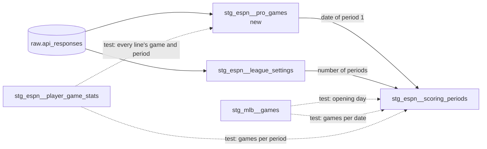

# ESPN's pro schedule — design

Issue: #73 · Requirements: [requirements.md](requirements.md) · Tasks: [tasks.md](tasks.md)

## Overview

ESPN's game-level season resource lists every pro game with its start time and its
scoring period. It is landed as one more ESPN capture, at the season level: no league,
no credentials. A new staging model, `stg_espn__pro_games`, holds one row per game from
the newest capture. Every game implies a date for period 1 (its Eastern date, minus its
period, plus one); in four seasons checked they all agree, and a test fails the build if
they ever do not. `stg_espn__scoring_periods` counts every period from that one date, so
it reads only ESPN again and a period with no game needs no special case. MLB's opening
day, which was the rule since #70, goes back to being the independent check on it.



Solid arrows are what a model is built from; dotted arrows are tests. Before this
change the arrow from `stg_mlb__games` to `stg_espn__scoring_periods` is solid.

## Alternatives considered

| | A — ESPN's schedule is the rule, MLB the check (chosen) | B — MLB stays the rule (ADR 0021), ESPN's schedule is a check | C — each period takes the date of its own games | D — ESPN's schedule, falling back to MLB |
|---|---|---|---|---|
| Staging reads one source | yes | no | yes | no |
| Dates a league-season with only ESPN data landed (#57) | yes | no | yes | yes |
| A period with no game | counted from period 1 | counted from period 1 | needs a rule for gaps | counted from period 1 |
| Independent check | MLB opening day; games per date | ESPN's schedule | MLB opening day; games per date | none: the check is the fallback |
| Change to an accepted ADR | supersedes 0021 | none | supersedes 0021 | supersedes 0021 |
| If the pro schedule is missing | null dates, build fails | unaffected | null dates, build fails | silently the old rule |

**A — ESPN's schedule is the rule.** ESPN's own statement of which day a period is,
with MLB as the outside witness. It removes the one cross-source `ref` in staging and
lets a past season be dated from ESPN alone.

**B — MLB stays the rule.** Nothing accepted changes, and the new data is only a test.
It loses because it keeps an inference where the source's own answer is available, keeps
the staging exception, and leaves #57 needing an MLB schedule for every past season
merely to keep the build from failing.

**C — each period takes the date of its own games.** The most literal reading of the
data. It loses on the gaps: periods 111 to 113 of 2026 and 3 to 9 of 2025 have no game,
so their dates would have to be filled from neighbours, which is the same one-day-per-
period assumption as A with more code. A states the assumption once and tests it.

**D — fall back to MLB when ESPN's schedule is missing.** It loses because a fallback
that produces the same dates hides that the schedule was not loaded, and removes the
independent check exactly when it is needed.

## Decisions

| ADR | Decision | Status |
|---|---|---|
| [0023](../../adr/0023-a-scoring-period-is-dated-from-espns-pro-schedule.md) | A scoring period is dated from ESPN's pro schedule; supersedes 0021 | accepted |
| [0024](../../adr/0024-the-pro-schedule-is-a-season-level-capture-fetched-without-credentials.md) | The pro schedule is a season-level ESPN capture, fetched without credentials | accepted |

## Detailed design

### Ingestion

- `espn/client.py` gains `game_url(season)`:
  `{BASE_HOST}/apis/v3/games/flb/seasons/{season}`, and `espn_public_client()`, an
  `HttpClient("espn")` with no cookies. It still reads no credentials for this.
- New module `espn/pro_schedule.py`, shaped like `espn/settings.py`: `SOURCE = "espn"`,
  `ENDPOINT = "pro_schedule"`, `VIEW = "proTeamSchedules_wl"`, and
  `backfill_pro_schedule(*, zone, client, season, fetched_at) -> Path`. It checks that
  the response is an object whose `settings.proTeams` is a list (R1.6) and lands it with
  `partitions={"season": season}` and the request recorded as the others do. That check
  is the only look inside the payload: enough to refuse an error page, not interpretation.
- A capture is therefore
  `data/raw/espn/pro_schedule/season=2026/fetched_at=<stamp>/`. It is the first ESPN
  capture with no `league_id` partition.
- `cli.py`, `backfill espn`: a new `--only` option accepting `pro-schedule`. With it, the
  command opens the writing session, lands the pro schedule with the public client and
  returns, without calling `load_env_file` or `EspnCredentials.from_env`. Without it,
  the pro schedule is landed first, with the public client, and the league run follows
  with the authenticated one as today. Both use the run's one `fetched_at`.
- If the pro schedule fails in a full run (a refused response, or retries exhausted),
  the error is printed, the league run goes on, and the command exits 1 at the end
  (R1.7). This is the pattern the transaction log already follows. The owner chose it on
  2026-10-07: the failure worth guarding against is ESPN withdrawing the view, which
  would otherwise stop every ESPN run, and the model reads the newest schedule already
  landed. An expired login still ends the run where it happens, as today.
- The loader needs no change: it stores `partitions` as JSON and identifies a response
  by request path and parameters (ADR 0011).

### `stg_espn__pro_games`

Grain: one row per (`season`, `espn_game_id`). Materialized as a table, like the other
models that parse a large payload. The owner confirmed this grain and column set on
2026-10-07, including the team ids, which nothing here reads: they are what a later
match to MLB's games would join on, and no such match is planned.

| Column | Type | From | Meaning |
|---|---|---|---|
| `season` | integer | the capture's `season` partition | the ESPN season |
| `espn_game_id` | text | `game.id` | ESPN's id for the pro game; the `externalId` of a roster stat line |
| `scoring_period` | bigint | `game.scoringPeriodId` | the period ESPN scores the game on |
| `game_start_at_utc` | timestamp | `game.date`, epoch milliseconds | scheduled start |
| `game_date` | date | `fo_eastern_date` of the start | the fantasy day the game is on |
| `home_pro_team_id` | bigint | `game.homeProTeamId` | ESPN's team id, not MLB's |
| `away_pro_team_id` | bigint | `game.awayProTeamId` | the same |
| `fetched_at` | timestamp | the capture | which capture the row is from |

How it is built:

1. `latest`: `fo_espn_latest('pro_schedule')`. The macro partitions by the capture's
   `league_id` and `season`; a pro schedule has no league, so every capture of a season
   falls in one group and the newest wins, with `file_path` as the tie-break.
2. `header`: the payload is parsed once, with an explicit schema, into the list of teams
   and then dropped (rule 1), as `stg_espn__player_game_stats` does. Each team's
   `proGamesByScoringPeriod` is a map from period to a list of games.
3. Unnest teams, then the map's values, then the games.
4. `select distinct` over the staged columns: a game is listed under both of its teams,
   identically. If the two listings ever differ, the game has two rows and the
   uniqueness test fails (R2.3, R2.4).

The newest capture, whole, and not the newest row per game: a schedule is a statement
about the season at one moment, and a game that ESPN drops from it should drop out here.
Rule 5 (deduplicate at the entity grain) is about a request split into overlapping
chunks; this response is not split.

Team 0 (free agents) has no games and contributes no row.

### `stg_espn__scoring_periods`

Same grain, columns and rows. The `opening_days` CTE is replaced:

```sql
period_one as (

    -- every game implies a date for period 1; a test holds them to one
    select
        season,
        min(game_date - ((scoring_period - 1)::integer)) as period_one_date
    from {{ ref('stg_espn__pro_games') }}
    group by season

)
```

and the final select counts from `period_one.period_one_date`, joined on `season` with
the same `left join` (R3.4). The header is rewritten: ESPN's schedule is the rule (ADR
0023), the model no longer reads MLB, and what checks it.

### Tests

- `dbt/tests/stg_espn__pro_games_fall_on_one_date_per_scoring_period.sql` (R2.5):
  returns every game whose `game_date` differs from its season's period-1 date plus
  `scoring_period` − 1. This is the test of the one-day-per-period assumption. It also
  catches a UTC date used in place of the Eastern one: 583 games of 2026 would fail.
- `dbt/tests/stg_espn__player_game_stats_games_are_scheduled.sql` (R4.3): returns every
  distinct (`league_id`, `season`, `scoring_period`, `espn_game_id`) of
  `stg_espn__player_game_stats` with no row in `stg_espn__pro_games` for that season and
  game, or with a different `scoring_period` there. 0 of 2,339 on 2026. Like the other
  game-line tests it has nothing to compare in CI until #74, and dbt has no unit tests
  for a singular test. Its two branches are therefore shown to bite on the real season,
  in the last task: with every scheduled period moved by one it must return all 2,339,
  and with one game removed, that game's lines.
- `stg_espn__scoring_periods_start_on_opening_day`: SQL unchanged. Its header says it is
  again two sources agreeing: period 1 from ESPN's schedule, opening day from MLB's.
- The two game-line tests of #70 and the structural tests: unchanged.
- YAML: `unique_combination_of_columns` on (`season`, `espn_game_id`) and `not_null` on
  every column of `stg_espn__pro_games`.

### The audit

- `check_espn`: the newest committed `espn/pro_schedule` capture of the season is read
  once. None → ERROR for each league: `no committed pro schedule capture, so scoring
  periods cannot be dated` (R5.1), and the date comparisons below are skipped.
- A helper mirrors the model: for each distinct game, the Eastern date of `date` minus
  (`scoringPeriodId` − 1) days. One distinct value → period 1's date. More than one →
  ERROR listing each date with its number of games (R5.4), and no date is used. None,
  because the capture has no game with a usable `date` and `scoringPeriodId` → ERROR
  that the capture dates nothing. (The fetch refuses a response without a `proTeams`
  list but does not count games: deciding what a usable game is belongs to the reader.)
- `_check_league` receives period 1's date in place of `opening_day` for the in-progress
  comparison (R5.2). The wording changes from "MLB opening day" to "period 1 per ESPN's
  schedule".
- Once per season: period 1's date ≠ MLB opening day → ERROR naming both; no MLB
  schedule → WARN, nothing to confirm against (R5.3). This restores the warning that #70
  turned into an error, because MLB is the witness again and not the rule. The `mlb`
  section still reports its own error for a season with no MLB schedule, unchanged
  (R5.5): an audit of ESPN data alone does not come out clean, and is not meant to yet.
- An INFO line reports the capture used and its number of games.

### Fixtures and isolation

- `scripts/make_fixtures.py`: `build_espn_pro_schedule()` reads the newest landed
  `espn/pro_schedule` capture of 2026 through `LandingZone`, and writes
  `fixtures/landing/espn/pro_schedule/season=2026/fetched_at=20260430T160000Z/` holding,
  by allowlist, `settings.proTeams[]` with `id` and `proGamesByScoringPeriod` for real
  periods 36 and 37 only, keys and `scoringPeriodId` renumbered 1 and 2, each game
  reduced to `id`, `date`, `scoringPeriodId`, `homeProTeamId`, `awayProTeamId`. A
  constant names the two source periods with a comment giving their dates. These are not
  `FIXTURE_SOURCE_SCORING_PERIODS` (100 and 101, the rosters' source): the pro schedule
  has to sit on the MLB fixture dates, which is what makes CI's period 1 2026-04-29.
- Running the script regenerates every fixture from the landing zone as it is now, which
  holds newer ESPN captures than when the fixtures were last built. Only the new
  directory is expected to appear. If any existing fixture file changes, the task stops
  and reports the diff; it is not committed.
- `scripts/make_multi_fixtures.py`: the 2026 pro schedule is copied once (it belongs to
  the season, not to a league). The 2027 one keeps period 1 only, with each game's
  `date` shifted by the same amount as the rest of 2027, so its period 1 is the 2027
  target day.
- `scripts/check_tenant_isolation.py`, `copy_single`: an ESPN endpoint folder whose
  season partition has no `league_id=` level is copied whole for that season.

### What is not changed, and why it is safe

The model's output for 2026 is the same 180 rows: the schedule's games imply 2026-03-25
for period 1, which is what MLB's opening day gave. Everything downstream joins on
`scoring_period` and reads `scoring_date`.

## Test strategy

| Requirement | Test | Catches |
|---|---|---|
| R1.1, R1.5, R7.1 | pytest, fake transport: URL, view, sidecar, partitions; two runs land two captures | a wrong resource or view; a capture filed under a league |
| R1.2, R1.4, R7.1 | pytest: the client used has no cookies; `--only pro-schedule` with the three variables unset | credentials sent to, or required for, a public request |
| R1.3, R1.7 | pytest on the CLI with fakes: order of landed captures; a failing pro schedule followed by a complete league run and exit code 1 | the schedule landed under another stamp; one public request stopping the league's data; a failure that exits 0 |
| R1.6, R7.1 | pytest: an error object, a list, `proTeams` missing | an error page landed as a schedule |
| R2.1, R2.3, R7.2 | unit tests on `stg_espn__pro_games` | double rows per game; an older capture read |
| R2.2, R7.2 | unit test: start at 02:05 UTC | the UTC date used for the fantasy day |
| R2.4 | YAML tests | disagreeing listings; a missing field |
| R2.5 | `stg_espn__pro_games_fall_on_one_date_per_scoring_period` | a season where one period is not one Eastern day |
| R2.6 | review of the model; the real build's memory | the payload copied per unnested row |
| R3.1–R3.5, R7.3 | unit tests on `stg_espn__scoring_periods` | dates from the settings capture; a gap undated; one season's date used for another; a silent drop |
| R4.1 | the opening-day test on the real season and in CI | ESPN's period 1 not being MLB's first game |
| R4.2, R4.4 | unchanged tests | a shift, gaps, repeats |
| R4.3 | `stg_espn__player_game_stats_games_are_scheduled`; its two branches exercised by one-off queries on the real season | a stat line scored on a period its game is not scheduled on; a line whose game is not scheduled |
| R5.1–R5.4, R7.4 | pytest in `test_audit.py` | an undatable league-season audited clean; a split schedule; a disagreement with MLB unreported |
| R6.1, R6.4 | fixture privacy test; fixture content check in pytest | a field outside the allowlist; the wrong two periods |
| R6.2, R6.3 | `test_make_multi_fixtures.py`; the isolation gate | a 2027 season dated from 2026; a single build with no schedule |
| Expected values | the last task, on the real season | correct on fixtures, wrong on the season |

## Risks

- ESPN changes or withdraws the view — unknown likelihood; it is undocumented — the
  fetch refuses a response without `settings.proTeams`, the build fails on null dates,
  and ADR 0021's rule is one model edit away.
- A game is rescheduled across midnight Eastern and ESPN keeps its period — not seen in
  four seasons — the one-date test fails and names the game.
- The capture lands on every `backfill espn`, about 850 KB a run — certain — accepted:
  150 MB over a season of daily runs, against 3 to 4 GB of boxscores.
- Regenerating fixtures changes existing ones — possible, the landing zone has moved on —
  the task stops and reports before committing.
- `fo_espn_latest` groups pro schedule captures under a null league — works in DuckDB,
  where null partition keys form one group; BigQuery does the same — covered by the unit
  test that two captures of a season give one set of rows.

## Open questions

- **What `statsOfficial`, `validForLocking` and `startTimeTBD` mean.** In 2026 only 52 of
  2,458 games have `statsOfficial` true, so it is not "the game is final"; 21 have
  `validForLocking` false, 20 of them in periods after 180. Not staged; the owner decides
  what they mean if they are ever needed.
- **Why ESPN lists 2,458 games where MLB has 2,430.** Period 36 has 15 listed against 13
  played, so postponed games appear to stay on their original day. Not verified game by
  game; nothing here depends on it.
- **Whether a postponed game's makeup gets a new ESPN id.** Not checked.
- **Whether a season with no MLB data should build and audit clean.** The model dates
  it; the opening-day test and the audit's `mlb` section still fail for it (R4.1, R5.5).
  #57 decides, when such a season is first loaded: land MLB's schedule for it, or turn
  the missing witness into a warning.
- **Whether MLB files the Tokyo and Seoul openers as regular season.** With ESPN as the
  rule it no longer affects dates, only whether the opening-day test passes for 2024 and
  2025. For #57.
- **Whether the counter stops one past the last period with a game in every season.**
  #75 can now read the last period with a game from this model.

## Review log

| Source | Finding | Resolution |
|---|---|---|
| design-review | F1 (P1): the opening-day test fails with no MLB season loaded, which contradicts "dated from ESPN data alone" | Changed the goal, not the test: the model dates such a season, the build does not pass, and R4.1 says so. Relaxing the test is left to #57; listed for the owner |
| design-review | F2 (P1): R5.3's warning cannot make an ESPN-only audit clean, because the `mlb` section errors on a missing schedule | Changed: R5.3 is scoped to the `espn` section and R5.5 says the `mlb` error stays. Same question as F1, same owner |
| design-review | F3 (P2): a capture with no games passes the fetch check and has no audit error | Changed: R5.4 and the audit design add an error for a capture that dates nothing, with a test (R7.4). The build already fails on null dates |
| design-review | F4 (P2): the scheduled-games test has no input in CI and no negative case | Not changed in CI: dbt cannot unit-test a singular test and the fixtures have no game lines until #74. Changed: two negative cases are run on the real season and are expected values. The owner accepted the gap until #74 on 2026-10-07 |

## Amendments
