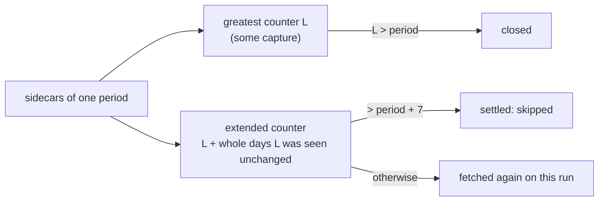

# A roster period settles after ESPN's counter stops — design

Issue: #75 · Requirements: [requirements.md](requirements.md) · Tasks: [tasks.md](tasks.md)

## Overview

ADR 0018 measures "a week has passed since this period closed" with ESPN's counter. The
counter is a calendar while the season runs and stops when MLB's regular season ends, so
the measure breaks for the last seven periods before the stop. The fix keeps the measure
and repairs the clock: when two captures of a period carry the same counter, and no
capture of the league-season carries a higher one, the time between them is added to
it, one per whole 24 hours. While the counter moves, no two
captures a day apart carry the same value and nothing changes. Once it has stopped, the
extended counter goes on rising by one a day, as ESPN's would have, and the period
settles on the day ADR 0018 intended.

Everything is read from sidecars, as today: a capture's `fetched_at` and its counter.
Nothing asks where the counter will stop.



## What was measured

Read-only, 2026-10-10, real landing zone (`data/raw`):

- Nine settings captures and nine pro schedule captures, 2018–2026 (table in
  requirements.md). In all nine the counter rests at the last period with a pro game
  plus one. The eight past seasons were captured on 2026-10-08, so this is where the
  counter rests, not when it got there.
- Scoring periods are calendar days: 2020's pro schedule has games in periods 120–186
  only, 67 periods for the 67 days of that season, and 2026 has 184 periods with a game
  out of 187.
- 2026 roster sidecars: 182 captures; periods 1–178 have one legacy capture (counter 186
  by the run's settings, ADR 0017); 179 and 180 have that and one more of
  `20261007T011005Z` with its own counter 188. All 180 settled today.
- The landed pro schedule payload has two top-level keys, `display` and `settings`, and
  no status block: it does not carry the counter.

## Alternatives considered

| | A — extend the counter by the calendar (chosen) | B — take the stop from the pro schedule | C — settle by date, not counter | D — nothing automatic |
|---|---|---|---|---|
| Settles every period | yes | yes, if the schedule is landed and "last game + 1" holds | yes | no: `--refresh` discipline, and the audit line is silenced |
| Keeps a week of re-checks for the last periods | yes | only with a time margin added, which is option A's clock again | yes | n/a |
| Ingestion reads a payload to decide | no | yes: the pro schedule, and it must turn game times into periods | yes: a period needs a date | no |
| Rests on how ESPN's counter stops | no | yes: nine seasons of resting values, none observed stopping | no | no |
| Changes ADR 0018 for ordinary periods | no | no | yes: every period | no |
| Extra requests for a past season landed at once | last 7 periods, for up to 7 days of runs | none | none | none |

**A — extend the counter by the calendar.** The rule in the overview. It wins because it
needs no new input, no assumption about where or why the counter stops, and it is ADR
0018's rule unchanged whenever the counter moves. Its cost is the last row: a season that
finished years ago still has its last seven periods fetched until a run a week later.

**B — take the stop from the pro schedule.** #73 landed ESPN's pro schedule, whose last
period with a game predicts the stop (9 of 9 seasons). Ingestion would read the newest
schedule capture, compute the stop, and treat a capture carrying it as final. It loses
on three counts. Knowing the stop does not by itself give the last periods their week:
a capture taken the morning after the season ends already carries the resting counter,
so a time margin is needed anyway, and that margin is option A. Ingestion would
interpret a payload, and a public fetch that the run tolerates failing would decide what
an authenticated run fetches. And it builds on a pattern seen only at rest.

**C — settle by date.** Settled means a capture fetched more than 7 days after the
period's date. It is the cleanest statement of intent, and it removes the pointless
week for past seasons. It loses because a period's date comes from the pro schedule
(ADR 0023, computed in dbt), so ingestion would again interpret a payload, and because
it replaces ADR 0018's rule for all 180 periods to fix seven.

**D — nothing automatic.** Keep the rule; make the audit stop reporting such periods and
rely on the season-close `--refresh`. Cheapest, and it leaves `backfill espn` fetching
seven periods on every run for good, which is the defect.

## Decisions

| ADR | Decision | Status |
|---|---|---|
| [0047](../../adr/0047-a-stopped-period-counter-is-extended-by-the-calendar.md) | A period counter that has stopped is extended by the calendar: one per whole day it was seen unchanged | accepted |

ADR 0047 adds to [ADR 0018](../../adr/0018-a-closed-roster-period-is-rechecked-for-seven-periods.md);
it does not supersede it. The number skips 0046, which spec PR #118 proposes.

## Detailed design

All in `ingestion/src/front_office/espn/rosters.py` and `audit.py`.

**Evidence.** `settled_through` returns `dict[int, PeriodEvidence]` in place of
`dict[int, int]`:

```python
@dataclass(frozen=True)
class PeriodEvidence:
    latest: int  # greatest counter any capture of the period carries
    extended: int  # R1.1; equals `latest` unless a counter was seen unchanged
    unchanged: int | None = None  # the counter behind `extended` when extended > latest
```

It is built from *sightings*, one per capture with a usable counter:
`(fetched_at, counter)`, the counter found exactly as today (own `source_status`, or the
same run's settings for a legacy sidecar). For one period:

- `latest` = the greatest counter of any sighting of the period;
- `top` = the greatest counter of any sighting of the league-season, over every period
  (the caller already passes one league-season's sidecars);
- if `latest == top` and `top > period`: `span` = whole 24-hour spans between the
  earliest and the latest sighting of `top` for this period
  (`(newest - oldest) // timedelta(days=1)`), and `extended = top + span`;
- otherwise `extended = latest`.

Only `top` is ever extended (R1.9). A counter that some other response has already
exceeded is a lagging status, which ADR 0016 expects to delay settling, and it goes on
delaying it.

`fetched_at` is the run stamp (`20261007T011005Z`), parsed as UTC. A sighting whose
stamp does not parse keeps its counter, so `latest` and closure are as today, and is
left out of the span with a warning naming the period: it cannot be evidence of elapsed
time (R1.6).

**The three questions.**

- `is_closed(period, evidence)`: `evidence[period].latest > period`. Unchanged in
  meaning (R1.5).
- `is_settled(period, evidence)`: `evidence[period].extended > period + RECHECK_PERIODS`.
- `needs_fetch`: unchanged, it calls `is_settled`.

**During a run.** `backfill_rosters` today writes `evidence[period] = max(...)` after a
fetch. It instead keeps the sightings per period and rebuilds that period's
`PeriodEvidence` with the new one (`fetched_at` of the run, the counter the response
recorded). `top` is taken again from all sightings when it does, since a fetch can raise
it. `summary.unproven` reads `latest` through `is_closed`, as now.

**Audit.** `audit.py` reads `evidence.get(period, 0)` in one place besides the three
functions: `unclosed_season`, which compares the greatest counter with the final period.
It reads `.latest`. The re-check INFO line gains a clause when any listed period has
`unchanged` set, that is `extended > latest` (R2.2): `…; N of them wait on the
calendar: ESPN's counter has read L across captures a day or more apart`. A period
whose stopped counter has been seen on one day only is in the line but not in N. With none, the line is today's, character for character.

### Why it cannot fire in season

The extension needs two captures of one period, at least 24 hours apart, carrying the
greatest counter the league-season has shown. A counter that advances once a day holds
any one value for 24 hours, so two captures both reading it are less than 24 hours
apart, whatever hour it turns over at. A status that lags behind the counter is lower
than what some other response shows and is never extended. What remains is every
response of two runs a day apart lagging at the same value: from sidecars that cannot
be told from a stopped counter, and it is put to the owner (PR, *Decisions for you*).
If ESPN's counter ever did stand still for a day or more in season, the calendar would
be extending it by exactly the days it missed, which is the behaviour ADR 0018 wanted
from it.

### Worked cases

One run a day; `T` is the first run on which the counter reads its resting value 183
(2022 shape, final 182).

| Period | Needs extended > | Captures carrying 183 | Settled on run |
|---|---|---|---|
| 175 | 182 | one is enough (183) | `T` (ADR 0018, unchanged) |
| 176 | 183 | `T`, `T+1d` → 184 | `T+1d` |
| 182 | 189 | `T` … `T+7d` → 190 | `T+7d`; skipped from `T+8d` |

Period 182 closes at `T` and is fetched on 8 runs, against 8 for an ordinary period
after it closes (ADR 0018 counts nine with the capture taken while it was current).

## Test strategy

Tests first, in `ingestion/tests/test_espn.py` and `test_audit.py`, on plain sidecar
dicts and the fake transport already used there.

| Requirement | Test | Catches |
|---|---|---|
| R1.1, R1.2 | 2022 shape replayed day by day; periods 176 and 182 settle on the runs in *Worked cases*; parametrised with the 2020 and 2024 shapes | the defect itself: today's rule fails this test on every run |
| R1.2 | a finished season landed in one run, then a run 6 days and a run 7 days later | an off-by-one in the span or the comparison |
| R1.3 | the existing boundary tests (`period + 7` closed not settled, `+ 8` settled) and the nine-daily-runs test, unmodified | the new rule changing an ordinary period |
| R1.3 | two captures with the same counter 23h59m apart: extended equals latest | a span rounded up |
| R1.4, R1.5 | period 100, two captures with counter 100 thirty days apart: not closed, not settled; counter 101 thirty days apart: closed and settled | extension leaking into closure, or counting a counter that does not close the period |
| R1.6 | a legacy sidecar and an own-status sidecar carrying the same counter a week apart extend it; a null counter counts for nothing; a counter 108 with an unreadable stamp still closes and settles period 100 | the legacy path left out of the sightings; a bad stamp discarding a usable counter |
| R1.9 | period 100 with counter 107 on two days 48 hours apart while another period's capture carries 109: not settled; the same without the 109: settled | a lagging status taken for a stopped counter |
| R1.7 | a run that fetches the capture completing the week: the period is not in `unproven`, and the next run skips it | in-run evidence not rebuilt |
| R1.8 | the existing "roster payload reads raise" tests, unmodified | a payload read creeping in |
| R2.1–R2.3 | audit over the 2022 shape before the week is up (the clause, with N and 183), after it (no line), and over a season with only ordinary re-checks (today's line exactly) | audit and fetch disagreeing; a changed message for seasons that are fine |
| Expected values, 2026 | the real sidecars, read-only: 180 of 180 settled before and after; audit output before against after | a regression on the one real season |

## Risks

- **A past season landed in one go keeps its last seven periods refetched for a week.**
  Certain if #83 goes ahead; at most 7 requests a run for 7 days, about 17 MB a run.
  Accepted (ADR 0047); option C is the alternative if it is not.
- **Runs less than a day apart do not advance the extension**, and runs at drifting
  times can take a day longer (a capture at 6 days 23 hours counts 6). One more capture
  per period; accepted.
- **The new path is not exercised by any real capture.** 2026 settled under the old rule
  and no other season has rosters. It is tested on constructed sidecars carrying real
  counters; the first real exercise is the end of the 2027 season, or #83.

- **A status lagging identically across every period for a day or more** would be
  extended as if the counter had stopped, and the period could settle on a capture no
  fresher than its status. Never observed; ADR 0016's in-season check (#66) is where it
  would show. Accepted, pending the owner (design-review F1).

## Open questions

- **Whether the counter ever stands still in season** (the All-Star break, an ESPN
  outage). Not observed: every 2026 capture is from 2026-09-26 or later. The design does
  not depend on the answer; #66's first week of 2027 will show it.
- **When the counter stops**, as opposed to where it rests. The 2026 captures show 186 on
  2026-09-26 and 188 on 2026-09-28; nothing was captured on the days after. The design
  does not depend on it.
- **A league whose final period is at or past the resting counter** could never have its
  last period closed (`latest > period` is impossible). Not seen in nine seasons. If one
  appears, the fetch reports it as unproven on every run, which is today's behaviour and
  is visible.
- **Whether the past-season cost above is acceptable** — the owner, with #83.

## Review log

| Source | Finding | Resolution |
|---|---|---|
| design-review | F1 (P1): two captures with the same counter a day apart do not prove the counter stopped; a repeated lagging status would settle a period early | Changed: only the greatest counter of the league-season is extended (R1.9), with a test. The residue, every response lagging alike for a day, is under *Risks* and is a decision for the owner |
| design-review | F2 (P1): dropping a capture with an unreadable stamp also discards its usable counter, changing closure | Changed: the counter is kept; the capture is left out of the span only (R1.6), with a test |
| design-review | F3 (P2): `unchanged` is set only when `extended > latest`, but R2.2 counted any repeated counter | Changed: R2.2 narrowed to periods whose extended counter exceeds their greatest counter, which is what `unchanged` records |
| design-review | F4 (P2): ADR 0047 says every period settles, but a period that can never close is out of scope | Changed: the ADR's consequence says every closed period |

## Amendments

