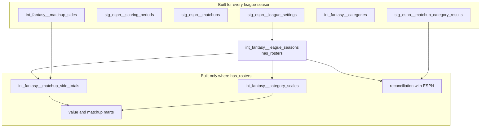

# Past seasons' matchup totals — design

Issue: #85 · Requirements: [requirements.md](requirements.md) · Tasks: [tasks.md](tasks.md)

## Overview

A past season's settings and matchups are landed under the endpoints a full run uses, by
a new `--only matchups` on `backfill espn`, together with ESPN's pro schedule; MLB's
schedule comes from the existing `backfill mlb --only schedule`. Staging then reads them
with no change: it already builds per league-season. What is new is one small model,
`int_fantasy__league_seasons`, which says of each league-season whether it has rosters.
The models that compute values from rosters and boxscores build only for those; the
models that describe what ESPN reported build for all. A league-season with no rosters
therefore has settings, categories, scoring periods, matchups and ESPN's category
results, and no computed value. The fixtures gain a real 2025 season of that kind, so CI
exercises it on every run.

## Alternatives considered

| | A — shared staging, coverage in one model (chosen) | B — a separate endpoint and one narrow model | C — a list of covered seasons in a seed or variable | D — make every model work for every season |
|---|---|---|---|---|
| Existing staging models change | no | no | no | no |
| Existing marts change | a join to the coverage model in a few | no | the same join, to a seed | yes: each must give nulls or nothing for a season with no rosters |
| A past season later gains rosters (#83) | it becomes covered when they are loaded | re-land and re-plumb | someone edits the list | already works |
| Coverage can be wrong | no: it is read from what is loaded | not applicable | yes: the list and the data can disagree | not applicable |
| The same response filed two ways | no | yes | no | no |
| Size | one model, about six edits, two tests restricted | one model | as A, plus a seed | large, and every test needs a rule for missing values |

**A — shared staging with a coverage model.** The owner chose this on 2026-10-08. It is
general: the build stops assuming a league-season is all or nothing, which is what #83
and any second league need as well.

**B — a narrow path.** Cheapest today. It loses because the same kind of response would
live under two endpoint names, and a season that later gains rosters would have to move.

**C — a declared list.** It loses because the list can disagree with what is loaded, and
then either values are computed from nothing or a loaded season is silently skipped.

**D — every model for every season.** It loses because "no rosters" would have to mean
something in every value model (null? zero? no row?), and each answer is a decision
about a number that nobody needs.

## Decisions

| ADR | Decision | Status |
|---|---|---|
| [0026](../../adr/0026-a-league-season-is-covered-when-it-has-rosters.md) | A league-season is covered when it has rosters, and value models build only for covered ones | proposed |

## Detailed design

### Ingestion

- `cli.py`, `backfill espn`: `--only` accepts `matchups` as well as `pro-schedule`. With
  `matchups` the command reads credentials, opens the writing session, lands the pro
  schedule with the public client (reporting a failure and going on, as a full run
  does), then settings and matchups with the authenticated client, prints the status
  line a full run prints, and exits; non-zero if the pro schedule failed. No teams,
  transactions or rosters are requested.
- `espn/settings.py`, `espn/matchups.py`, `espn/pro_schedule.py` are used as they are.
- MLB's schedule for a past season: `front-office backfill mlb --season <year> --only
  schedule`, which exists.
- The landing zone then holds, for a past season, `espn/settings`, `espn/matchups` and
  `espn/pro_schedule` under `season=<year>`, and `mlb/schedule`. Raw responses of
  settings and matchups contain member data, as 2026's do; they are gitignored.

### `int_fantasy__league_seasons`

Grain: one row per (`platform`, `league_id`, `season`). A table, like
`int_fantasy__categories`, so its contract is enforced.

| Column | Meaning |
|---|---|
| `platform` | `'espn'` |
| `league_id`, `season` | from `stg_espn__league_settings` |
| `has_rosters` | true when `stg_espn__roster_entries` has a row for the league-season |

It is spined on settings because a league-season exists for this project once its
settings are loaded; R2.6 covers rosters loaded without them.

### Where coverage is applied

The rule: **a model or test that needs rosters applies to covered league-seasons; one
that describes what the platform reported applies to all.**

| Relation | Change |
|---|---|
| `int_fantasy__matchup_side_totals` | inner join to covered league-seasons. Everything computed from it follows: `int_fantasy__matchup_stat_values`, `fct_matchup_category_scores`, `fct_matchup_results` |
| `int_fantasy__category_scales` | its spine of categories is restricted to covered league-seasons, so an uncovered one has no scale row instead of a row with no matchups measured |
| `int_fantasy__category_scales_cover_the_scored_categories` (test) | its category side is restricted to covered league-seasons, to match; for a covered one it still requires exactly the scored categories |
| `fct_player_category_value`, `fct_player_season_value`, `fct_transaction_impact` | no change expected: they start from roster days, which only covered seasons have. The test of R4.3 holds them to it |
| `rec_espn__matchup_stat_differences`, `rec_espn__category_result_differences` | ESPN's side of the comparison is restricted to covered league-seasons, so a season we do not compute is not reported as missing on our side |
| `fct_matchup_results_match_espn` (test) | the same restriction on ESPN's side |
| `fct_player_category_value_has_every_scored_category` (test) | categories of covered league-seasons |
| `stg_espn__every_scoring_period_has_one_matchup` (test) | covered league-seasons: the mapping exists to assign roster days to matchups |
| the `relationships` test from `int_fantasy__categories.category_key` to `int_fantasy__stat_components` | replaced by a singular test making the same check for covered league-seasons: complete games is scored in 2018 to 2021 and has no rule, and needs none where no value is computed |

A new singular test, `stg_espn__decided_matchups_have_category_totals` (R5.4), applies to
every league-season: a decided matchup with a side missing a score for a scored category
is returned. It is what makes "the season's totals are landed" a checked statement; with
R5.5's count it also catches a response that parses to nothing. A matchup still
`UNDECIDED` is left out, so the test does not fail during a season, and that includes
byes, which ESPN also reports as `UNDECIDED`.

The four mart tests and the two others above are what the spikes showed failing. The
build runs the real seasons and CI with the 2025 fixture; a test outside this table that
fails for an uncovered season is R5.3, not a seventh row added quietly.

The owner agreed this list on 2026-10-08, and that `int_fantasy__category_scales` stays a
model of our recomputed totals: measuring a scale from the platform's reported totals of
past seasons is #57's to design, not a change made here.

The owner accepted on 2026-10-08 that the last two rows narrow a test instead of
satisfying it, and chose not to add a complete-games rule here: there is no season with
rosters to reconcile it against. Both gaps come due when a past season gains rosters,
because it then becomes covered and the tests apply to it again; they are noted on #83.

Staging tests that read a model's own rows (`stg_espn__matchup_periods_are_contiguous`
and the like) are expected to pass for 2021 because it has no rows there; the build
confirms it.

### Fixtures

- `scripts/make_fixtures.py` gains a past season, 2025, beside `FIXTURE_SEASON`:
  settings and matchups by the allowlists and trims the 2026 builders use (league id and
  name replaced, `latestScoringPeriod` and `finalScoringPeriod` set to 2, the first two
  matchups, `pointsByScoringPeriod` cut to periods 1 and 2); the pro schedule's real
  periods 1 and 2; MLB's schedule for their two dates. The builders take the season as
  an argument; `check_one_league` and the date check run per season.
- 2025's periods 1 and 2 are the Tokyo games, 2025-03-18 and 2025-03-19 by ESPN's
  schedule. So the fixture also holds the case that was the open question of #73: an
  opening day a week before the rest of the league. If MLB's landed schedule has no
  regular-season game on those dates, generation stops (R3.2) and that is the answer to
  the question, taken to the owner.
- No 2025 boxscore, roster, team, transaction or id-map row is added.
- The owner agreed on 2026-10-08 that the fixture is the real 2025 season, trimmed, not
  a made-up one: two real matchups' category totals, with no member data, as the 2026
  fixtures already hold.
- `scripts/make_multi_fixtures.py` copies the base tree, so the 2025 season of league
  111111 arrives with it. Today the generator then reads every ESPN and MLB capture of
  the base tree as its source for the second league and for 2027, with no season
  filter: with 2025 in the tree it would relabel 2025's settings and matchups as 2026
  and 2027 captures and could take 2025's MLB schedule as the 2027 source. So its source
  captures are filtered to `BASE_SEASON` before anything is selected or relabelled, and
  the 2025 captures are copied and otherwise left alone. `scripts/check_tenant_isolation.py`
  adds ("111111", 2025) to its league-seasons.

### Landing the real seasons

For each of 2018 to 2025: `backfill espn --season <year> --only matchups`, then `backfill
mlb --season <year> --only schedule`. Sixteen authenticated requests and sixteen public
ones. Then `front-office load` and a full build.

The owner approved these requests on 2026-10-08: for each season 2018 to 2025, settings
and matchups with the login (16) and ESPN's pro schedule and MLB's schedule without it
(16). A season is requested again only if its own request failed, and the build reports
the final count.

## Test strategy

| Requirement | Test | Catches |
|---|---|---|
| R1.1–R1.4, R4.1 | pytest with a fake transport | a roster request for a past season; cookies on the public request; a failed schedule stopping the league data |
| R2.1, R4.2 | dbt unit tests on `int_fantasy__league_seasons` | coverage leaking between leagues or seasons |
| R2.2, R4.3 | singular test: no row in the matchup or value marts for a league-season with `has_rosters` false | a mart building values from nothing |
| R2.3 | the reconciliation tests in CI with the 2025 season, and on the real seasons | a season we do not compute reported as a difference |
| R2.4 | row counts of the every-season models by season, real build | coverage applied too early |
| R2.5 | the two restricted tests still fail on a covered league-season: checked by a unit-level case where dbt allows, otherwise by the 2026 season and a one-off mutation recorded in the run evidence | a restriction that also blinds the test for covered seasons |
| R2.6 | singular test | rosters loaded with no settings or matchups |
| R2.7 | every model compared for season 2026, real build | any side effect on the one covered season |
| R3.1–R3.5 | pytest of the committed 2025 fixtures; privacy test; isolation over 5 league-seasons | a field outside the allowlists; a past season depending on another's rows |
| R5.1–R5.3 | the real build with nine seasons | a season that behaves unlike the three probed |
| R5.4, R5.5 | `stg_espn__decided_matchups_have_category_totals`; the per-season count in the run evidence | a season "landed" whose response holds no matchups or no totals |

## Risks

- A season not probed (2019, 2020, 2022 to 2024) differs in shape — possible — R5.3:
  stop and report; the staging models are not changed to fit it without the owner.
- MLB files the Tokyo or Seoul openers outside the regular season, so the opening-day
  test fails for 2024 or 2025 — unknown — the build stops there with the two dates; the
  owner then chooses between landing those games and a warning for that case.
- The 2020 season's schedule does not sit on one period per day — unknown — the
  one-date test of #73 fails and names the games.
- ESPN refuses or throttles sixteen requests in a row — low; the client spaces them —
  the run is per season, so a failure costs one season's retry.
- A restriction to covered seasons hides a real failure in 2026 — the reason for R2.5's
  check and for comparing every 2026 row.

## Open questions

- **Whether the audit should understand a season with no rosters.** Today `front-office
  audit --season 2021` would report every scoring period as missing a roster and every
  game as missing a boxscore. Out of scope; if past seasons are to be audited, the audit
  needs the same notion of coverage, from the landing zone and not from dbt. The owner
  chose on 2026-10-08 to leave the audit as it is; its help text says what it does with
  such a season (R1.5).
- **Whether MLB files the Seoul (2024) and Tokyo (2025) openers as regular season.** Not
  checked before approval, by the owner's choice on 2026-10-08: the build lands MLB's
  schedules first and finds out. If they are not regular-season games there, the
  opening-day test fails for those seasons and the build stops for the owner (R5.3);
  what the test should then mean is not decided here.
- **When the categories changed** between 2021 and 2025. The landed settings will say.
- **Whether 2020 is usable.** For #57.
- **Whether the two long matchup periods and the playoffs should count.** For #57.

## Review log

| Source | Finding | Resolution |
|---|---|---|
| design-review | F1 (P1): the multi-fixture generator reads every season of the base tree, so a 2025 season would be relabelled as 2026 and 2027 | Changed: the design filters its sources to `BASE_SEASON`; task 6 covers it with a test |
| design-review | F2 (P1): restricting category scales to covered seasons breaks `int_fantasy__category_scales_cover_the_scored_categories` for uncovered ones | Changed: the test is in the table, restricted on its category side |
| design-review | F3 (P1): nothing requires a landed season to hold any matchup totals | Changed: R5.4, a test for every league-season, and R5.5, a per-season count that stops the build |

## Amendments

### 2026-10-08: three findings of the real build, settled by the owner

The build landed and built all eight past seasons before stopping (R5.6) and took three
findings to the owner, who chose as follows on 2026-10-08.

1. **A seventh test is narrowed to covered league-seasons.** The `dbt_utils.equal_rowcount`
   test of `int_fantasy__matchup_side_totals` against `int_fantasy__matchup_sides` was not
   in the table of *Where coverage is applied*, and cannot hold once the first is built
   for covered league-seasons and the second for all (286 rows against 2,324). The spikes
   did not show it because they ran before the restriction existed. It is replaced by the
   singular test `int_fantasy__matchup_side_totals_hold_every_side`, which makes the check
   side by side, in both directions, for league-seasons with rosters. R2.5's list grows
   by this one test.
2. **The opening-day test asserts the first period with a game, not period 1.** In 2020
   ESPN kept the numbering of the season as first scheduled: period 1 is 2020-03-26 and
   the first game is period 120, on 2020-07-23, MLB's first regular-season game.
   `stg_espn__scoring_periods_start_on_opening_day` now requires that a league-season's
   first scoring period with a game in ESPN's pro schedule falls on MLB's earliest game
   date of the season. That holds for all nine seasons, is the same statement as before
   for the eight where the first game is period 1, and still compares two sources. No
   season is exempted. The model is unchanged.
3. **2020 is loaded with settings and no matchups, and R5.5 does not apply to it.** ESPN's
   response for 2020 holds one schedule entry with no sides and no winner: the league did
   not play. It stays a league-season of `int_fantasy__league_seasons` with `has_rosters`
   false and contributes no matchup to #57, which has seven past seasons to measure. R5.5
   holds for the other seven.

Also found, and changing nothing here: the open question on the Seoul and Tokyo openers
is answered (MLB files them as regular-season games; 2019 opened in Tokyo too); the
categories changed between 2021 and 2022; and only 2025 and 2026 have a full
scoring-period to matchup-period mapping, which widens the gap noted on #83 from 2021 to
six seasons.

### 2026-10-08: review round 1 of PR #87

- requirements.md now says what the amendment above decided for 2020: R5.5, the 2020
  rabbit hole and the expected values carry it.
- The owner chose not to add a dbt test for a league-season with no decided matchup. A
  season that was not played and a capture that parsed to nothing look the same in
  staging, so a failing test would need a hand-kept list of unplayed seasons, and a
  warning would never clear for 2020. The count stays a check made when a season is
  landed. #57's model of margins is to carry the number of matchups measured per
  league-season, so that an empty season shows where it would do harm; recorded on #57.
