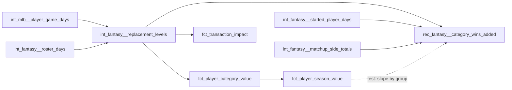

# The replacement level for a start, and a standing check of values against re-scored matchups — design

Issue: #89 · Requirements: [requirements.md](requirements.md)

## Overview

One CTE of `int_fantasy__replacement_levels` changes: which player-days make up the
start pool. Everything downstream reads the level it is given, so the value facts move
without their SQL changing. A new reconciliation model re-scores every decided matchup
with each player swapped for replacement, and a test holds values to what that shows.

## Alternatives considered

Each was built on 2026 and its effect computed (requirements.md has the levels).

| | A. Today: top N by free-agent starts over the season | **B. Every free-agent start by a pitcher who was a starter at the time** | C. Best free agents each day, ranked on their season to date | D. Most-used free agents each matchup period | E. Players the league added and dropped | F. The tier beyond the league's demand |
|---|---|---|---|---|---|---|
| Start ERA / outs | 5.41 / 15.0 | 4.90 / 14.9 | 4.84 / 13.4 | 5.17 / 15.2 | 4.39 / 15.5 | 4.19–4.45 / 15.4–15.9 |
| Stable when its parameter moves | 5.40 / 5.41 / 5.06 at N = 6 / 12 / 24 | no parameter; 4.87–4.93 across four cuts | 4.66 / 4.84 / 4.84 | 5.88 / 5.17 / 4.97 | 4.16–4.39 across three wordings | 4.19 / 4.45 / 4.48 |
| Hindsight | whole season | none | none | none | whole season | whole season |
| Rests on managers' moves | no | no | no | no | yes | no |
| Length of a relief outing, if applied to relief | 2.80 | not applied | 3.67 | 2.77 | 3.60 | 2.94 |
| Top 20, SP / hitters | 11 / 9 | 9 / 11 | 11 / 9 | not computed | 7 / 13 | 11 / 9 |

- **A** is half a run too lenient on ERA: its pool is the pitchers nobody wanted.
- **C** was the owner's first choice. For starters its ranking selects nobody (about 11
  free-agent starters a day), so it is B plus openers; for relievers it brings back long
  outings.
- **D** is today's principle made point-in-time, and shows why usage cannot rank
  starters: the most-used free-agent starters are the worst.
- **E** was rejected by the owner, and removing the 14 days before a pickup moves a
  similar pool from 4.20 to 4.79.
- **F** is the textbook definition; its tier is lifted by stars with half a season.

B is applied to starts only. For relievers an unranked pool is ADR 0009's rejected
option 4 (3.58 outs an appearance, call-ups and position players); for hitters it is
bench players with one at-bat (1.14 total bases a game). Those kinds need a ranking to
find the players doing the job, and for them usage is not adversely selected.

## Decisions

| ADR | Decision | Status |
|---|---|---|
| [0029](../../adr/0029-the-start-pool-is-every-free-agent-start-by-a-starter.md) | The start pool is every free-agent start by a pitcher who was a starter at the time, unranked; amends ADRs 0001 and 0009 for the start kind | proposed |

## Detailed design

### `int_fantasy__replacement_levels`

Grain and columns unchanged. `pitching_pool` today ranks both kinds by appearances and
keeps the top N. It is split:

- **relief**: as today.
- **start**: no player-level pool. `start_pool_days` is the free-agent days whose
  `fo_pitching_day_kind` is `start` and whose pitcher's role to date is `SP`.

Role to date: `fo_replacement_group` applied to the sums of the pitcher's
`plate_appearances`, `batters_faced`, `outs_recorded`, `games_pitched` and
`games_started` over `int_mlb__player_game_days` of the same season with `game_date`
before the day, by a window over the player's days. The macro is the one
`dim_players` and the batting pool already use, so "a starter" has one meaning. A
pitcher's first appearance of a season has no totals and is not `SP`; 120 such starts
are left out in 2026, with 465 by pitchers who were relievers up to then (openers, 9.4
outs).

`pool_played_days` for the start kind then counts `start_pool_days`, and
`pool_players` its distinct pitchers. The header's DEFINITION, BIAS and SENSITIVITY
sections are rewritten for the start kind, with the table of requirements.md.

The roles are decided from all MLB days, not only free-agent ones: what a pitcher has
been doing is the same whoever rosters him.

### The value facts

No SQL change. `fct_transaction_impact` moves with the others; it reads the same level.

### `rec_fantasy__category_wins_added`

In `models/reconciliation/fantasy/`, a table. Grain: (`platform`, `league_id`, `season`,
`platform_player_id`, `fantasy_team_id`). League-seasons with rosters only.

| Column | Meaning |
|---|---|
| `matchups_rescored` | decided two-sided matchups in which the pair had a started day |
| `category_wins_added` | actual category points minus points with replacement in his place, summed over those matchups and scored categories; a win is 1, a tie one half; averaged over the draws |
| `matchup_wins_added` | the same for the matchup, decided by most categories |

Steps, all in components (AGENTS.md rule 4):

1. The pair's components and played days by kind in each matchup, from
   `int_fantasy__started_player_days`, the dates of `int_fantasy__matchup_periods` and
   the sides of `int_fantasy__matchup_sides`.
2. Replacement's expected components: played days of each kind times that kind's level.
3. Twenty draws. A draw's amount is the floor of the expectation plus 1 when a uniform
   number is below its fraction. The uniform number is the first 32 bits of the MD5 of
   the pair, matchup, component and draw number, over 2³²: the same on every build and
   every DuckDB version, which `hash()` does not promise.
4. The side's totals from `int_fantasy__matchup_side_totals`, minus the pair's, plus the
   draw's.
5. Every scored category's value for that side by the rules, and its result against the
   opponent's actual value, rounded to 9 places as `fct_matchup_category_scores` does. A
   category undefined on either side in a draw is left out of that draw.
6. Sum and average.

The matchups are all decided ones, playoffs included: the values being checked count
every started day.

### The test

`values_track_rescored_category_wins`: per league-season with at least 100 decided
matchups and replacement group (`dim_player_league_seasons.replacement_group`) with at
least 100 pairs, Σ(wins × value) / Σ(value²) must lie in 0.30 to 0.50. If margins are
normal with the scale as their root mean square, a small contribution of *x* scale
units changes the expected result by *x*/√(2π) = 0.399*x*. Measured after the change:
0.43, 0.40 and 0.33 for starters, hitters and relievers. The band is wide enough for the
relievers and narrow enough to fail if a group's values were scaled by a quarter more or
less than another's.

## Test strategy

| Requirement | Test | Catches |
|---|---|---|
| R1.1–R1.4, R1.7, R4.1 | unit tests on `int_fantasy__replacement_levels` | a role decided with hindsight; an opener or a first start in the pool; a cap applied; another league's roster removing a free agent |
| R1.5, R4.2 | the existing batting and relief unit tests; real rows compared | a side effect on the other kinds |
| R1.6 | the existing empty-pool unit test, for the start kind | a missing row in place of a null level |
| R4.3, R4.4 | the two singular tests | a batting or relief pool above N; a level that is not the pool's own mean |
| R2.1 | `git diff` of the facts is comments only | a fact computing its own level |
| R3.1–R3.4, R3.6, R4.5 | unit tests on the re-scoring; two real builds compared | a tie broken by a fraction; a category judged the wrong way round; a result that changes between builds |
| R3.5 | `values_track_rescored_category_wins` | one group's values tilted against another's |
| R5.1–R5.3 | real build; every relation compared with a copy kept before; the expected values | any movement this document does not state |

## Risks

- **The fixture start pool is empty.** Two days cannot hold a pitcher's earlier start, so
  in CI the start level is null, fixture starts have a null value, and
  `int_fantasy__replacement_pool_has_played_days` warns. Unit tests carry the rule. If a
  CI test fails on those nulls, the build stops (R5.3).
- **Early in a season the pool is thin**: no pitcher is a starter until his second
  appearance. The level exists from the first days and settles over weeks.
- **The re-scoring is the heaviest model in the build.** Twenty draws of every
  pair-matchup-component; measured when built.
- **The band of R3.5 is a judgment.** Relievers sit at 0.33.
- **One season, one league.**

## Open questions

- **Whether the relief and batting pools should also be decided at the time.** No gap
  was measured; both still use whole-season hindsight.
- **Why relievers' values convert to real wins less steadily** (slope 0.33, correlation
  0.69).
- **Hitter pools by position** (ADR 0001's follow-up).

## Review log

## Amendments
