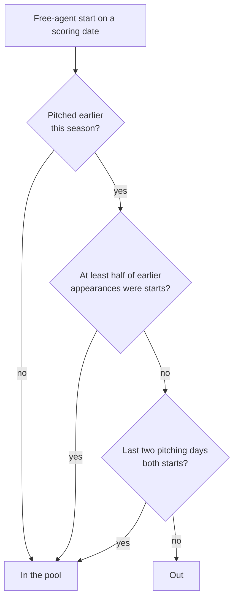

# Who is a starter — design

Issue: #92 · Requirements: [requirements.md](requirements.md) · Tasks: [tasks.md](tasks.md)

## Overview

"A starter at the time" gains two ways in. Today a free-agent start is in the pool when
at least half the pitcher's earlier appearances of the season were starts. It will also
be in when he has not pitched yet that season, and when his last two pitching days were
both starts. The change is to one CTE of `int_fantasy__replacement_levels` and a new
macro beside `fo_replacement_group`, which itself does not change. No column, grain or
other model changes; no fixture changes.

## Alternatives considered

All measured on 2026's 1,875 free-agent starts. "Opener-like" is a start that faced nine
batters or fewer, used to describe a pool and never to choose it.

| | A — keep | B — first appearance | C — B and last two starts (chosen) | D — B and last one start | E — window of three | F — judge the outing |
|---|---|---|---|---|---|---|
| Starts / pitchers | 1,290 / 153 | 1,410 / 170 | 1,518 / 182 | 1,584 / 202 | 1,488 / 187 | 1,656 / 209 |
| Outs a start, ERA | 14.92, 4.90 | 14.82, 4.88 | 14.78, 4.89 | 14.62, 4.89 | 14.77, 4.86 | 14.73, 4.84 |
| Opener-like in the pool | 18 | 21 | 24 | 42 | 27 | 0, by construction |
| Counts a debut | no | yes | yes | yes | yes | yes |
| A reliever joining a rotation waits | until starts outnumber relief | the same | 2 starts | 1 start | 2 starts | 0 |
| New parameter | — | none | "two" | "one" | window size | a length threshold |
| Uses the outing's result | no | no | no | no | no | yes |

**A.** The two gaps of #92.

**B.** Closes the first gap. The 120 starts it adds run at 13.68 outs and 4.55, three of
them opener-like. 67 are in the first fortnight.

**C.** Adds to B the 108 starts by 24 pitchers whose last two appearances were starts:
14.31 outs, 5.10, three opener-like. Two starts running is a rotation turn taken twice.

**D.** Adds a further 66 starts: 10.95 outs, 18 of them opener-like. A single earlier
start is as often last week's opener.

**E.** Reaches about the same pool as C by a different road, and loses 38 of the 86
starts by season-long starters whose last appearance was in relief. It has a window size
to defend, and it puts in 11 starts by relievers by the count straight after a relief
day.

**F.** The only option that reaches a reliever's first real start. It loses because it
selects on the result: the 18 short starts in today's pool run at a 16.55 ERA, and they
are starts.

Not options: a role carried from the previous season or the minors (one MLB season is
landed), and ESPN's eligibility (roster payloads hold rostered players only; the id map
labels all 282 of these pitchers `P` or nothing).

## Decisions

| ADR | Decision | Status |
|---|---|---|
| [0031](../../adr/0031-a-starter-at-the-time-has-not-pitched-yet-has-mostly-started-or-started-his-last-two.md) | A starter at the time has not pitched yet, has mostly started, or started his last two | proposed |

## Detailed design

### The macro

`dbt/macros/fo_is_starter_at_the_time.sql`, a boolean expression over already-computed
values, in the style of `fo_replacement_group`:

- `earlier_pitching_days` — how many pitching days he had before this one, this season;
- `replacement_group_to_date` — `fo_replacement_group` over his earlier MLB days;
- `last_was_start`, `one_before_was_start` — whether his most recent and second most
  recent earlier pitching days were starts (null when there is no such day).

True when `earlier_pitching_days = 0`, or the group is `SP`, or both flags are true.
Null flags are false. It is a macro so that the rule has one home with its own comment
and can gain a BigQuery variant with the others; it is called once.

### `int_fantasy__replacement_levels`

- `roles_to_date` keeps its running totals over all of a player's MLB days (R1.5) and
  its `role_to_date`.
- A new CTE, `pitching_days_to_date`, over the rows of `int_mlb__player_game_days` with
  `games_pitched > 0`, partitioned by player and season and ordered by date: the row's
  position minus one (earlier pitching days), and `lag` of "was a start" at 1 and 2. A
  start is `fo_pitching_day_kind(...) = 'start'`, so a doubleheader day with a start and
  a relief outing is one pitching day, a start, as everywhere else. The lags run over
  pitching days only, which is why this is its own CTE: a day he only batted is not an
  appearance.
- `start_pool_days` joins it as it joins `roles_to_date`, and its filter becomes the
  macro. Everything after it is untouched: the pool is still days, unranked, uncut.
- A pitcher with earlier plate appearances and no earlier pitching day (a two-way
  player's first start) is in by R1.1. There is none in 2026.

Grain and columns of the model are unchanged.

### The fixtures (after #93)

Nothing is regenerated. On #93's fixtures the free-agent starts are 678394 and 687064 on
period 1 and 641778 and 678394 on period 6. Today's rule takes the last only. R1.1 adds
the other three, so the pool is 4 starts, 3 pitchers, 51 outs. The generator's purpose
check stays: it guarantees CI has a start admitted by history, the path R1.2 and R1.3
share, which the three debut starts do not exercise. Without the check the pool would no
longer be empty if that pitcher were lost, so `int_fantasy__replacement_pool_has_played_days`
would not notice; the pytest of the committed fixtures from #93 is what would.

## Test strategy

| Requirement | Test | Catches |
|---|---|---|
| R1.1 | unit: a first appearance that is a start is in, also for a player with earlier batting days | the debut left out again; earlier MLB days counted as appearances |
| R1.2 | the existing unit test's cases, kept | the season count lost when the new conditions were added |
| R1.3 | unit: three relief days, then starts: the third start in, the first two out | a role change still waiting on the count; or one start being enough |
| R1.3, R1.4 | unit: relief, start, relief, start: out | "any two earlier starts" in place of "the last two" |
| R1.4 | unit: an opener with relief days only: out | the pool opening to every start |
| R1.5 | unit: a 2025 start is not an earlier pitching day of 2026; a later day changes nothing earlier; a batting-only day between two starts does not break "last two" | another season or hindsight deciding; lags run over all days |
| R2.1, R2.2, R5.2 | row diff of the real warehouse before and after | the change reaching the labels or the other pools |
| R3.3, R5.1 | the real-season build | a value test failing on the new level |
| R4.3 | `ci.duckdb` after the gates | the rule not reaching CI |
| Expected values, R5.4 | the last task | numbers that moved since measurement |

## Risks

- The level's movement tilts the re-scored check (`values_track_rescored_category_wins`)
  — low: 0.14 outs and 0.01 ERA — R5.3 stops the build.
- Starters' values move a second time in two days — certain, small — recorded by R5.4
  for the owner before the PR.
- Three conditions are harder to explain than one — accepted; the macro's comment and
  the flowchart carry it.
- #93's build changes the fixtures again before this is built — low — R4.1 and the CI
  expected values are checked at the build.

## Open questions

- **How much starters' values move.** Not measured: it needs every started day re-valued
  against the new level. The level's components move by about 1%. R5.4 records it.
- **Whether one season is enough to judge "two".** 2026 is the only MLB season landed.
  The 108 and the 66 are one year's counts. #83 would land more seasons to check it on.
- **A role carried over from last season** would let an established reliever's
  season-opening "start" stay out and is the better answer for the first fortnight. It
  needs a second MLB season landed, which is #83. The owner decided on 2026-10-09
  that no separate issue is filed; it is noted on #83.

## Review log

| Source | Finding | Resolution |
|---|---|---|
| design-review | F1 (P1): R5.2's boundary left out the two reconciliation models that re-score matchups against the start level, so the row diff would stop the build on an expected change | Changed: R5.2 names `rec_fantasy__category_wins_added` and `rec_fantasy__category_wins_by_group`, with their row counts held and the value test as their check |
| design-review | F2 (P1): two more existing unit tests assert a first start is out; R3.2 named one and R3.3 froze the rest | Changed: R3.2 names all three, says how the empty-pool test keeps an empty pool, and has any further one reported before it is revised |
| design-review | F3 (P2): R4.2 forbade any generator change while R6.2 asks for a comment in one | Changed: R4.2 allows that comment and nothing else |
| design-review | F4 (P2): no test for a player who has batted but never pitched | Changed: added to R3.1, with the batting-only day between two starts |

## Amendments
