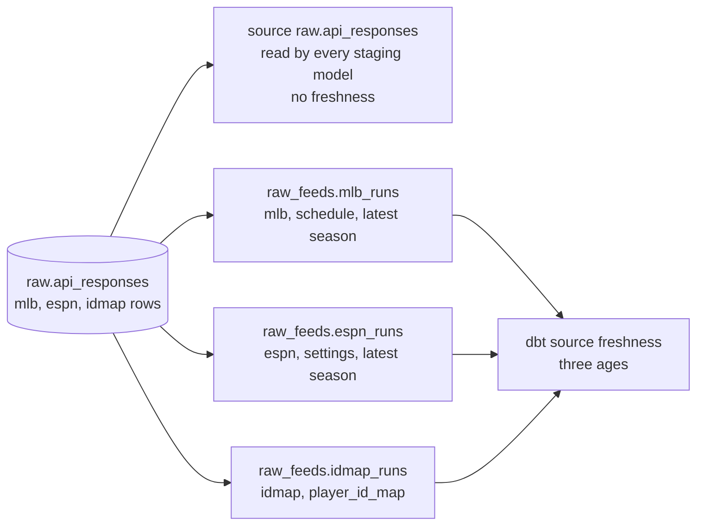

# Source freshness is one age per feed — design

Issue: #114 · Requirements: [requirements.md](requirements.md) · Tasks: [tasks.md](tasks.md)

## Overview

dbt computes freshness once per declared source table: `max(loaded_at_field)` over the
table, compared with now. One declaration gives one age, whatever the table holds. So
the table is declared three more times, once per feed, in a source of their own, each
pointing at the same relation and each with a filter.

Two dbt settings do this. `identifier` is the relation's real name when it differs from
the name dbt knows the table by: `mlb_runs` with `identifier: api_responses` is a second
name for `raw.api_responses`. `freshness.filter` is a `where` clause dbt adds to the
freshness query alone.

The filter selects one endpoint of the feed, its *run marker*: the first call of a run
that fetches the feed's league or season data, which no run of another endpoint and no
unauthenticated call lands. And it selects that marker only in the latest season that
has one, because past seasons are fetched too. A feed's age is then the age of its last
run for the season being played, not of whatever it landed last.

`raw.api_responses` stays declared as it is, for the models that read it, and loses its
own freshness check. No model, macro or test changes.



## What was measured

Read-only, 2026-10-10 22:29 UTC. dbt-core 1.12.5, dbt-duckdb 1.11.0, DuckDB 1.5.5.

**The real warehouse** (`data/warehouse.duckdb`, queried directly):

| feed | responses | capture days | newest capture (UTC) |
|---|---|---|---|
| espn | 228 | 4: 09-26, 09-28, 10-07, 10-08 | 2026-10-08T16:38:28 |
| idmap | 1 | 1: 09-26 | 2026-09-26T17:36:54 |
| mlb | 4,963 | 6: 09-26, 09-28, 10-05, 10-07, 10-08, 10-09 | 2026-10-09T19:42:27 |

Every capture was taken after the season ended. There is no daily cadence in the data to
read a threshold from.

Within a feed the endpoints differ:

| feed | endpoint | capture days | newest capture (UTC) |
|---|---|---|---|
| espn | matchups | 4 | 2026-10-08T16:38:28 |
| espn | pro_schedule | 1 | 2026-10-08T16:38:28 |
| espn | roster | 2 | 2026-10-07T01:10:05 |
| espn | **settings** | 4 | 2026-10-08T16:38:28 |
| espn | teams | 3 | 2026-10-07T17:16:57 |
| espn | transactions | 3 | 2026-10-07T17:16:57 |
| idmap | **player_id_map** | 1 | 2026-09-26T17:36:54 |
| mlb | boxscore | 4 | 2026-10-07T22:11:16 |
| mlb | players | 1 | 2026-10-09T19:42:27 |
| mlb | **schedule** | 5 | 2026-10-08T16:38:27 |

The `mlb` feed's newest capture is a player list landed on its own; the newest schedule
is a day older. An age over every `mlb` row would have called a players-only run a run
of the feed.

**What the commands land** (read in `ingestion/src/front_office/cli.py`):

- `backfill mlb`: schedule, then the player list, then boxscores. `--only` limits it to
  one of the three.
- `backfill espn`: the pro schedule first, with a client that carries no login, "so the
  schedule is landed even if the league run later stops"; then settings, the first call
  that needs the login; then teams, transactions, rosters. `--only pro-schedule` needs no
  login at all; `--only matchups` lands the pro schedule, settings and matchups.
- `backfill idmap`: one capture.

So when the ESPN login expires, a run still lands a pro schedule and then stops.

**The markers by season** (second design review, read-only on the real warehouse). Past
seasons were fetched for #57, each landing a schedule and a settings capture:

| marker | season | captures | newest capture (UTC) |
|---|---|---|---|
| mlb schedule | 2018 to 2025 | 1 each | 2026-10-08, 16:37:11 (2025) to 16:38:27 (2018) |
| mlb schedule | **2026** | 4 | **2026-10-07T22:11:16** |
| espn settings | 2018 to 2025 | 1 each | 2026-10-08, 16:37:21 (2025) to 16:38:28 (2018) |
| espn settings | **2026** | 5 | **2026-10-07T17:16:57** |

The newest schedule and the newest settings in the table are the 2018 season's. The
first draft of this design reported them as each feed's last run. Every `mlb` and
`espn` capture carries `season` in `partitions`; the id map's one capture carries only
`{"provider": "sfbb"}`.

**The spike**, on a copy of the fixture warehouse, with the three declarations below
added and `dbt source freshness --target ci` run:

| declaration | status | `max_loaded_at` |
|---|---|---|
| `raw.api_responses` (as today) | error | 2026-05-02T16:00:00+00:00 |
| `raw_feeds.mlb_runs` | error | 2026-04-30T16:00:00+00:00 |
| `raw_feeds.espn_runs` | error | 2026-04-30T16:00:00+00:00 |
| `raw_feeds.idmap_runs` (warn only) | warn | 2026-04-30T16:00:00+00:00 |

The whole-table age is a boxscore correction stamped 2026-05-02, which is not a run. In
an earlier spike with each filter on the feed alone, `mlb` read 2026-05-02 for the same
reason. With `loaded_at_field` and `freshness` removed from `raw.api_responses`, dbt ran
three checks and that table was not among them. dbt parsed the project without a warning
(57 models, 4 sources). The spike's files were removed.

**The second spike** (second design review), on a scratch copy of the fixture warehouse
in which the 2025 season's `espn` settings and `mlb` schedule were given a stamp one
hour old, the 2026 season's left at 2026-04-30:

| filter | status | `max_loaded_at` |
|---|---|---|
| espn, feed and endpoint only | pass | the restamped 2025 capture |
| espn, with the season clause | error | 2026-04-30T16:00:00+00:00 |
| mlb, feed and endpoint only | pass | the restamped 2025 capture |
| mlb, with the season clause | error | 2026-04-30T16:00:00+00:00 |
| a filter that matches no row, warn only | warn | 0001-01-01T00:00:00+00:00 |
| a filter that matches no row, with an error threshold | error | 0001-01-01T00:00:00+00:00 |

A subquery inside `freshness.filter` works on dbt 1.12.5 with DuckDB 1.5.5. The spike's
files were removed.

Not run: `dbt source freshness` on the real warehouse. dbt opens the file for writing,
and this spec reads the real season only through read-only connections. The real ages
above are from a query; the build runs the command (task 5).

## Alternatives considered

### How the ages are split

| | A — one declaration per feed over the same relation, with a filter (chosen) | B — re-point every model at its feed's declaration | C — a model of newest captures, with a test | D — a recency check in `front-office audit` |
|---|---|---|---|---|
| Uses dbt's own freshness (`sources.json`, `warn`/`error`, the docs site) | yes | yes | no | no |
| Files changed | one YAML, one test file, README | four models, two macros that the other staging models read through, two singular tests, eleven unit-test inputs | a new model, a test, and every `dbt build` invocation | the audit and its tests |
| Runs in `dbt build` | no | no | yes, so it must be excluded everywhere the fixtures are built | no |
| One age per league, not only per feed | no | no | yes | yes |
| A declaration could mislead | the three extra tables are freshness-only and say so | a table named for `mlb` that holds every feed's rows | no | no |

**A — one declaration per feed.** Spiked and working. It is the smallest change that
makes `dbt source freshness` say what the issue asks, and it leaves the lineage alone.
Its cost is three source tables in the docs site that nothing reads; their descriptions
say what they are for.

**B — re-point the models.** The same declarations, and each staging model reads its
own feed's table, so the lineage shows which feed a model depends on. It loses because
`identifier` only renames: a model reading the `mlb` declaration would still get every
feed's rows, and would have to keep its own `where`. A declaration that looks like a
feed's table and is not one invites the mistake of dropping that filter.

**C — a model and a test.** A view at the grain feed and league, with its newest run
marker, and a test that fails past a threshold. It is the only option that sees a
stalled league behind a live one, because leagues are rows and dbt's freshness
declarations are written by hand. It loses today on what it does to the build: the test
depends on the time of day, fails on the fixtures by design, and so has to be excluded
from `.agentic/gates`, CI, the tenant-isolation script and every documented `dbt build`.
One league is fetched today. The owner accepted the limit (*Settled by the owner*).

**D — the audit.** `front-office audit` is where operational checks live, and it reads
the landing zone, not the warehouse. It loses because it would be a second definition
of freshness beside the one dbt already has and the README already explains, and
because the audit's findings do not depend on when it is run, and this one would.

### What a feed's age is the age of

| | 1 — the feed's run marker, in its latest season (chosen) | 2 — any capture of the feed | 3 — every endpoint, each with its own age |
|---|---|---|---|
| A past season fetched again counts as a run | no | yes | yes, unless each is scoped too |
| An expired ESPN login shows as stale | yes | no: the pro schedule still lands | yes |
| A players-only MLB run counts as a run | no | yes (measured: 10-09 against 10-08) | no |
| An off day warns | no | no | yes: no boxscore is landed |
| A run that starts and then fails shows | no | no | partly |
| Declarations | 3 | 3 | 10 |

**1 — the run marker.** Chosen. It fails for the likeliest stall, and it does not fire
on days when there was nothing to fetch.

**2 — any capture.** What the issue's wording suggests and what this spec first drew.
It loses on the two cases above, one of them measured.

**3 — every endpoint.** It loses on the endpoints that are fetched only when there is
something to fetch, whose thresholds would need to know the MLB calendar.

### Which season a marker counts in

| | i — the latest season that has a marker, read in the filter (chosen) | ii — any season, named as a limit | iii — a season passed as a dbt variable |
|---|---|---|---|
| A past season fetched again shows as a run | no (spiked) | yes: measured on the real warehouse, where the newest markers are 2018's | no, if the right season is passed |
| Needs something each new season | no | no | yes: whoever runs freshness passes it, and a wrong or missing one gives a wrong age |
| The filter is plain SQL every warehouse reads | no: it reads a key out of the `partitions` JSON, in DuckDB's spelling | yes | no, the same |
| A later season's marker landed early | moves the scope to that season | no effect | no effect |

**i — the latest season, in the filter.** Chosen by the owner (2026-10-10). It needs no
upkeep and it is spiked. Its costs are the two last rows: the filter names a DuckDB JSON
function in YAML, where the `fo_json_*` macros that models use were not tried (see *Open
questions*); and a 2027 schedule fetched in the 2026 off-season would make 2027 the
season that counts. Out of season nothing runs freshness, so that is a limit to write
down, not a fault to design around.

**ii — any season.** No change to the design, and the fault this spec exists to remove
stays in for the one case already in the data.

**iii — a variable.** Explicit, and it moves the knowledge of the current season to
whatever runs the command, which does not exist yet.

## Decisions

| ADR | Decision | Status |
|---|---|---|
| [0050](../../adr/0050-freshness-is-declared-once-per-feed-over-the-same-relation.md) | Freshness is declared once per feed over the same relation, and is the age of the feed's run marker in its latest season | proposed |

## Detailed design

### `dbt/models/staging/_raw_feeds__sources.yml` (new)

```yaml
version: 2

# One declaration per feed, for source freshness and nothing else (spec 0114, ADR 0050).
#
# raw.api_responses holds three feeds. dbt gives one age per declared table, so the table
# is declared once per feed here: `identifier` points each name at the same relation, and
# `freshness.filter` is the where clause dbt adds to the freshness query.
#
# Each filter selects the feed's run marker: the first call of a run that fetches the
# feed's league or season data. An age over every row of a feed would be refreshed by a
# capture that proves nothing: espn's public pro schedule lands with no login, so it
# would stay fresh after the login expired.
#
# A marker counts only in the latest season that has one. Past seasons are fetched too
# (2018 to 2025 were, for #57), and each lands a schedule and a settings capture: without
# the season clause, fetching an old season would make a stalled feed look fresh. The id
# map's captures carry no season, so it has no such clause.
#
# No model reads these. Models read source('raw', 'api_responses').
#
# Still dormant: nothing runs `dbt source freshness`, and no gate or CI job may, because
# the fixtures' newest capture is months old by design. It wakes with the 2027 daily
# schedule.
#
# Known limits:
#   - A run that lands its marker and then fails shows as fresh. Nothing checks that the
#     latest run landed everything; `front-office audit` checks the season, not the run.
#   - One age for espn however many leagues are fetched.
#   - A later season's marker landed early (next year's schedule, fetched in the
#     off-season) moves the scope to that season.

sources:
  - name: raw_feeds
    description: >
      raw.api_responses, declared once per feed so that source freshness gives one age
      per feed: the age of the feed's last run. Freshness only: no model reads these.
    schema: raw
    tables:
      - name: mlb_runs
        identifier: api_responses
        description: >
          The schedule captures of the mlb feed. Every full run lands one first; a run
          limited to the player list or the boxscores does not.
        loaded_at_field: "strptime(fetched_at, '%Y%m%dT%H%M%SZ')"
        freshness:
          warn_after: {count: 36, period: hour}
          error_after: {count: 7, period: day}
          filter: >-
            source = 'mlb' and endpoint = 'schedule'
            and json_extract_string(partitions, '$.season') = (
              select max(json_extract_string(partitions, '$.season'))
              from raw.api_responses
              where source = 'mlb' and endpoint = 'schedule'
            )

      - name: espn_runs
        identifier: api_responses
        description: >
          The settings captures of the espn feed: the first call of a run that needs the
          login. The pro schedule lands before it, without one, and does not count.
        loaded_at_field: "strptime(fetched_at, '%Y%m%dT%H%M%SZ')"
        freshness:
          warn_after: {count: 36, period: hour}
          error_after: {count: 7, period: day}
          filter: >-
            source = 'espn' and endpoint = 'settings'
            and json_extract_string(partitions, '$.season') = (
              select max(json_extract_string(partitions, '$.season'))
              from raw.api_responses
              where source = 'espn' and endpoint = 'settings'
            )

      - name: idmap_runs
        identifier: api_responses
        description: >
          The idmap feed's one endpoint. Not fetched daily by design, so it warns late
          and never errors.
        loaded_at_field: "strptime(fetched_at, '%Y%m%dT%H%M%SZ')"
        freshness:
          warn_after: {count: 14, period: day}
          filter: "source = 'idmap' and endpoint = 'player_id_map'"
```

The file sits in `dbt/models/staging/`, beside the three feed directories, because it
belongs to none of them. `loaded_at_field` is written out, as it is today, because a
macro call in a YAML source property was not tried. For the same reason the season
clause names DuckDB's `json_extract_string` directly. AGENTS.md keeps DuckDB JSON syntax
out of *models*, behind `fo_json_*`, so that BigQuery variants can replace it; this is
not a model, but it is the one other place that syntax now lives, and the comment in
the file says so. Seasons are four-digit years, so the greatest as text is the latest.

### `dbt/models/staging/mlb/_mlb__sources.yml`

`loaded_at_field` and `freshness` are removed from `api_responses` (R1.3). The comment
block above them is replaced by two lines: freshness is declared per feed in
`_raw_feeds__sources.yml`, and why not here. Nothing else in the file changes.

### Thresholds

| feed | warn | error | basis |
|---|---|---|---|
| mlb | 36 hours | 7 days | today's, unchanged (spec 0013, R4.1). A daily run a day and a half late warns |
| espn | 36 hours | 7 days | the same |
| idmap | 14 days | none | a recommendation without data behind it: see below |

The id map is one snapshot, fetched by its own command and not by the daily run. What a
stale one costs is known: the crosswalk lags for players called up late, so their
started days go unresolved until it is fetched again. How often it must be fetched to
keep that small has not been measured. Fourteen days is the age at which the issue found
it and called it unnoticed; no error threshold, because a stale id map degrades a few
players and stops nothing. The owner may prefer another number, or no check at all.

Out of season every feed is stale, correctly, and the command is not run.

### What is not changed

Every `.sql` file, the macros, the unit tests' `input: source('raw', 'api_responses')`,
the loader, the audit, `.agentic/gates`, `.github/workflows/ci.yml`.

## Test strategy

Freshness itself cannot be a gate. What can be held in CI is the declarations.

| Requirement | Test | Catches |
|---|---|---|
| R3.1 | pytest, new file `ingestion/tests/test_source_freshness.py`: the feeds filtered for in `raw_feeds` equal the feeds of the committed captures in `fixtures/landing/`, read through `LandingZone.committed` | a feed with fixtures and no freshness declaration; a declaration left behind for a feed that is gone |
| R3.2 | pytest: each declaration's endpoint is one its feed has a committed capture of in the fixtures | a run marker misspelt or renamed, whose filter would then match no row |
| R3.3 | pytest: each `raw_feeds` filter, with its whitespace collapsed, is exactly the text built from its one feed and one endpoint: `source = '<feed>' and endpoint = '<endpoint>'`, followed for `mlb` and `espn` by the season clause whose subquery repeats the same feed and endpoint; no feed twice | a copy-pasted declaration, or a season clause, still naming the feed it was copied from, which would report that feed's age, or scope to that feed's season, under another's name |
| R3.4 | pytest: the `raw_feeds` source has `schema: raw`; each table has `identifier: api_responses` and the exact `loaded_at_field` expression `strptime(fetched_at, '%Y%m%dT%H%M%SZ')` | a declaration that reads another relation, or parses the stamp differently, and still passes the filter checks |
| R3.5 | pytest: every committed `mlb` schedule and `espn` settings capture in the fixtures, read through `LandingZone.committed`, has a `season` partition that is a four-digit year | a marker landed without a season, which the season clause would silently leave out: the landing zone requires `partitions` to be a mapping and nothing more |
| R1.1 | pytest: the three run markers are schedule, settings and player_id_map | a marker changed without the spec |
| R1.3 | pytest: `raw.api_responses` has neither `freshness` nor `loaded_at_field` | the whole-table age coming back beside the three |
| R2.1, R2.2 | pytest: the three declarations' thresholds are the ones in *Thresholds* | a threshold changed without the spec |
| R1.2 | by hand: `dbt source freshness --target ci` on the fixture warehouse, results read from `target/sources.json` | a filter dbt does not apply: `mlb` must read 2026-04-30, not the 2026-05-02 of the boxscore correction |
| R1.4 | by hand, on a scratch copy of the fixture warehouse with the `espn` settings rows' `fetched_at` set to one hour ago: espn `pass`, mlb `error` | the three results moving together |
| R1.5 | by hand, on a scratch copy with one `pro_schedule` row's `fetched_at` set to one hour ago: espn still `error` at 2026-04-30 | a capture that needs no login refreshing the feed |
| R1.6 | by hand, on a scratch copy with the 2025 season's `espn` settings and `mlb` schedule given a stamp one hour old: both still `error` at 2026-04-30 | a past season fetched again refreshing the feed |
| R1.7 | by hand, on a scratch copy with the `idmap` rows deleted: `idmap_runs` is `warn` with `max_loaded_at` in year 1, not `pass` and not a crash | a feed with no marker at all passing silently |
| R1.2 | by hand on the real season: the three `max_loaded_at` against the query of the expected values | a parsing or time-zone error in one declaration |
| R4.1 | `.agentic/gates`: the `dbt build` counts | the declarations disturbing the build |

Each pytest is seen to fail first: against the YAML as it is today for R1.3 and R3.1,
and against a deliberately wrong copy for the others.

## Risks

- A filter is a string dbt pastes into a query — a typo gives an age over no rows — low
  — R3.2 and R3.3 hold the feed, the endpoint and the form, and a filter that matches
  no row is never `pass` (R1.7, spiked: the age is that of year 1).
- The season clause reads `partitions` with a DuckDB function — it has to be rewritten
  for BigQuery with the models' JSON macros — certain, later — one file, and the comment
  in it says so.
- A later season's marker is landed early and the scope moves to it — possible in an
  off-season — freshness is not run then; named as a limit.
- An endpoint is renamed in ingestion and the marker stops matching — low — R3.2 fails
  as soon as the fixtures are rebuilt under the new name.
- The docs site shows three source tables nobody reads — certain, cosmetic — their
  descriptions say so.
- Top-level `freshness` and `loaded_at_field` on a source table are accepted by dbt
  1.12.5 without a warning (spiked) — a later dbt may want them under `config:` — the
  build notes any deprecation message it sees.

## Open questions

- **The markers against the 2027 schedule.** Settings for `espn` and the schedule for
  `mlb` are read from the order of calls in `cli.py` today. No daily command exists yet:
  the 2027 schedule may run something other than today's `backfill` commands, and the
  markers must be checked against it then.
- **`dbt source freshness` on the real warehouse** was not run for this spec (it opens
  the file for writing). Task 5 runs it.
- **Whether `freshness.filter` can call a macro.** If dbt renders the filter as Jinja,
  the season clause could read `partitions` through `fo_json_*` like the models do. Not
  tried. Task 3 tries it once and records the answer on #114. The filter is built as
  the design writes it either way: R3.3 holds its exact text, and switching to the macro
  is a change to that text and its test, to be made with the BigQuery work it serves.

## Settled by the owner (2026-10-10, PR #125)

- **What an age measures:** each feed's run marker, not any capture of the feed. The
  schedule for `mlb`, settings for `espn`, the one endpoint for `idmap`.
- **How the check is split:** alternative A, one source declaration per feed over the
  same relation, each with a freshness filter (ADR 0050).
- **The id map's threshold:** 14 days, warn only.
- **A run that lands its marker and then fails shows as fresh**, and nothing else catches
  it at the time: the audit checks the season, not the latest run. Accepted; not in this
  spec, and no issue is opened for it.
- **One age for `espn`, however many leagues.** With two leagues fetched, one that has
  stopped hides behind the other. One league is fetched today. Accepted, to be revisited
  when a second league is fetched; alternative C is the design that removes it.
- **A feed added with no fixtures is not caught by the declaration tests.** Accepted.
- **The names** `raw_feeds`, `mlb_runs`, `espn_runs` and `idmap_runs`, and tier M, were
  put to the owner and not changed.
- **Which season a marker counts in** (second design review, same day): the latest
  season that has a marker, read in the filter. Alternative i above.

## Review log

| Source | Finding | Resolution |
|---|---|---|
| design-review | F1 (P0, semantics): filtering on the feed alone lets any endpoint's capture count as a run, against the stated meaning; `cli.py` has endpoint-only paths | Agreed, and worse than stated: a full `espn` run lands the pro schedule with no login before settings, so an expired login would not show. Each filter now selects a run marker (R1.1, R1.5); the alternatives gain the table *What a feed's age is the age of*; re-spiked, and the expected values changed (`mlb` on the fixtures is 2026-04-30, not 05-02). Which capture is the marker is put to the owner |
| design-review | F2 (P0, rule): the planned test read directory names under the landing zone, against AGENTS.md | Fixed: R3.1 and the test read the fixtures through `LandingZone.committed` |
| design-review | F3 (P1, gap): fixtures alone cannot guarantee that a new feed is declared; the loader has no fixed list of feeds | The claim is narrowed, not the check widened: the goal and R3 now say "a feed with committed fixtures", and R3 says what is not caught. There is no authoritative list to check against, and adding one is ingestion work outside this spec |
| design-review | F4 (P1, assumption): the spec gave latest-run completeness to the audit, which checks the newest capture per endpoint and not the latest run | Agreed. The rabbit hole, R5.1, the YAML comment and the ADR now state what the audit checks and name "a run that starts and then fails shows as fresh" as a remaining limit; it is an open question for the owner |
| design-review | F5 (P2, test-gap): nothing exercised R1.4, one feed stale and another healthy | Fixed: a scratch-copy scenario for R1.4, and one for R1.5, in the test strategy, the expected values and task 4 |
| second round, lead agent | G1 (semantics): the markers are not scoped to a season. On the real warehouse the newest `mlb` schedule and `espn` settings are the 2018 season's, fetched for #57, and the spec reported them as each feed's last run | Put to the owner, who chose the latest season that has a marker (2026-10-10). R1.1, R1.6, the filters, a second spike, the expected real-season values (now the 2026 season's, a day older), the ADR and tasks 1, 4 and 5 changed |
| second round, lead agent | G2 (accuracy): a marker was defined as a capture "that nothing less than such a run lands", but `backfill mlb --only schedule` lands a schedule alone and `backfill espn --only matchups` lands settings without rosters | The definition now says what is true: the first league or season call of a run, so a run limited to that call counts. R1.1 names `--only schedule` |
| design-review, round 2 | F1 (P2, test-gap): the declaration test did not check `schema: raw` or the exact timestamp expression | Fixed: R3.4 and its test |
| design-review, round 3 | F1 (P2, test-gap): nothing requires a marker capture to carry a season, and one without it is silently left out by the season clause | Fixed: R3.5 and its test on the committed fixtures. Task 1 already checks the real warehouse's markers |
| design-review, round 3 | F2 (P2, consistency): task 3 would switch to a JSON macro if its trial worked, while the test of R3.3 holds the filter's exact text | Fixed by narrowing task 3: the trial is recorded, and the filter is built as designed either way |
| design-review, round 2 | F2 (P2, testability): the no-row scratch run had no expected result | Fixed: R1.7 and an expected value, from a spike: `max_loaded_at` in year 1, `warn` for the warn-only id map, `error` where there is an error threshold |

## Amendments

