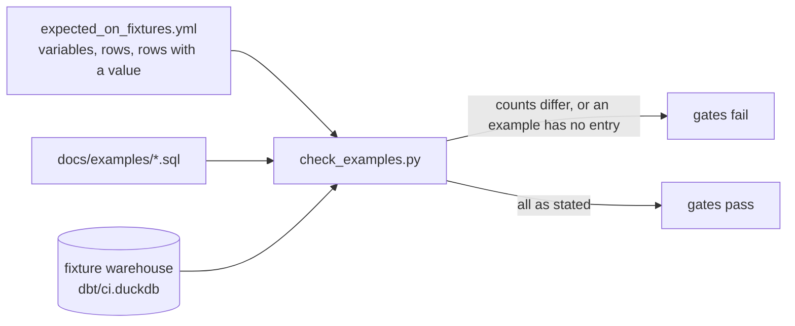

# An example returns the rows it should on the fixtures — design

Issue: #117 · Requirements: [requirements.md](requirements.md) · Tasks: [tasks.md](tasks.md)

## Overview

Two changes, and no change to the fixtures.

`roster_day_query.sql` reads its three parameters from DuckDB variables, each falling
back to the value committed today. Run as it is, it asks what it has always asked. A
*variable* in DuckDB is a named value held by the session: `set variable team_id = 3`
stores it and `getvariable('team_id')` reads it, giving NULL when nothing was set.

A new file beside the examples, `docs/examples/expected_on_fixtures.yml`, states for each
example what it returns on the fixture warehouse: the number of rows, and for the roster
example the variables to set and how many rows carry a batting line and a pitching line.
`scripts/check_examples.py` already runs each example there; it now sets the stated
variables, runs the file, and fails when what came back is not what was stated.



The gate's command line does not change, so neither `.agentic/gates` nor
`.github/workflows/ci.yml` is edited.

## What was measured

Read-only, 2026-10-10. Fixture warehouse: `dbt/ci.duckdb` as `.agentic/gates` built it at
`b4d16fd`. Real season: `data/warehouse.duckdb`. DuckDB 1.5.5 (the Python package).

The fixtures hold one league-season with rosters: league `111111`, 2026, 12 teams, 921
roster entries, on 2026-04-24, 04-29 and 04-30. The real warehouse holds league `73677`,
2026, 180 periods.

| Example | Fixtures | Real season |
|---|---|---|
| `lineup_decisions_query.sql` | 12 | 12 |
| `matchup_results_query.sql` | 4 | 12 |
| `player_value_query.sql` | 15 | 15 |
| `roster_day_query.sql`, as committed | 0 | 18 |

The roster example, rewritten to read variables as this design has it:

| Run | Rows | `at_bats` has a value | `innings_pitched` has a value |
|---|---|---|---|
| Real season, no variable set | 18, equal row for row to the committed file | 6 | 1 |
| Fixtures, no variable set | 0 | 0 | 0 |
| Fixtures, team 11 on 2026-04-29 | 18 | 2 | 1 |
| Fixtures, team 2 on 2026-04-29 | 18 | 3 | 0 |
| Fixtures, team 3 on 2026-04-29 | 18 | 1 | 0 |
| Fixtures, team 6 on 2026-04-30 | 17 | 0 | 0 |

Across all 36 team-days of the fixtures the row count is 18 for 35 and 17 for one. Few
rows carry a stat line because the fixtures hold two boxscores a day.

The same query broken on purpose, on the fixtures with team 11 on 2026-04-29:

| Break | Rows | `at_bats` | `innings_pitched` | A row count catches it | The value counts catch it |
|---|---|---|---|---|---|
| none | 18 | 2 | 1 | | |
| join on `team_id` removed | 216 | 14 | 4 | yes | yes |
| join on `scoring_date` removed | 54 | 6 | 2 | yes | yes |
| batting joined to the day five days earlier | 18 | 1 | 1 | no | yes |
| join on `league_id` removed | 18 | 2 | 1 | no | no |

Two things follow. A row count alone leaves the join to that day's MLB games untested. And nothing on the main fixture can hold the league
filter, because there is one league in it.

Also checked: `getvariable` of a name never set is NULL; a variable can be set from a
Python value with a bound parameter (`set variable on_date = ?` with a `date` gives a
`DATE`), and `reset variable` clears it; PyYAML reads `on_date: 2026-04-29` as a `date`
and `league_id: "111111"` as a string.

## Alternatives considered

### How the roster example gets rows in CI

| | A — variables with the committed values as defaults (chosen) | B — the gate rewrites the `params` block | C — the fixtures gain the real league's day | D — the file's values become the fixtures' |
|---|---|---|---|---|
| File still runs as it is on a real warehouse | yes, same 18 rows | yes | yes | no: 0 rows on any real league |
| Fixtures change | no | no | yes: a new day's boxscores, rosters and schedule, and every recorded count | no |
| What CI runs is the file's own text | yes | no: text the gate edited | yes | yes |
| A reader can ask about another team without editing | yes | no | no | no |
| Needs | DuckDB 1.1 or later | a pattern that survives any edit to the block | the real league's id as a fixture league, or a second league in the main fixture | |

**A — variables.** The `params` block becomes three `coalesce(getvariable(...), <today's
value>)` expressions. It wins because the fixtures do not move, CI runs the text that is
committed, and the file gains a use it lacked. `pyproject.toml` already requires
`duckdb>=1.1`, the release that introduced variables.

**B — the gate rewrites the block.** The gate would replace `'73677' as league_id` and
its neighbours with fixture values before running. Nothing in the file changes. It loses
because the gate then tests a query nobody committed, and it breaks the day someone
reformats the block: the grounding for this spec did exactly this substitution, and it
needed an assertion to notice a replacement that matched nothing.

**C — the fixtures gain the day.** The fixture league is `111111` by design, and its
season is seven periods in April. Matching `73677` on 2026-07-02 means renaming the
fixture league to the real one or adding a league, and adding a July day, which makes
the fixture season about seventy periods and moves every count in the README and in spec
0013. It would test the committed values directly, which is the one thing A cannot do;
the price is the whole fixture set, for one example.

**D — fixture values in the file.** The README's first query would return nothing for
anyone who ran it on their own league.

### What the gate asserts

| | 1 — stated rows, and stated counts of rows with a value in named columns (chosen) | 2 — at least one row | 3 — the output compared with a stored copy |
|---|---|---|---|
| Catches an example that returns nothing | yes | yes | yes |
| Catches a filter removed (216 or 54 rows for 18) | yes | no | yes |
| Catches stats read from the wrong day | yes, by the value counts | no | yes |
| Catches another valid team under the gate's parameters | often (team 3 gives 1 and 0, not 2 and 1), not by design | no | yes |
| Moves when the fixtures are rebuilt | the numbers, where they change | no | every stored row |
| New committed content | four small entries | none | a results file with players' lines per example |

**1 — stated counts.** Chosen: it is the smallest check that fails for each break
measured above except the league filter, and what it stores is a handful of numbers that
say something a reader can check by running the file.

**2 — at least one row.** It answers the issue's title and nothing else: the two removed
filters return more rows, not none.

**3 — a stored copy.** The strongest. It loses on what it costs to keep: every fixture
rebuild rewrites it (the fixtures were rebuilt for #60, #74 and #93 in one week), a diff
of it says nothing a reviewer can judge, and it still cannot see the league filter or
the committed defaults.

### Where the expectations live

Beside the examples, in one YAML file (chosen), because they describe the examples and
change with them. The two others: under `meta` on each example's exposure, which would
publish CI parameters on the public docs site as if they described the example, and
whose place in dbt 1.12's exposure schema was not checked; or as a table inside
`check_examples.py`, which would make the script know the examples by name when today it
takes any directory.

## Decisions

| ADR | Decision | Status |
|---|---|---|
| [0048](../../adr/0048-an-example-is-held-to-stated-counts-on-the-fixtures.md) | An example is held on the fixtures to a stated number of rows, and to stated counts of rows with a value | proposed |
| [0049](../../adr/0049-an-examples-parameters-are-variables-with-defaults.md) | An example's parameters are DuckDB variables that default to the committed values | proposed |

ADR 0048 amends ADR 0045, whose accepted cost was "on the fixtures an example is only
proved to run, not to return rows".

## Detailed design

### `docs/examples/roster_day_query.sql`

The `params` block, and nothing else in the query:

```sql
with params as (
    -- A team is chosen by its id, so that this file names no team. ...
    -- Each value is read from a DuckDB variable of the same name and falls back to the
    -- one written here, so the file runs as it is and can be asked about another team:
    --   set variable team_id = 3;
    select
        coalesce(getvariable('league_id'), '73677') as league_id,
        coalesce(getvariable('team_id'), 6) as team_id,
        coalesce(getvariable('on_date'), date '2026-07-02') as on_date
),
```

The header's "Run with" gains the way to set a variable (R2.5). The exact wording is the
build's, once the open question on the command-line client is answered.

### `docs/examples/expected_on_fixtures.yml`

```yaml
# What each example returns on the fixture warehouse (dbt/ci.duckdb), which is what
# scripts/check_examples.py holds it to in the gates (spec 0117, ADR 0048).
#
# These numbers describe the fixtures, not the real season. Change one only together
# with the fixtures or the example it describes, and read the new number from the gate's
# own output: it prints what each example returned.
#
# variables:          DuckDB variables set before the example runs (ADR 0049)
# rows:               rows returned; never 0
# rows_with_a_value:  for a named output column, the rows in which it is not null

lineup_decisions_query:
  rows: 12

matchup_results_query:
  rows: 4

player_value_query:
  rows: 15

roster_day_query:
  # Team 11 on 2026-04-29 is a team-day of the fixtures with a batter and a pitcher who
  # played, so both halves of the example's output are held.
  variables:
    league_id: "111111"
    team_id: 11
    on_date: 2026-04-29
  rows: 18
  rows_with_a_value:
    at_bats: 2
    innings_pitched: 1
```

Keys are example file stems. `variables` and `rows_with_a_value` are optional; `rows` is
required, a whole number greater than zero.

### `scripts/check_examples.py`

- `--expectations`, default `<examples-dir>/expected_on_fixtures.yml`.
- `load_expectations(path) -> dict[str, dict]`: the parsed file; a missing file is a
  problem, not an empty set.
- `check_expectations(example_files, expectations) -> list[str]`, pure, on file stems,
  SQL text and the parsed dict. A problem for: an example with no entry; an entry with no
  example (R1.3); `rows` missing, not a whole number, or less than 1 (R1.4); a key other
  than the three; a variable `v` for which `getvariable('v')` does not occur in the
  example's text once comments are removed (R2.4), using the scan the script already has
  for comments, kept apart from the one that also removes string literals.
- `run_examples(db, files, expectations)`: for each file, set each stated variable with
  a bound parameter, execute, then `reset variable` each one in a `finally`, so a failed
  example cannot leave its variables for the next (R2.3). Compare the row count with
  `rows` (R1.2). For each column in `rows_with_a_value`, find it by name in the cursor's
  description (absent: a problem, R3.2) and count the rows where it is not None (R3.1).
  Every difference is a problem that names the file, what was stated and what was found.
  The `ok, N rows` line stays, and is printed for a file with a difference too, since
  R4.2 sends the reader to it for the new number.
- A query error is reported as today (R1.5), and no count is compared for that file.

Nothing else in the script changes: exposures, the dashboard and owners are checked as
they are.

### What is not changed

`fixtures/`, `scripts/make_fixtures.py`, `.agentic/gates`, `.github/workflows/ci.yml`,
the three mart examples, `_exposures.yml` (the roster example reads the same seven
models, so its exposure still matches).

## Test strategy

Tests first, each seen to fail before the code that satisfies it. All in
`ingestion/tests/test_check_examples.py`; the end-to-end ones use a temporary DuckDB
file, as `test_examples_run_against_a_real_database` does.

| Requirement | Test | Catches |
|---|---|---|
| R1.2 | an example returning 2 rows against `rows: 1` | the gate passing a filter that stopped filtering |
| R1.2 | an example returning 0 rows against `rows: 1` | the finding itself: no rows passing as success |
| R1.3 | an example with no entry; an entry with no example | a new example added without an expectation; a stale entry |
| R1.4 | `rows: 0`, `rows` missing, `rows: "many"` | an expectation that holds the example to nothing |
| R1.5 | a failing query with an entry | counts being compared, or the error lost, after a failure |
| R2.3 | two examples reading the same variable, only the first with `variables` | a variable leaking from one example into the next |
| R2.3 | an example whose query fails after its variables are set, then another | the same leak on the failure path |
| R2.4 | a variable the file does not read; one read only inside a comment | a misspelt variable silently leaving the default in force |
| R3.1 | a column stated at 1 with a value in 2 rows | a join that stopped matching, with the row count unchanged |
| R3.2 | a column the example does not return | a renamed output column leaving the count unchecked |
| R1.1, R3.3 | the committed `expected_on_fixtures.yml` loads, covers exactly the files in `docs/examples/`, and the roster entry states both columns above zero | the committed file drifting from the examples |
| R2.1 | the committed roster example, read as text: each of the three variables is read, and each default is the committed value | a default changed by accident. This is the only check on the defaults that CI can make, and it compares the file with a copy of itself |
| R2.2 | by hand on the real season, before against after | the rewrite changing what the file returns |

The gate itself is the test of the four stated numbers: `.agentic/gates` and CI.

## Risks

- A fixture rebuild changes a stated number and the gates go red — likely, by design —
  the gate prints the number found, and the file says how to update it. A red gate here
  is the reminder that the fixtures changed what an example returns.
- The value counts for the roster example are small (2 and 1), because the fixtures hold
  two boxscores a day — a fixture rebuild that picks other games may leave team 11 with
  no pitcher who played — the build then picks another team-day and says so; R3.3 keeps
  both counts above zero.
- A reader's DuckDB command-line client older than 1.1 fails on `getvariable` — low; the
  project already requires 1.1 for the Python package — the header names the version.

## Open questions

- **The command-line client.** Variables were checked through the Python package only:
  `duckdb` is not on this machine's `PATH`. Whether `duckdb db < file` reads an unset
  variable as NULL the same way, and which form of setting one is best to show in the
  header (a `set variable` line piped ahead of the file, or `-cmd`), is checked in task 1
  on a machine with the client. If the client behaves differently, stop: ADR 0049 is
  then wrong.
- **The values in a stat line are not held.** The gate counts rows that have a line. A
  third optional key, stated totals of named columns, would hold the values too.
  Measured on the fixtures for team 11 on 2026-04-29: `at_bats` 7, `hits` 4,
  `innings_pitched` 4.0, `strikeouts` 3, `earned_runs` 2. It is the same mechanism as
  `rows_with_a_value` and a few more numbers to move at a fixture rebuild; it would catch
  a line summed twice or read from the wrong column. Not in this spec unless the owner
  asks for it: it goes past what the issue found.
- **The league filter is not held.** Measured, and accepted in ADR 0048. Running the
  examples on the two-league fixture inside `check_tenant_isolation.py` would hold it,
  and is not in this spec. The owner decides whether it is worth an issue.
- **The committed defaults are not held in CI**, beyond the text check of R2.1. Accepted
  in ADR 0049; the alternative that holds them is option C.

## Review log

| Source | Finding | Resolution |
|---|---|---|
| design-review | F1 (P1, gap): R3 says the gate tests what each player did, and it checks only that `at_bats` and `innings_pitched` are not null; wrong stat values pass | Agreed. The claim is narrowed, not the check widened: the goal, R3's title and purpose, and a new no-go now say the gate holds that a line is present and not what is in it. Widening the check to stated column totals is put to the owner under *Open questions*, with the totals measured |

## Amendments

